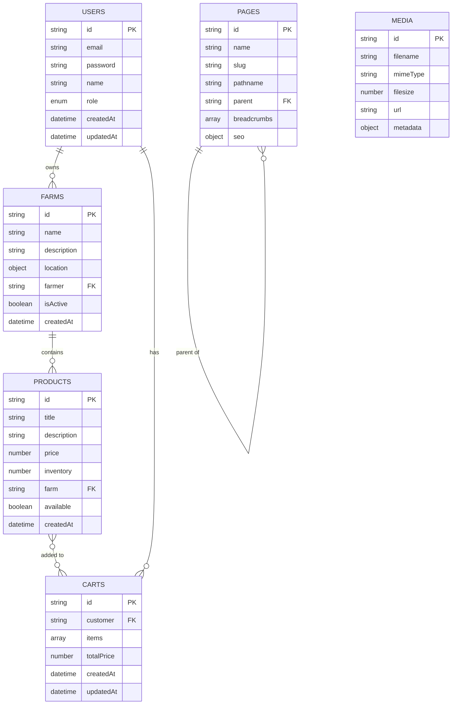

# Modelo de Datos: Guía Completa de Construcción 🗄️

## Tabla de Contenido
1. [Arquitectura de Datos](#arquitectura-de-datos)
2. [Paso a Paso: Construcción de Colecciones](#paso-a-paso-construcción-de-colecciones)
3. [Relaciones y Referencias](#relaciones-y-referencias)
4. [Control de Acceso por Colección](#control-de-acceso-por-colección)
5. [Ejemplos Prácticos de Implementación](#ejemplos-prácticos-de-implementación)
6. [Patrones de Validación](#patrones-de-validación)
7. [Optimización y Performance](#optimización-y-performance)

---

## Arquitectura de Datos

### Diagrama de Relaciones



### Principios de Diseño

1. **Separación de Responsabilidades**: Cada colección tiene un propósito específico
2. **Relaciones Claras**: FK y relaciones explícitas
3. **Escalabilidad**: Diseño que soporta crecimiento
4. **Seguridad**: Control de acceso granular
5. **Performance**: Índices y optimizaciones

### Colecciones del Sistema

#### **Colecciones de Autenticación**
- `admins`: Panel administrativo únicamente
- `users`: Usuarios de la aplicación con roles (`farmer` | `customer`)

#### **Colecciones de Negocio**
- `farms`: Granjas con geolocalización y detalles de contacto
- `products`: Catálogo de productos con inventario
- `carts`: Carritos de compra activos

#### **Colecciones de Contenido**
- `pages`: Páginas CMS con estructura jerárquica y SEO
- `media`: Archivos subidos (almacenamiento S3)

#### **Globals**
- `header`, `footer`: Configuración de interfaz
- `home-config`: Configuración de página de inicio

---

## Paso a Paso: Construcción de Colecciones

### 1. Instalación y Configuración Base

#### Dependencias Requeridas
```bash
npm install @payloadcms/db-mongodb @payloadcms/richtext-lexical
npm install @payloadcms/storage-s3 @payloadcms/plugin-nested-docs
npm install @payloadcms/plugin-seo standard-slugify
```

#### Configuración Base de Payload
```typescript
// src/payload.config.ts
import { buildConfig } from 'payload'
import { mongooseAdapter } from '@payloadcms/db-mongodb'
import { lexicalEditor } from '@payloadcms/richtext-lexical'

export default buildConfig({
  admin: {
    user: 'admins',
    bundler: nextjsWebpackBundler(),
  },
  editor: lexicalEditor(),
  db: mongooseAdapter({
    url: process.env.DATABASE_URI!,
  }),
  collections: [
    // Las colecciones se importarán aquí
  ],
  globals: [
    // Los globals se importarán aquí
  ],
})
```

### 2. Colección de Usuarios (Fundación del Sistema)

#### ¿Por qué comenzar con Users?
- Base para autenticación y autorización
- Define roles que afectan todas las demás colecciones
- Patrón que se replica en otras colecciones

#### Implementación Paso a Paso

**Archivo**: `src/collections/Users.ts`

```typescript
import type { CollectionConfig } from 'payload'

export const Users: CollectionConfig = {
  slug: 'users',
  auth: true, // ← CRÍTICO: Habilita autenticación automática
  admin: {
    useAsTitle: 'email',
    description: 'Usuarios de la aplicación (Farmers y Customers).',
    defaultColumns: ['name', 'email', 'role', 'createdAt'],
  },
  fields: [
    // Campo FUNDAMENTAL: Define permisos del usuario
    {
      name: 'role',
      label: 'Rol del Usuario',
      type: 'select',
      options: [
        {
          label: 'Productor/Granjero',
          value: 'farmer',
        },
        {
          label: 'Cliente/Comprador', 
          value: 'customer',
        },
      ],
      required: true,
      defaultValue: 'customer',
      admin: {
        position: 'sidebar',
        description: 'Define qué funcionalidades tiene acceso el usuario',
      },
    },
    
    // Información básica requerida
    {
      name: 'name',
      label: 'Nombre Completo',
      type: 'text',
      required: true,
      admin: {
        placeholder: 'Ej: Juan Pérez García',
      },
    },
    
    // Campos condicionales por rol
    {
      name: 'bio',
      label: 'Biografía del Productor',
      type: 'textarea',
      admin: {
        condition: (data) => data?.role === 'farmer',
        description: 'Información visible para clientes',
      },
    },
    
    // Avatar para perfil
    {
      name: 'avatar',
      label: 'Foto de Perfil',
      type: 'upload',
      relationTo: 'media',
    },
    
    // Control de estado
    {
      name: 'isActive',
      label: 'Usuario Activo',
      type: 'checkbox',
      defaultValue: true,
      admin: {
        position: 'sidebar',
      },
    },
  ],
  
  // Hooks para normalización y logging
  hooks: {
    beforeChange: [
      ({ data }) => {
        if (data.email) {
          data.email = data.email.toLowerCase().trim()
        }
        return data
      },
    ],
    afterChange: [
      ({ doc, operation }) => {
        if (operation === 'create') {
          console.log(`✅ Usuario creado: ${doc.email} (${doc.role})`)
        }
      },
    ],
  },
}
```

#### ¿Qué hace cada parte del código?

**`auth: true`**
- Añade automáticamente campos `email` y `password`
- Habilita métodos de login/logout
- Integra con sistema de sesiones de Payload

**Campo `role`**
- Define permisos y funcionalidades
- Usado en funciones de control de acceso
- Base para UI condicional

**Hooks de normalización**
- `beforeChange`: Limpia datos antes de guardar
- `afterChange`: Logging y notificaciones post-guardado

### 3. Colección de Granjas

#### Análisis de Requerimientos
- **Ownership**: Una granja pertenece a un farmer
- **Geolocalización**: Para mapas y búsquedas por ubicación
- **Estado**: Activa/inactiva para control de visibilidad
- **SEO**: URLs amigables con slugs

#### Implementación Completa

**Archivo**: `src/collections/Farms.ts`

```typescript
import type { CollectionConfig } from 'payload'
import { slug } from '@/fields/slug/slug'

export const Farms: CollectionConfig = {
  slug: 'farms',
  admin: {
    useAsTitle: 'name',
    defaultColumns: ['name', 'farmer', 'location', 'isActive'],
  },
  
  // CONTROL DE ACCESO GRANULAR
  access: {
    // Solo farmers pueden crear granjas
    create: ({ req: { user } }) => {
      return Boolean(
        user && 
        user.collection === 'users' && 
        user.role === 'farmer'
      )
    },
    
    // Lectura pública para búsquedas
    read: () => true,
    
    // Solo el farmer propietario puede editar
    update: ({ req: { user } }) => {
      if (!user || user.collection !== 'users' || user.role !== 'farmer') {
        return false
      }
      // Retorna query que filtra por ownership
      return { farmer: { equals: user.id } }
    },
    
    // Solo el farmer propietario puede eliminar
    delete: ({ req: { user } }) => {
      if (!user || user.collection !== 'users' || user.role !== 'farmer') {
        return false
      }
      return { farmer: { equals: user.id } }
    },
  },
  
  fields: [
    // Información básica
    {
      name: 'name',
      label: 'Nombre de la Granja',
      type: 'text',
      required: true,
    },
    
    // URL amigable generada automáticamente
    slug('name'),
    
    // Descripción rica
    {
      name: 'description',
      label: 'Descripción',
      type: 'richText',
    },
    
    // RELACIÓN CRÍTICA: Ownership
    {
      name: 'farmer',
      label: 'Propietario',
      type: 'relationship',
      relationTo: 'users',
      required: true,
      admin: {
        position: 'sidebar',
      },
      // Filtrar solo farmers en el selector
      filterOptions: {
        role: { equals: 'farmer' },
      },
      // Auto-asignar farmer logueado
      defaultValue: ({ user }) => {
        if (user?.collection === 'users' && user?.role === 'farmer') {
          return user.id
        }
      },
    },
    
    // GEOLOCALIZACIÓN COMPLETA
    {
      name: 'location',
      label: 'Ubicación',
      type: 'group',
      fields: [
        {
          name: 'address',
          label: 'Dirección',
          type: 'text',
          required: true,
        },
        {
          name: 'coordinates',
          label: 'Coordenadas GPS',
          type: 'group',
          fields: [
            {
              name: 'latitude',
              label: 'Latitud',
              type: 'number',
              required: true,
              min: -90,
              max: 90,
            },
            {
              name: 'longitude', 
              label: 'Longitud',
              type: 'number',
              required: true,
              min: -180,
              max: 180,
            },
          ],
        },
        {
          name: 'city',
          label: 'Ciudad',
          type: 'text',
          required: true,
        },
        {
          name: 'state',
          label: 'Departamento',
          type: 'text',
          required: true,
        },
      ],
    },
    
    // Información de contacto
    {
      name: 'contact',
      type: 'group',
      fields: [
        {
          name: 'phone',
          type: 'text',
        },
        {
          name: 'email',
          type: 'email',
        },
      ],
    },
    
    // Galería de imágenes
    {
      name: 'gallery',
      label: 'Galería',
      type: 'array',
      fields: [
        {
          name: 'image',
          type: 'upload',
          relationTo: 'media',
          required: true,
        },
        {
          name: 'caption',
          type: 'text',
        },
      ],
    },
    
    // Control de estado
    {
      name: 'isActive',
      label: 'Granja Activa',
      type: 'checkbox',
      defaultValue: true,
      admin: {
        position: 'sidebar',
      },
    },
  ],
  
  // Hooks para auto-asignación y logging
  hooks: {
    beforeChange: [
      ({ data, req }) => {
        // Auto-asignar farmer si no está asignado
        if (!data.farmer && req.user?.collection === 'users' && req.user?.role === 'farmer') {
          data.farmer = req.user.id
        }
        return data
      },
    ],
  },
}
```

### 4. Colección de Productos

#### Análisis de Requerimientos
- **Relación**: Pertenece a una granja
- **Inventario**: Control de stock con alertas
- **Precios**: Gestión con descuentos por volumen
- **Imágenes**: Galería con imagen principal

#### Implementación Completa

**Archivo**: `src/collections/Products.ts`

```typescript
import type { CollectionConfig } from 'payload'
import { slug } from '@/fields/slug/slug'

export const Products: CollectionConfig = {
  slug: 'products',
  admin: {
    useAsTitle: 'title',
    defaultColumns: ['title', 'farm', 'price', 'inventory', 'available'],
  },
  
  // Control de acceso basado en ownership de granja
  access: {
    create: ({ req: { user } }) => {
      return Boolean(
        user && 
        user.collection === 'users' && 
        user.role === 'farmer'
      )
    },
    read: () => true,
    update: ({ req: { user } }) => {
      if (!user || user.collection !== 'users' || user.role !== 'farmer') {
        return false
      }
      // Solo productos de granjas del farmer
      return {
        farm: {
          farmer: { equals: user.id }
        }
      }
    },
    delete: ({ req: { user } }) => {
      if (!user || user.collection !== 'users' || user.role !== 'farmer') {
        return false
      }
      return {
        farm: {
          farmer: { equals: user.id }
        }
      }
    },
  },
  
  fields: [
    // Información básica
    {
      name: 'title',
      label: 'Nombre del Producto',
      type: 'text',
      required: true,
    },
    
    slug('title'),
    
    {
      name: 'description',
      label: 'Descripción',
      type: 'richText',
    },
    
    // RELACIÓN CON GRANJA
    {
      name: 'farm',
      label: 'Granja',
      type: 'relationship',
      relationTo: 'farms',
      required: true,
      admin: {
        position: 'sidebar',
      },
      // Filtrar granjas del farmer logueado
      filterOptions: ({ user }) => {
        if (user?.collection === 'users' && user?.role === 'farmer') {
          return {
            farmer: { equals: user.id }
          }
        }
        return {}
      },
    },
    
    // SISTEMA DE PRECIOS COMPLETO
    {
      name: 'pricing',
      label: 'Precios',
      type: 'group',
      fields: [
        {
          name: 'price',
          label: 'Precio por Unidad',
          type: 'number',
          required: true,
          min: 0,
        },
        {
          name: 'unit',
          label: 'Unidad de Medida',
          type: 'select',
          required: true,
          options: [
            { label: 'Kilogramo (kg)', value: 'kg' },
            { label: 'Gramo (g)', value: 'g' },
            { label: 'Unidad', value: 'unit' },
            { label: 'Docena', value: 'dozen' },
            { label: 'Litro (L)', value: 'L' },
            { label: 'Paquete', value: 'package' },
          ],
        },
        {
          name: 'minimumOrder',
          label: 'Pedido Mínimo',
          type: 'number',
          defaultValue: 1,
          min: 1,
        },
      ],
    },
    
    // CONTROL DE INVENTARIO
    {
      name: 'inventory',
      label: 'Inventario',
      type: 'group',
      fields: [
        {
          name: 'stock',
          label: 'Stock Disponible',
          type: 'number',
          required: true,
          min: 0,
        },
        {
          name: 'trackInventory',
          label: 'Controlar Inventario',
          type: 'checkbox',
          defaultValue: true,
        },
        {
          name: 'lowStockThreshold',
          label: 'Umbral de Stock Bajo',
          type: 'number',
          defaultValue: 5,
          admin: {
            condition: (data, siblingData) => siblingData?.trackInventory,
          },
        },
      ],
    },
    
    // Categorización
    {
      name: 'category',
      label: 'Categoría',
      type: 'select',
      required: true,
      options: [
        { label: 'Frutas', value: 'fruits' },
        { label: 'Verduras', value: 'vegetables' },
        { label: 'Hierbas', value: 'herbs' },
        { label: 'Lácteos', value: 'dairy' },
        { label: 'Otros', value: 'others' },
      ],
    },
    
    // GALERÍA DE IMÁGENES
    {
      name: 'images',
      label: 'Imágenes',
      type: 'array',
      required: true,
      minRows: 1,
      fields: [
        {
          name: 'image',
          type: 'upload',
          relationTo: 'media',
          required: true,
        },
        {
          name: 'alt',
          label: 'Texto Alternativo',
          type: 'text',
          required: true,
        },
        {
          name: 'isPrimary',
          label: 'Imagen Principal',
          type: 'checkbox',
        },
      ],
    },
    
    // Estado de disponibilidad
    {
      name: 'available',
      label: 'Disponible',
      type: 'checkbox',
      defaultValue: true,
      admin: {
        position: 'sidebar',
      },
    },
  ],
  
  // Hooks para cálculos automáticos
  hooks: {
    beforeChange: [
      ({ data }) => {
        // Calcular disponibilidad basada en stock
        if (data.inventory?.trackInventory) {
          data.available = data.inventory.stock > 0
        }
        return data
      },
    ],
    afterChange: [
      ({ doc, operation, previousDoc }) => {
        // Alerta de stock bajo
        if (operation === 'update' && doc.inventory?.trackInventory) {
          const currentStock = doc.inventory.stock
          const threshold = doc.inventory.lowStockThreshold || 5
          
          if (currentStock <= threshold && previousDoc?.inventory?.stock > threshold) {
            console.log(`🚨 STOCK BAJO: ${doc.title} (${currentStock} unidades)`)
          }
        }
      },
    ],
  },
}
```

---

## Relaciones y Referencias

### Tipos de Relaciones Implementadas

#### 1. One-to-Many: Granja → Productos
```typescript
// En Products collection
{
  name: 'farm',
  type: 'relationship',
  relationTo: 'farms',
  required: true,
}

// Query: Obtener productos de una granja
const products = await payload.find({
  collection: 'products',
  where: {
    farm: { equals: farmId }
  }
})
```

#### 2. One-to-One: Usuario → Carrito
```typescript
// En Carts collection
{
  name: 'customer',
  type: 'relationship',
  relationTo: 'users',
  required: true,
  unique: true, // ← Un usuario, un carrito
}
```

#### 3. Many-to-Many: Carrito ↔ Productos
```typescript
// En Carts collection
{
  name: 'items',
  type: 'array',
  fields: [
    {
      name: 'product',
      type: 'relationship',
      relationTo: 'products',
      required: true,
    },
    {
      name: 'quantity',
      type: 'number',
      required: true,
    },
    {
      name: 'priceAtTime',
      type: 'number',
      required: true,
      admin: {
        description: 'Precio cuando se añadió (snapshot)',
      },
    },
  ],
}
```

### Patrones de Query Avanzados

#### Query con Populate (Joins)
```typescript
// Obtener productos con información de granja y farmer
const productsWithFarm = await payload.find({
  collection: 'products',
  populate: {
    farm: {
      farmer: true, // Nested populate
    },
    images: true,
  },
  limit: 20,
})
```

#### Filtros por Relaciones
```typescript
// Productos de granjas activas cerca de una ubicación
const nearbyProducts = await payload.find({
  collection: 'products',
  where: {
    and: [
      { available: { equals: true } },
      {
        farm: {
          isActive: { equals: true }
        }
      },
      {
        farm: {
          'location.city': { equals: 'Bogotá' }
        }
      }
    ]
  }
})
```

---

## Control de Acceso por Colección

### Funciones de Acceso Reutilizables

**Archivo**: `src/access/index.ts`

```typescript
import type { Access } from 'payload'

// Verificar usuario autenticado de la app
export const isAuthenticatedUser: Access = ({ req: { user } }) => {
  return Boolean(user && user.collection === 'users')
}

// Solo farmers
export const isFarmer: Access = ({ req: { user } }) => {
  return Boolean(
    user && 
    user.collection === 'users' && 
    user.role === 'farmer'
  )
}

// Solo customers
export const isCustomer: Access = ({ req: { user } }) => {
  return Boolean(
    user && 
    user.collection === 'users' && 
    user.role === 'customer'
  )
}

// Ownership de recursos
export const isOwner: Access = ({ req: { user } }) => {
  if (!user || user.collection !== 'users') return false
  
  // Retorna query que filtra por ownership
  return { farmer: { equals: user.id } }
}

// Acceso a productos por ownership de granja
export const canAccessFarmProducts: Access = ({ req: { user } }) => {
  if (!user || user.collection !== 'users' || user.role !== 'farmer') {
    return false
  }
  
  return {
    farm: {
      farmer: { equals: user.id }
    }
  }
}
```

### Aplicación Práctica del Control de Acceso

#### Patrón Estándar para Recursos con Ownership
```typescript
access: {
  // Crear: solo rol apropiado
  create: isFarmer,
  
  // Leer: público o autenticado
  read: () => true,
  
  // Actualizar/Eliminar: solo propietario
  update: isOwner,
  delete: isOwner,
}
```

#### Acceso Condicional Complejo
```typescript
access: {
  read: ({ req: { user } }) => {
    // Admins ven todo
    if (user?.collection === 'admins') return true
    
    // Usuarios ven solo granjas activas
    if (user?.collection === 'users') {
      return { isActive: { equals: true } }
    }
    
    // Guests ven granjas activas y públicas
    return {
      and: [
        { isActive: { equals: true } },
        { isPublic: { equals: true } }
      ]
    }
  }
}
```

---

## Ejemplos Prácticos de Implementación

### Ejemplo 1: Sistema de Búsqueda Avanzada

```typescript
// Búsqueda de productos con filtros múltiples
export async function searchProducts(filters: {
  category?: string
  location?: string
  priceRange?: { min: number; max: number }
  inStock?: boolean
  isOrganic?: boolean
}) {
  const whereClause: any = {
    and: [
      { available: { equals: true } },
      { 
        farm: {
          isActive: { equals: true }
        }
      }
    ]
  }
  
  // Filtro por categoría
  if (filters.category) {
    whereClause.and.push({
      category: { equals: filters.category }
    })
  }
  
  // Filtro por ubicación
  if (filters.location) {
    whereClause.and.push({
      farm: {
        'location.city': { contains: filters.location }
      }
    })
  }
  
  // Filtro por precio
  if (filters.priceRange) {
    whereClause.and.push({
      'pricing.price': {
        greater_than_equal: filters.priceRange.min,
        less_than_equal: filters.priceRange.max,
      }
    })
  }
  
  // Filtro por stock
  if (filters.inStock) {
    whereClause.and.push({
      'inventory.stock': { greater_than: 0 }
    })
  }
  
  return await payload.find({
    collection: 'products',
    where: whereClause,
    populate: {
      farm: {
        farmer: true,
      },
      images: true,
    },
    sort: '-createdAt',
    limit: 20,
  })
}
```

### Ejemplo 2: Gestión de Carrito con Validaciones

```typescript
export async function addToCart(
  customerId: string,
  productId: string, 
  quantity: number
) {
  // 1. Verificar producto disponible
  const product = await payload.findByID({
    collection: 'products',
    id: productId,
    populate: { farm: true },
  })
  
  if (!product?.available) {
    throw new Error('Producto no disponible')
  }
  
  // 2. Verificar stock
  if (product.inventory?.trackInventory && product.inventory.stock < quantity) {
    throw new Error(`Solo hay ${product.inventory.stock} unidades disponibles`)
  }
  
  // 3. Obtener carrito del cliente
  const existingCart = await payload.find({
    collection: 'carts',
    where: { customer: { equals: customerId } },
    limit: 1,
  })
  
  let cart = existingCart.docs[0]
  
  if (!cart) {
    // Crear nuevo carrito
    cart = await payload.create({
      collection: 'carts',
      data: {
        customer: customerId,
        items: [],
        totalPrice: 0,
      },
    })
  }
  
  // 4. Actualizar items del carrito
  const existingItems = cart.items || []
  const existingItemIndex = existingItems.findIndex(
    item => item.product === productId
  )
  
  let updatedItems
  
  if (existingItemIndex >= 0) {
    // Actualizar cantidad existente
    updatedItems = [...existingItems]
    updatedItems[existingItemIndex].quantity += quantity
  } else {
    // Añadir nuevo item
    updatedItems = [
      ...existingItems,
      {
        product: productId,
        quantity,
        priceAtTime: product.pricing.price, // Snapshot del precio
      },
    ]
  }
  
  // 5. Recalcular total
  const totalPrice = updatedItems.reduce(
    (total, item) => total + (item.priceAtTime * item.quantity),
    0
  )
  
  // 6. Guardar carrito actualizado
  return await payload.update({
    collection: 'carts',
    id: cart.id,
    data: {
      items: updatedItems,
      totalPrice,
      updatedAt: new Date(),
    },
  })
}
```

---

## Patrones de Validación

### Validaciones de Negocio

#### Validador de Stock Mínimo
```typescript
const validateStock: Validate = (value, { siblingData }) => {
  if (!siblingData?.trackInventory) return true
  
  const minOrder = siblingData?.pricing?.minimumOrder || 1
  
  if (value < minOrder) {
    return `Stock debe ser al menos ${minOrder} unidades (pedido mínimo)`
  }
  
  return true
}

// Uso en campo
{
  name: 'stock',
  type: 'number',
  validate: [validateStock],
}
```

#### Validador de Coordenadas GPS
```typescript
const validateCoordinates: Validate = (value) => {
  if (!value) return true
  
  const { latitude, longitude } = value
  
  if (latitude < -90 || latitude > 90) {
    return 'Latitud debe estar entre -90 y 90'
  }
  
  if (longitude < -180 || longitude > 180) {
    return 'Longitud debe estar entre -180 y 180'
  }
  
  return true
}
```

### Hooks de Auto-cálculo

#### Cálculo de Disponibilidad
```typescript
const calculateAvailability: FieldHook = ({ siblingData }) => {
  const trackInventory = siblingData?.inventory?.trackInventory
  const stock = siblingData?.inventory?.stock || 0
  
  if (!trackInventory) return true
  
  return stock > 0
}

// Uso en campo
{
  name: 'available',
  type: 'checkbox',
  hooks: {
    beforeChange: [calculateAvailability],
  },
}
```

---

## Optimización y Performance

### Índices de Base de Datos

#### Índices Básicos en Campos Clave
```typescript
// En definiciones de campo
{
  name: 'slug',
  type: 'text',
  index: true,    // Búsquedas por slug
  unique: true,   // Unicidad enforced por DB
}

{
  name: 'farmer',
  type: 'relationship',
  relationTo: 'users',
  index: true,    // Queries por ownership
}
```

#### Índices Compuestos (MongoDB)
```javascript
// En la base de datos directamente
db.products.createIndex({ 
  "available": 1, 
  "category": 1,
  "farm": 1 
})

db.farms.createIndex({ 
  "isActive": 1,
  "location.coordinates.latitude": 1,
  "location.coordinates.longitude": 1 
})
```

### Optimizaciones de Query

#### Limit y Paginación
```typescript
// SIEMPRE usar limit
const products = await payload.find({
  collection: 'products',
  limit: 20,
  page: 1,
  sort: '-createdAt'
})
```

#### Populate Selectivo
```typescript
// Solo incluir campos necesarios
const farms = await payload.find({
  collection: 'farms',
  populate: {
    farmer: {
      select: ['name', 'email'] // Solo campos necesarios
    }
  }
})
```

#### Proyección de Campos
```typescript
// Para listados ligeros
const lightProducts = await payload.find({
  collection: 'products',
  select: {
    title: true,
    'pricing.price': true,
    'images.0.image': true, // Solo primera imagen
  }
})
```

---

## Siguiente Paso

Después de implementar el modelo de datos:

1. **[03-Auth-Step-by-Step.md](./03-Auth-Step-by-Step.md)**: Sistema de autenticación robusto
2. **[Slug-Factory-Guide.md](./Slug-Factory-Guide.md)**: URLs SEO-friendly
3. **[11-Server-Actions-Deep-Dive.md](./11-Server-Actions-Deep-Dive.md)**: Lógica de negocio
4. **[12-Client-Components-Integration.md](./12-Client-Components-Integration.md)**: Frontend dinámico

---

*Este modelo de datos establece las bases sólidas para un sistema escalable y seguro. Cada patrón ha sido optimizado para performance y mantenibilidad a largo plazo.*
