# Sistema de Carrito: Guía Completa de Implementación 🛒

## Tabla de Contenido
1. [Arquitectura del Sistema de Carrito](#arquitectura-del-sistema-de-carrito)
2. [Paso 1: Diseño del Modelo de Datos](#paso-1-diseño-del-modelo-de-datos)
3. [Paso 2: Implementación de Server Actions](#paso-2-implementación-de-server-actions)
4. [Paso 3: Hooks de React Query](#paso-3-hooks-de-react-query)
5. [Paso 4: Componentes de Interfaz](#paso-4-componentes-de-interfaz)
6. [Paso 5: Gestión de Estado Global](#paso-5-gestión-de-estado-global)
7. [Lógica de Negocio Avanzada](#lógica-de-negocio-avanzada)
8. [Optimizaciones y Performance](#optimizaciones-y-performance)

---

## Arquitectura del Sistema de Carrito

### Flujo Completo del Carrito

```mermaid
graph TD
    A[Usuario selecciona producto] --> B[Verificar stock disponible]
    B --> C[Verificar carrito existente]
    C --> D{¿Carrito existe?}
    D -->|No| E[Crear nuevo carrito]
    D -->|Sí| F[Carrito existente]
    E --> G[Añadir primer item]
    F --> H{¿Producto ya en carrito?}
    H -->|No| I[Añadir nuevo item]
    H -->|Sí| J[Actualizar cantidad]
    G --> K[Recalcular total]
    I --> K
    J --> K
    K --> L[Invalidar cache React Query]
    L --> M[Actualizar UI]
```



### Principios de Diseño del Sistema Actual

1. **Price Snapshots**: Preservar precio histórico al momento de añadir
2. **One Cart per Customer-Farm**: Un carrito activo por combinación usuario-granja
3. **Stock Enforcement**: Validación de inventario en cada operación
4. **Server-Authoritative**: Lógica de negocio solo en el servidor
5. **Atomic Operations**: Operaciones transaccionales

### Estructura de Datos Actual

#### **Farm Inventory Entry** (Actual en el proyecto)
```typescript
// En farm.products[] array
{
  product: ProductRef,
  quantity: number,   // Tamaño del bundle (ej: 5 kg por bundle)
  unit: string,       // 'kg' | 'pcs' | 'liters' | 'boxes'
  price: number,      // Precio por bundle
  stock: number       // Bundles disponibles
}
```

#### **Cart Document** (Implementación actual)
```typescript
{
  user: UserRef,
  farm: FarmRef,
  status: 'active' | 'ordered' | 'cancelled',
  items: [
    {
      product: ProductRef,
      quantity: number,         // Bundles en carrito
      unit: string,             // Copiado del farm entry al añadir
      priceSnapshot: number     // Copiado del farm entry al añadir
    }
  ]
}
```

#### **CartDTO** (Lo que retorna al cliente)
```typescript
{
  id: string,
  farmId: string,
  farmName: string,
  lines: [
    {
      id: string,
      productId: string,
      productName: string,
      bundleSize: number,
      unit: string,
      bundles: number,
      priceEach: number,
      subtotal: number
    }
  ],
  total: number
}
```

---

## Paso 1: Diseño del Modelo de Datos

### 1.1 Análisis del Sistema Actual

#### ¿Por qué Farm-Specific Carts?
```typescript
// Ventajas del sistema actual:
// 1. Checkout más simple (un farmer por orden)
// 2. Shipping/logistics más claro
// 3. Menos complejidad en pago
// 4. Farmers ven órdenes completas
```

#### ¿Por qué Price Snapshots?
```typescript
// Problema sin snapshots:
const scenario1 = {
  step1: "Usuario añade tomate a $5000",
  step2: "Farmer cambia precio a $6000", 
  step3: "Usuario ve carrito con precio nuevo → confusión"
}

// Solución con snapshots:
const scenario2 = {
  step1: "Usuario añade tomate a $5000 → guardamos $5000",
  step2: "Farmer cambia precio a $6000",
  step3: "Usuario ve carrito con $5000 (precio cuando añadió)"
}
```

### 1.2 Server Actions Implementadas

**Archivo**: `src/app/(frontend)/cart/actions/cartActions.ts`

```typescript
'use server'

import { getPayload } from 'payload'
import config from '@/payload.config'
import { headers } from 'next/headers'

// Action: Añadir al carrito
export async function addToCart({ 
  farmId, 
  productId, 
  bundles = 1 
}: {
  farmId: string
  productId: string
  bundles?: number
}) {
  const payload = await getPayload({ config })
  
  try {
    // 1. Verificar autenticación
    const headersList = await headers()
    const { user } = await payload.auth({ headers: headersList })
    
    if (!user || user.collection !== 'users' || user.role !== 'customer') {
      throw new Error('Acceso denegado')
    }
    
    // 2. Verificar que farm y product existen
    const farm = await payload.findByID({
      collection: 'farms',
      id: farmId,
    })
    
    if (!farm) {
      throw new Error('Granja no encontrada')
    }
    
    // 3. Encontrar producto en el inventario de la granja
    const inventoryItem = farm.products?.find(
      (item: any) => item.product === productId
    )
    
    if (!inventoryItem) {
      throw new Error('Producto no disponible en esta granja')
    }
    
    // 4. Verificar stock disponible
    if (inventoryItem.stock < bundles) {
      throw new Error(`Solo hay ${inventoryItem.stock} bundles disponibles`)
    }
    
    // 5. Buscar carrito existente para esta farm
    const existingCarts = await payload.find({
      collection: 'carts',
      where: {
        and: [
          { user: { equals: user.id } },
          { farm: { equals: farmId } },
          { status: { equals: 'active' } }
        ]
      },
      limit: 1,
    })
    
    let cart = existingCarts.docs[0]
    
    if (!cart) {
      // 6a. Crear nuevo carrito
      cart = await payload.create({
        collection: 'carts',
        data: {
          user: user.id,
          farm: farmId,
          status: 'active',
          items: [
            {
              product: productId,
              quantity: bundles,
              unit: inventoryItem.unit,
              priceSnapshot: inventoryItem.price,
            },
          ],
        },
      })
    } else {
      // 6b. Actualizar carrito existente
      const existingItems = cart.items || []
      const existingItemIndex = existingItems.findIndex(
        (item: any) => item.product === productId
      )
      
      let updatedItems
      
      if (existingItemIndex >= 0) {
        // Producto existe → incrementar cantidad
        updatedItems = [...existingItems]
        const newQuantity = updatedItems[existingItemIndex].quantity + bundles
        
        // Verificar stock total
        if (inventoryItem.stock < newQuantity) {
          throw new Error(`Solo hay ${inventoryItem.stock} bundles disponibles`)
        }
        
        updatedItems[existingItemIndex].quantity = newQuantity
      } else {
        // Producto nuevo → añadir
        updatedItems = [
          ...existingItems,
          {
            product: productId,
            quantity: bundles,
            unit: inventoryItem.unit,
            priceSnapshot: inventoryItem.price,
          },
        ]
      }
      
      cart = await payload.update({
        collection: 'carts',
        id: cart.id,
        data: {
          items: updatedItems,
        },
      })
    }
    
    return cart
  } catch (error) {
    console.error('Error añadiendo al carrito:', error)
    throw error
  }
}

// Action: Decrementar item del carrito
export async function decrementCartItem({ 
  cartId, 
  productId, 
  amount = 1 
}: {
  cartId: string
  productId: string
  amount?: number
}) {
  const payload = await getPayload({ config })
  
  try {
    const headersList = await headers()
    const { user } = await payload.auth({ headers: headersList })
    
    if (!user || user.collection !== 'users' || user.role !== 'customer') {
      throw new Error('Acceso denegado')
    }
    
    // Verificar ownership del carrito
    const cart = await payload.findByID({
      collection: 'carts',
      id: cartId,
    })
    
    if (!cart || cart.user !== user.id) {
      throw new Error('Carrito no encontrado')
    }
    
    const existingItems = cart.items || []
    const itemIndex = existingItems.findIndex(
      (item: any) => item.product === productId
    )
    
    if (itemIndex === -1) {
      throw new Error('Producto no encontrado en el carrito')
    }
    
    let updatedItems = [...existingItems]
    const currentQuantity = updatedItems[itemIndex].quantity
    
    if (currentQuantity <= amount) {
      // Eliminar item completamente
      updatedItems.splice(itemIndex, 1)
      
      // Si no quedan items, eliminar el carrito
      if (updatedItems.length === 0) {
        await payload.delete({
          collection: 'carts',
          id: cartId,
        })
        return null
      }
    } else {
      // Reducir cantidad
      updatedItems[itemIndex].quantity = currentQuantity - amount
    }
    
    return await payload.update({
      collection: 'carts',
      id: cartId,
      data: {
        items: updatedItems,
      },
    })
  } catch (error) {
    console.error('Error decrementando item:', error)
    throw error
  }
}

// Action: Limpiar todos los carritos del usuario
export async function clearAllCarts() {
  const payload = await getPayload({ config })
  
  try {
    const headersList = await headers()
    const { user } = await payload.auth({ headers: headersList })
    
    if (!user || user.collection !== 'users' || user.role !== 'customer') {
      throw new Error('Acceso denegado')
    }
    
    // Eliminar todos los carritos activos del usuario
    const result = await payload.delete({
      collection: 'carts',
      where: {
        and: [
          { user: { equals: user.id } },
          { status: { equals: 'active' } }
        ]
      },
    })
    
    return { success: true, deletedCount: result.docs.length }
  } catch (error) {
    console.error('Error limpiando carritos:', error)
    throw error
  }
}

// Action: Obtener carrito de una granja específica
export async function getCart(farmId: string) {
  const payload = await getPayload({ config })
  
  try {
    const headersList = await headers()
    const { user } = await payload.auth({ headers: headersList })
    
    if (!user || user.collection !== 'users' || user.role !== 'customer') {
      return null
    }
    
    const carts = await payload.find({
      collection: 'carts',
      where: {
        and: [
          { user: { equals: user.id } },
          { farm: { equals: farmId } },
          { status: { equals: 'active' } }
        ]
      },
      populate: {
        farm: true,
        items: {
          product: true,
        },
      },
      limit: 1,
    })
    
    return carts.docs[0] || null
  } catch (error) {
    console.error('Error obteniendo carrito:', error)
    return null
  }
}

// Action: Obtener todos los carritos activos del usuario
export async function getAllCarts() {
  const payload = await getPayload({ config })
  
  try {
    const headersList = await headers()
    const { user } = await payload.auth({ headers: headersList })
    
    if (!user || user.collection !== 'users' || user.role !== 'customer') {
      return []
    }
    
    const carts = await payload.find({
      collection: 'carts',
      where: {
        and: [
          { user: { equals: user.id } },
          { status: { equals: 'active' } }
        ]
      },
      populate: {
        farm: true,
        items: {
          product: true,
        },
      },
    })
    
    return carts.docs
  } catch (error) {
    console.error('Error obteniendo carritos:', error)
    return []
  }
}
```

---

## Paso 2: Serialización de Datos

### 2.1 Pipeline de Serialización

**Archivo**: `src/utils/cartSerialization.ts`

```typescript
interface CartDTO {
  id: string
  farmId: string
  farmName: string
  lines: Array<{
    id: string
    productId: string
    productName: string
    bundleSize: number
    unit: string
    bundles: number
    priceEach: number
    subtotal: number
  }>
  total: number
}

// Paso 1: Serialización base
function baseSerialize(cart: any): CartDTO {
  const lines = (cart.items || []).map((item: any) => ({
    id: `${cart.id}-${item.product}`,
    productId: item.product,
    productName: item.product?.title || 'Producto desconocido',
    bundleSize: 1, // Simplificado, podrías extraer del farm inventory
    unit: item.unit,
    bundles: item.quantity,
    priceEach: item.priceSnapshot,
    subtotal: item.quantity * item.priceSnapshot,
  }))
  
  const total = lines.reduce((sum, line) => sum + line.subtotal, 0)
  
  return {
    id: cart.id,
    farmId: cart.farm?.id || cart.farm,
    farmName: cart.farm?.name || 'Granja desconocida',
    lines,
    total,
  }
}

// Paso 2: Llenar nombres de productos faltantes
async function fillMissingProductNames(cartDTO: CartDTO): Promise<CartDTO> {
  const payload = await getPayload({ config })
  
  const linesWithMissingNames = cartDTO.lines.filter(
    line => line.productName === 'Producto desconocido'
  )
  
  if (linesWithMissingNames.length === 0) {
    return cartDTO
  }
  
  const productIds = linesWithMissingNames.map(line => line.productId)
  
  const products = await payload.find({
    collection: 'products',
    where: {
      id: { in: productIds }
    },
    select: {
      id: true,
      title: true,
    },
  })
  
  const updatedLines = cartDTO.lines.map(line => {
    if (line.productName === 'Producto desconocido') {
      const product = products.docs.find(p => p.id === line.productId)
      return {
        ...line,
        productName: product?.title || `Producto ${line.productId}`,
      }
    }
    return line
  })
  
  return {
    ...cartDTO,
    lines: updatedLines,
  }
}

// Función principal de serialización
export async function serializeCart(cart: any): Promise<CartDTO> {
  const baseDTO = baseSerialize(cart)
  return await fillMissingProductNames(baseDTO)
}

export async function serializeCarts(carts: any[]): Promise<CartDTO[]> {
  return Promise.all(carts.map(serializeCart))
}
```

---

## Paso 3: Hooks de React Query

### 3.1 Hook Principal: useCarts

**Archivo**: `src/app/(frontend)/cart/hooks/useCarts.ts`

```typescript
'use client'

import { useQuery, useMutation, useQueryClient } from '@tanstack/react-query'
import { 
  addToCart, 
  decrementCartItem, 
  clearAllCarts,
  getAllCarts,
} from '../actions/cartActions'

interface CartDTO {
  id: string
  farmId: string
  farmName: string
  lines: Array<{
    id: string
    productId: string
    productName: string
    bundleSize: number
    unit: string
    bundles: number
    priceEach: number
    subtotal: number
  }>
  total: number
}

// Hook principal para todos los carritos
export const useAllCarts = () => {
  return useQuery<CartDTO[]>({
    queryKey: ['carts'],
    queryFn: async () => {
      const response = await fetch('/cart/api')
      if (!response.ok) {
        throw new Error('Error obteniendo carritos')
      }
      const data = await response.json()
      return data.carts
    },
    staleTime: 30 * 1000, // 30 segundos
    retry: 1,
  })
}

// Hook para totales derivados
export const useCartTotals = () => {
  const { data: carts = [] } = useAllCarts()
  
  const totalBundles = carts.reduce(
    (sum, cart) => sum + cart.lines.reduce(
      (lineSum, line) => lineSum + line.bundles, 0
    ), 0
  )
  
  const totalAmount = carts.reduce(
    (sum, cart) => sum + cart.total, 0
  )
  
  const totalItems = carts.reduce(
    (sum, cart) => sum + cart.lines.length, 0
  )
  
  return {
    totalBundles,
    totalAmount,
    totalItems,
    cartCount: carts.length,
    isEmpty: carts.length === 0,
  }
}

// Hook mutation: añadir al carrito
export const useAddToCart = () => {
  const queryClient = useQueryClient()
  
  return useMutation({
    mutationFn: async ({ 
      farmId, 
      productId, 
      bundles = 1 
    }: {
      farmId: string
      productId: string
      bundles?: number
    }) => {
      const response = await fetch('/cart/api/add', {
        method: 'POST',
        headers: {
          'Content-Type': 'application/json',
        },
        body: JSON.stringify({ farmId, productId, bundles }),
      })
      
      if (!response.ok) {
        const error = await response.json()
        throw new Error(error.error || 'Error añadiendo al carrito')
      }
      
      return response.json()
    },
    onSuccess: () => {
      queryClient.invalidateQueries({ queryKey: ['carts'] })
    },
  })
}

// Hook mutation: decrementar item
export const useDecrementItem = () => {
  const queryClient = useQueryClient()
  
  return useMutation({
    mutationFn: async ({ 
      cartId, 
      productId, 
      amount = 1 
    }: {
      cartId: string
      productId: string
      amount?: number
    }) => {
      const response = await fetch('/cart/api/decrement', {
        method: 'POST',
        headers: {
          'Content-Type': 'application/json',
        },
        body: JSON.stringify({ cartId, productId, amount }),
      })
      
      if (!response.ok) {
        const error = await response.json()
        throw new Error(error.error || 'Error actualizando carrito')
      }
      
      return response.json()
    },
    onSuccess: () => {
      queryClient.invalidateQueries({ queryKey: ['carts'] })
    },
  })
}

// Hook mutation: limpiar todos los carritos
export const useClearCarts = () => {
  const queryClient = useQueryClient()
  
  return useMutation({
    mutationFn: async () => {
      const response = await fetch('/cart/api/clear', {
        method: 'POST',
      })
      
      if (!response.ok) {
        const error = await response.json()
        throw new Error(error.error || 'Error limpiando carritos')
      }
      
      return response.json()
    },
    onSuccess: () => {
      queryClient.invalidateQueries({ queryKey: ['carts'] })
    },
  })
}
```

---

## Paso 4: API Routes

### 4.1 Ruta GET: Obtener Carritos

**Archivo**: `src/app/(frontend)/cart/api/route.ts`

```typescript
import { NextResponse } from 'next/server'
import { getAllCarts } from '../actions/cartActions'
import { serializeCarts } from '@/utils/cartSerialization'

export async function GET() {
  try {
    const carts = await getAllCarts()
    const serializedCarts = await serializeCarts(carts)
    
    return NextResponse.json({ carts: serializedCarts })
  } catch (error) {
    console.error('API Error:', error)
    return NextResponse.json(
      { error: error instanceof Error ? error.message : 'Error inesperado' },
      { status: 500 }
    )
  }
}
```

### 4.2 Ruta POST: Añadir al Carrito

**Archivo**: `src/app/(frontend)/cart/api/add/route.ts`

```typescript
import { NextRequest, NextResponse } from 'next/server'
import { addToCart } from '../../actions/cartActions'

export async function POST(request: NextRequest) {
  try {
    const body = await request.json()
    const { farmId, productId, bundles } = body
    
    if (!farmId || !productId) {
      return NextResponse.json(
        { error: 'farmId y productId son requeridos' },
        { status: 400 }
      )
    }
    
    const cart = await addToCart({ farmId, productId, bundles })
    
    return NextResponse.json({ success: true, cart })
  } catch (error) {
    console.error('API Error:', error)
    return NextResponse.json(
      { error: error instanceof Error ? error.message : 'Error inesperado' },
      { status: 400 }
    )
  }
}
```

### 4.3 Ruta POST: Decrementar Item

**Archivo**: `src/app/(frontend)/cart/api/decrement/route.ts`

```typescript
import { NextRequest, NextResponse } from 'next/server'
import { decrementCartItem } from '../../actions/cartActions'

export async function POST(request: NextRequest) {
  try {
    const body = await request.json()
    const { cartId, productId, amount } = body
    
    if (!cartId || !productId) {
      return NextResponse.json(
        { error: 'cartId y productId son requeridos' },
        { status: 400 }
      )
    }
    
    const result = await decrementCartItem({ cartId, productId, amount })
    
    return NextResponse.json({ success: true, cart: result })
  } catch (error) {
    console.error('API Error:', error)
    return NextResponse.json(
      { error: error instanceof Error ? error.message : 'Error inesperado' },
      { status: 400 }
    )
  }
}
```

---

## Paso 5: Componentes de UI

### 5.1 Componente de Cart Badge

**Archivo**: `src/app/(frontend)/components/CartBadge.tsx`

```tsx
'use client'

import React from 'react'
import { useCartTotals } from '@/app/(frontend)/cart/hooks/useCarts'
import { Button, Badge, Spinner } from '@heroui/react'
import { ShoppingCartIcon } from '@heroicons/react/24/outline'
import Link from 'next/link'

export default function CartBadge() {
  const { totalBundles, isEmpty } = useCartTotals()

  return (
    <Link href="/cart">
      <Button isIconOnly variant="ghost" className="relative">
        <ShoppingCartIcon className="h-6 w-6" />
        {!isEmpty && (
          <Badge 
            content={totalBundles} 
            color="primary" 
            size="sm"
            className="absolute -top-1 -right-1"
          />
        )}
      </Button>
    </Link>
  )
}
```

### 5.2 Integración en Farm Detail

**Archivo**: `src/app/(frontend)/farms/[slug]/FarmDetail.tsx` (excerpt)

```tsx
import { useAddToCart } from '@/app/(frontend)/cart/hooks/useCarts'

export default function FarmDetail({ farm }: { farm: any }) {
  const { mutate: addToCart, isPending } = useAddToCart()

  return (
    <div>
      {/* Farm info */}
      
      {/* Products */}
      <div className="grid grid-cols-1 md:grid-cols-2 lg:grid-cols-3 gap-6">
        {farm.products?.map((inventoryItem: any) => {
          const product = inventoryItem.product
          const isOutOfStock = (inventoryItem.stock ?? 0) <= 0
          
          return (
            <Card key={product.id}>
              <CardBody>
                <h3 className="font-semibold mb-2">{product.title}</h3>
                <p className="text-gray-600 mb-4">{product.description}</p>
                
                <div className="flex justify-between items-center mb-4">
                  <div>
                    <span className="text-lg font-bold">
                      ${inventoryItem.price.toLocaleString()}
                    </span>
                    <span className="text-sm text-gray-500 ml-1">
                      / {inventoryItem.unit}
                    </span>
                  </div>
                  <div className="text-sm text-gray-500">
                    Stock: {inventoryItem.stock} bundles
                  </div>
                </div>
                
                <Button
                  color="primary"
                  isDisabled={isPending || isOutOfStock}
                  isLoading={isPending}
                  onPress={() => addToCart({ 
                    farmId: farm.id, 
                    productId: product.id 
                  })}
                  className="w-full"
                >
                  {isOutOfStock ? 'Sin Stock' : 'Añadir al Carrito'}
                </Button>
              </CardBody>
            </Card>
          )
        })}
      </div>
    </div>
  )
}
```

---

## Lógica de Negocio Avanzada

### Validaciones de Stock en Tiempo Real

```typescript
// Hook para validaciones previas
export function useStockValidation() {
  return async (farmId: string, productId: string, requestedBundles: number) => {
    const response = await fetch(`/api/farms/${farmId}/stock/${productId}`)
    const { available, stock } = await response.json()
    
    if (!available) {
      throw new Error('Producto no disponible')
    }
    
    if (stock < requestedBundles) {
      throw new Error(`Solo hay ${stock} bundles disponibles`)
    }
    
    return true
  }
}
```

### Manejo de Edge Cases

```typescript
// Casos especiales manejados:
export const edgeCases = {
  // 1. Eliminar último item → eliminar carrito
  deleteLastItem: (cart: any) => {
    if (cart.items.length === 1) {
      return 'DELETE_CART'
    }
    return 'REMOVE_ITEM'
  },
  
  // 2. Producto eliminado de granja → mostrar ID
  missingProduct: (productId: string) => {
    return `Producto ${productId} (no disponible)`
  },
  
  // 3. Stock reducido → no reconciliar automáticamente
  stockReduced: (cartQuantity: number, availableStock: number) => {
    // Se maneja en checkout, no en carrito
    return {
      warning: `Producto con stock reducido: ${availableStock} disponibles, ${cartQuantity} en carrito`,
      action: 'VALIDATE_ON_CHECKOUT'
    }
  }
}
```

---

## Optimizaciones y Performance

### Índices de Base de Datos

```javascript
// Índices MongoDB optimizados para carritos
db.carts.createIndex({ "user": 1, "farm": 1, "status": 1 }, { unique: true })
db.carts.createIndex({ "status": 1 })
db.carts.createIndex({ "items.product": 1 })
```

### Caching Estratégico

```typescript
// Configuración optimizada de React Query
export const cartQueryConfig = {
  staleTime: 30 * 1000,       // 30 segundos fresh
  cacheTime: 5 * 60 * 1000,   // 5 minutos en cache
  refetchOnWindowFocus: false, // No refetch al cambiar tab
  retry: 1,                   // Solo un retry
}
```

### Future Enhancements (Roadmap)

```typescript
const futureFeatures = {
  // 1. Checkout flow → orders collection
  checkout: 'Convertir carritos en órdenes',
  
  // 2. Optimistic updates
  optimistic: 'Updates con rollback en error',
  
  // 3. Soft stock reservations
  reservations: 'Reservar stock temporalmente',
  
  // 4. Descuentos/promociones
  discounts: 'Líneas de descuento en carrito',
  
  // 5. Multi-farm checkout
  multiFarm: 'Checkout combinado múltiples granjas'
}
```

---

## Siguiente Paso

Después de implementar el sistema de carrito:

1. **[05-Mapping.md](./05-Mapping.md)**: Funcionalidades de geolocalización con Mapbox
2. **[Order-Management-Guide.md](./Order-Management-Guide.md)**: Sistema de órdenes y facturación
3. **[Payment-Integration-Guide.md](./Payment-Integration-Guide.md)**: Integrar pasarelas de pago
4. **[Inventory-Sync-Guide.md](./Inventory-Sync-Guide.md)**: Sincronización de inventario

---

*Este sistema de carrito balanceó simplicity y functionality, manteniendo un carrito por granja para simplificar logistics mientras preserva price integrity con snapshots. El sistema actual es production-ready y escalable.*
