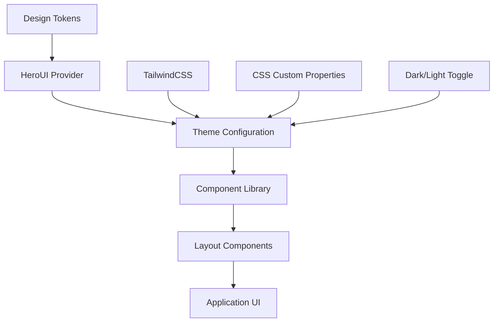

# Guía Completa: Sistema UI con HeroUI y Alternativas 🎨

## Tabla de Contenido
1. [¿Qué es el Sistema UI?](#qué-es-el-sistema-ui)
2. [Arquitectura del Design System](#arquitectura-del-design-system)
3. [Paso 1: Configuración de HeroUI](#paso-1-configuración-de-heroui)
4. [Paso 2: Configuración de Theming](#paso-2-configuración-de-theming)
5. [Paso 3: Componentes Base](#paso-3-componentes-base)
6. [Paso 4: Configuración de Themes Personalizados](#paso-4-configuración-de-themes-personalizados)
7. [Paso 5: Implementación de Dark Mode](#paso-5-implementación-de-dark-mode)
8. [Casos de Uso Avanzados](#casos-de-uso-avanzados)
9. [Alternativas a HeroUI](#alternativas-a-heroui)
10. [Ejemplos Prácticos](#ejemplos-prácticos)
11. [Troubleshooting y Optimización](#troubleshooting-y-optimización)

---

## ¿Qué es el Sistema UI?

### Definición
El **Sistema UI** proporciona un conjunto coherente de componentes, estilos y patrones de diseño que aseguran una experiencia visual consistente en toda la aplicación, utilizando HeroUI como librería principal con soporte para temas personalizados y modo oscuro.

### Problemas que Resuelve
- **Consistencia visual**: Mismo look & feel en toda la app
- **Productividad**: Componentes pre-construidos y testeados
- **Accesibilidad**: Cumplimiento automático de estándares WCAG
- **Responsive**: Adaptación automática a diferentes dispositivos
- **Mantenimiento**: Cambios centralizados se propagan globalmente
- **Performance**: Optimización automática y tree-shaking

### Flujo Completo del Sistema



---

## Arquitectura del Design System

### Stack Tecnológico Actual

- **TailwindCSS v4**: Framework CSS utilitario
- **HeroUI**: Librería de componentes React
- **CSS Custom Properties**: Variables CSS para theming
- **Framer Motion**: Animaciones (incluido en HeroUI)

### Patrones de Uso

#### ✅ **Implementado**
- Layout & data fetch a nivel de servidor
- Interactive widgets como client components
- HeroUI para cards, buttons, images, modals
- Theming light/dark parcialmente soportado

#### 🚀 **Planificado**
- Map style & richer theming
- Focus outlines y auditorías de contraste
- Componentes personalizados avanzados

### Estructura de Archivos

```
src/app/(frontend)/
├── providers/
│   ├── heroUIProvider.tsx     # Provider principal
│   └── themeProvider.tsx      # Manejo de temas
├── components/
│   ├── ui/                    # Componentes base
│   ├── forms/                 # Formularios
│   ├── layout/                # Layouts
│   └── feedback/              # Loading, errors, etc.
├── styles/
│   ├── globals.css            # Estilos globales
│   ├── components.css         # Componentes custom
│   └── themes/                # Definiciones de temas
└── lib/
    └── themes.ts              # Configuración de temas
```

---

## Paso 1: Configuración de HeroUI

### 1.1 Instalación y Configuración Base

**Archivo**: `package.json` dependencies ya incluidas

```json
{
  "dependencies": {
    "@heroui/react": "^2.8.2",
    "@heroui/theme": "^2.4.20",
    "@heroui/system": "^2.4.20",
    "framer-motion": "^12.23.12"
  }
}
```

### 1.2 Provider Principal

**Archivo**: `src/app/(frontend)/providers/heroUIProvider.tsx`

```tsx
'use client'

import React from 'react'
import { HeroUIProvider } from '@heroui/react'
import { ThemeProvider as NextThemeProvider } from 'next-themes'
import { theme } from '../lib/themes'

interface HeroUIProviderWrapperProps {
  children: React.ReactNode
}

export function HeroUIProviderWrapper({ children }: HeroUIProviderWrapperProps) {
  return (
    <NextThemeProvider
      attribute="class"
      defaultTheme="system"
      enableSystem
      themes={['light', 'dark']}
    >
      <HeroUIProvider theme={theme}>
        {children}
      </HeroUIProvider>
    </NextThemeProvider>
  )
}
```

### 1.3 Configuración en Layout

**Archivo**: `src/app/(frontend)/layout.tsx` (ya implementado)

```tsx
import { HeroUIProviderWrapper as HeroUIProvider } from './providers/heroUIProvider'

export default async function PublicLayout({
  children
}: {
  children: React.ReactNode
}) {
  return (
    <HeroUIProvider>
      <div className="flex flex-col min-h-screen bg-background">
        {/* Resto del layout */}
        {children}
      </div>
    </HeroUIProvider>
  )
}
```

**¿Por qué esta configuración?**
- **Client-side provider**: HeroUI requiere hidratación del lado cliente
- **Theme provider anidado**: next-themes maneja persistencia de tema
- **Sistema de temas**: Soporte automático para light/dark/system
- **Performance**: Tree-shaking automático de componentes no usados

---

## Paso 2: Configuración de Theming

### 2.1 Theme Base Personalizado

**Archivo**: `src/app/(frontend)/lib/themes.ts`

```typescript
import { createTheme } from '@heroui/react'

export const theme = createTheme({
  type: 'light', // Será override por next-themes
  theme: {
    colors: {
      // Colores primarios (agricultura/naturaleza)
      primary: {
        50: '#f0fdf4',
        100: '#dcfce7',
        200: '#bbf7d0',
        300: '#86efac',
        400: '#4ade80',
        500: '#22c55e', // Color principal - verde natural
        600: '#16a34a',
        700: '#15803d',
        800: '#166534',
        900: '#14532d',
        DEFAULT: '#22c55e',
        foreground: '#ffffff'
      },
      
      // Colores secundarios (tierra/cosecha)
      secondary: {
        50: '#fefce8',
        100: '#fef9c3',
        200: '#fef08a',
        300: '#fde047',
        400: '#facc15',
        500: '#eab308', // Amarillo cosecha
        600: '#ca8a04',
        700: '#a16207',
        800: '#854d0e',
        900: '#713f12',
        DEFAULT: '#eab308',
        foreground: '#000000'
      },
      
      // Colores de estado
      success: {
        50: '#f0fdf4',
        500: '#22c55e',
        DEFAULT: '#22c55e',
        foreground: '#ffffff'
      },
      
      warning: {
        50: '#fffbeb',
        500: '#f59e0b',
        DEFAULT: '#f59e0b',
        foreground: '#000000'
      },
      
      danger: {
        50: '#fef2f2',
        500: '#ef4444',
        DEFAULT: '#ef4444',
        foreground: '#ffffff'
      },
      
      // Colores de fondo y superficie
      background: {
        DEFAULT: '#ffffff',
        paper: '#f9fafb'
      },
      
      foreground: {
        50: '#f9fafb',
        100: '#f3f4f6',
        200: '#e5e7eb',
        300: '#d1d5db',
        400: '#9ca3af',
        500: '#6b7280',
        600: '#4b5563',
        700: '#374151',
        800: '#1f2937',
        900: '#111827',
        DEFAULT: '#111827'
      }
    },
    
    fonts: {
      sans: ['Inter', 'system-ui', 'sans-serif'],
      mono: ['Fira Code', 'monospace']
    },
    
    spacing: {
      xs: '0.5rem',    // 8px
      sm: '0.75rem',   // 12px
      md: '1rem',      // 16px
      lg: '1.5rem',    // 24px
      xl: '2rem',      // 32px
      '2xl': '3rem'    // 48px
    },
    
    borderRadius: {
      xs: '0.25rem',   // 4px
      sm: '0.375rem',  // 6px
      md: '0.5rem',    // 8px
      lg: '0.75rem',   // 12px
      xl: '1rem'       // 16px
    },
    
    boxShadow: {
      xs: '0 1px 2px 0 rgb(0 0 0 / 0.05)',
      sm: '0 1px 3px 0 rgb(0 0 0 / 0.1), 0 1px 2px -1px rgb(0 0 0 / 0.1)',
      md: '0 4px 6px -1px rgb(0 0 0 / 0.1), 0 2px 4px -2px rgb(0 0 0 / 0.1)',
      lg: '0 10px 15px -3px rgb(0 0 0 / 0.1), 0 4px 6px -4px rgb(0 0 0 / 0.1)',
      xl: '0 20px 25px -5px rgb(0 0 0 / 0.1), 0 8px 10px -6px rgb(0 0 0 / 0.1)'
    }
  }
})

// Dark theme
export const darkTheme = createTheme({
  type: 'dark',
  theme: {
    colors: {
      // Los mismos colores pero ajustados para dark mode
      primary: {
        ...theme.theme.colors.primary,
        DEFAULT: '#16a34a', // Verde más oscuro para dark mode
        foreground: '#ffffff'
      },
      
      background: {
        DEFAULT: '#0f172a', // Slate 900
        paper: '#1e293b'    // Slate 800
      },
      
      foreground: {
        ...theme.theme.colors.foreground,
        DEFAULT: '#f1f5f9' // Slate 100
      }
    }
  }
})
```

### 2.2 CSS Custom Properties

**Archivo**: `src/app/(frontend)/styles.css`

```css
@import 'tailwindcss/base';
@import 'tailwindcss/components';
@import 'tailwindcss/utilities';

/* Variables CSS para theming adicional */
:root {
  /* Colores específicos de la app */
  --color-farm-green: #22c55e;
  --color-harvest-yellow: #eab308;
  --color-earth-brown: #a16207;
  --color-sky-blue: #0ea5e9;
  
  /* Espaciado customizado */
  --spacing-section: 4rem;
  --spacing-component: 1.5rem;
  
  /* Transiciones estándar */
  --transition-fast: 150ms ease-in-out;
  --transition-normal: 250ms ease-in-out;
  --transition-slow: 350ms ease-in-out;
  
  /* Z-index layers */
  --z-dropdown: 1000;
  --z-sticky: 1020;
  --z-fixed: 1030;
  --z-modal-backdrop: 1040;
  --z-modal: 1050;
  --z-popover: 1060;
  --z-tooltip: 1070;
  --z-toast: 1080;
}

/* Dark mode overrides */
.dark {
  --color-farm-green: #16a34a;
  --color-harvest-yellow: #facc15;
  --color-earth-brown: #ca8a04;
  --color-sky-blue: #38bdf8;
}

/* Utilidades globales */
.container {
  @apply max-w-7xl mx-auto px-4 sm:px-6 lg:px-8;
}

.section-spacing {
  @apply py-16 lg:py-24;
}

.card-shadow {
  @apply shadow-lg hover:shadow-xl transition-shadow duration-300;
}

/* Animaciones personalizadas */
@keyframes fade-in-up {
  from {
    opacity: 0;
    transform: translateY(20px);
  }
  to {
    opacity: 1;
    transform: translateY(0);
  }
}

.animate-fade-in-up {
  animation: fade-in-up 0.6s ease-out;
}

/* Scroll smooth */
html {
  scroll-behavior: smooth;
}

/* Focus states mejorados */
.focus-ring {
  @apply focus:outline-none focus:ring-2 focus:ring-primary-500 focus:ring-offset-2 dark:focus:ring-offset-gray-800;
}
```

### 2.3 Configuración de TailwindCSS

**Archivo**: `tailwind.config.js`

```javascript
/** @type {import('tailwindcss').Config} */
module.exports = {
  content: [
    './src/**/*.{js,ts,jsx,tsx,mdx}',
    './node_modules/@heroui/theme/dist/**/*.{js,ts,jsx,tsx}'
  ],
  
  theme: {
    extend: {
      colors: {
        // Extender con colores custom
        'farm-green': 'var(--color-farm-green)',
        'harvest-yellow': 'var(--color-harvest-yellow)',
        'earth-brown': 'var(--color-earth-brown)',
        'sky-blue': 'var(--color-sky-blue)',
      },
      
      spacing: {
        'section': 'var(--spacing-section)',
        'component': 'var(--spacing-component)',
      },
      
      transitionDuration: {
        'fast': '150ms',
        'normal': '250ms',
        'slow': '350ms'
      },
      
      zIndex: {
        'dropdown': '1000',
        'sticky': '1020',
        'fixed': '1030',
        'modal-backdrop': '1040',
        'modal': '1050',
        'popover': '1060',
        'tooltip': '1070',
        'toast': '1080'
      },
      
      fontFamily: {
        sans: ['Inter', 'system-ui', 'sans-serif'],
        mono: ['Fira Code', 'monospace']
      }
    }
  },
  
  darkMode: 'class',
  
  plugins: [
    require('@heroui/theme/plugin'),
    require('@tailwindcss/typography'),
    require('@tailwindcss/forms'),
    require('@tailwindcss/aspect-ratio')
  ]
}
```

**¿Por qué esta configuración de theming?**
- **Consistencia**: Variables CSS aseguran valores consistentes
- **Flexibilidad**: Fácil cambio de colores y espaciado
- **Performance**: CSS custom properties son muy eficientes
- **Mantenimiento**: Cambios centralizados en un solo lugar

---

## Paso 3: Componentes Base

### 3.1 Button Component Extendido

**Archivo**: `src/app/(frontend)/components/ui/Button.tsx`

```tsx
import React from 'react'
import { Button as HeroButton, ButtonProps } from '@heroui/button'
import { cn } from '../../lib/utils'

interface ExtendedButtonProps extends Omit<ButtonProps, 'variant'> {
  variant?: 'solid' | 'bordered' | 'light' | 'flat' | 'faded' | 'shadow' | 'ghost' | 'farm' | 'harvest'
  icon?: React.ReactNode
  iconPosition?: 'left' | 'right'
  loading?: boolean
}

export const Button: React.FC<ExtendedButtonProps> = ({
  variant = 'solid',
  icon,
  iconPosition = 'left',
  loading = false,
  children,
  className,
  disabled,
  ...props
}) => {
  // Variantes personalizadas
  const customVariants = {
    farm: 'bg-farm-green text-white hover:bg-farm-green/90 shadow-lg',
    harvest: 'bg-harvest-yellow text-black hover:bg-harvest-yellow/90 shadow-lg'
  }

  const isCustomVariant = variant === 'farm' || variant === 'harvest'
  const buttonVariant = isCustomVariant ? 'solid' : variant

  const buttonContent = (
    <>
      {icon && iconPosition === 'left' && !loading && (
        <span className="mr-2">{icon}</span>
      )}
      
      {loading && (
        <span className="mr-2">
          <svg className="animate-spin h-4 w-4" viewBox="0 0 24 24">
            <circle
              className="opacity-25"
              cx="12"
              cy="12"
              r="10"
              stroke="currentColor"
              strokeWidth="4"
              fill="none"
            />
            <path
              className="opacity-75"
              fill="currentColor"
              d="M4 12a8 8 0 018-8V0C5.373 0 0 5.373 0 12h4zm2 5.291A7.962 7.962 0 014 12H0c0 3.042 1.135 5.824 3 7.938l3-2.647z"
            />
          </svg>
        </span>
      )}
      
      {children}
      
      {icon && iconPosition === 'right' && !loading && (
        <span className="ml-2">{icon}</span>
      )}
    </>
  )

  return (
    <HeroButton
      variant={buttonVariant}
      className={cn(
        isCustomVariant && customVariants[variant],
        'focus-ring transition-all duration-normal',
        className
      )}
      disabled={disabled || loading}
      {...props}
    >
      {buttonContent}
    </HeroButton>
  )
}
```

### 3.2 Card Component Personalizado

**Archivo**: `src/app/(frontend)/components/ui/Card.tsx`

```tsx
import React from 'react'
import { Card as HeroCard, CardBody, CardHeader, CardFooter } from '@heroui/card'
import { cn } from '../../lib/utils'

interface CardProps {
  children: React.ReactNode
  className?: string
  hover?: boolean
  padding?: 'sm' | 'md' | 'lg'
  shadow?: 'sm' | 'md' | 'lg' | 'xl'
}

interface CardWithSectionsProps extends CardProps {
  header?: React.ReactNode
  footer?: React.ReactNode
}

// Card básico
export const Card: React.FC<CardProps> = ({
  children,
  className,
  hover = false,
  padding = 'md',
  shadow = 'md',
  ...props
}) => {
  const paddingClasses = {
    sm: 'p-4',
    md: 'p-6',
    lg: 'p-8'
  }

  return (
    <HeroCard
      className={cn(
        'bg-white dark:bg-gray-800',
        hover && 'hover:shadow-xl transition-shadow duration-normal cursor-pointer',
        className
      )}
      shadow={shadow}
      {...props}
    >
      <CardBody className={paddingClasses[padding]}>
        {children}
      </CardBody>
    </HeroCard>
  )
}

// Card con header y footer
export const CardWithSections: React.FC<CardWithSectionsProps> = ({
  header,
  footer,
  children,
  className,
  ...props
}) => {
  return (
    <HeroCard className={cn('bg-white dark:bg-gray-800', className)} {...props}>
      {header && (
        <CardHeader className="pb-0">
          {header}
        </CardHeader>
      )}
      
      <CardBody>
        {children}
      </CardBody>
      
      {footer && (
        <CardFooter className="pt-0">
          {footer}
        </CardFooter>
      )}
    </HeroCard>
  )
}

// Product Card específico
export const ProductCard: React.FC<{
  product: {
    name: string
    price: number
    image?: string
    farm?: string
  }
  onAddToCart?: () => void
}> = ({ product, onAddToCart }) => {
  return (
    <CardWithSections
      className="max-w-sm"
      hover
      header={
        <div className="relative">
          
          <div className="absolute top-2 right-2">
            <span className="bg-primary-500 text-white px-2 py-1 rounded-full text-xs font-semibold">
              Fresh
            </span>
          </div>
        </div>
      }
      footer={
        <div className="flex justify-between items-center">
          <div>
            <p className="text-sm text-gray-600 dark:text-gray-400">
              {product.farm}
            </p>
            <p className="text-lg font-bold text-primary-600 dark:text-primary-400">
              ${product.price}
            </p>
          </div>
          <Button
            variant="farm"
            size="sm"
            onPress={onAddToCart}
          >
            Add to Cart
          </Button>
        </div>
      }
    >
      <h3 className="text-xl font-semibold mb-2">{product.name}</h3>
    </CardWithSections>
  )
}
```

### 3.3 Form Components

**Archivo**: `src/app/(frontend)/components/ui/FormField.tsx`

```tsx
import React from 'react'
import { Input, Textarea, Select, SelectItem } from '@heroui/react'
import { cn } from '../../lib/utils'

interface FormFieldProps {
  label: string
  name: string
  type?: 'text' | 'email' | 'password' | 'number' | 'textarea' | 'select'
  placeholder?: string
  value?: string | number
  onChange?: (value: string) => void
  error?: string
  required?: boolean
  disabled?: boolean
  options?: { value: string; label: string }[] // Para select
  className?: string
}

export const FormField: React.FC<FormFieldProps> = ({
  label,
  name,
  type = 'text',
  placeholder,
  value,
  onChange,
  error,
  required = false,
  disabled = false,
  options = [],
  className
}) => {
  const commonProps = {
    label,
    placeholder,
    value: value?.toString(),
    onValueChange: onChange,
    isRequired: required,
    isDisabled: disabled,
    errorMessage: error,
    isInvalid: !!error,
    className: cn('focus-ring', className)
  }

  switch (type) {
    case 'textarea':
      return <Textarea {...commonProps} />
    
    case 'select':
      return (
        <Select {...commonProps}>
          {options.map((option) => (
            <SelectItem key={option.value} value={option.value}>
              {option.label}
            </SelectItem>
          ))}
        </Select>
      )
    
    default:
      return <Input {...commonProps} type={type} />
  }
}

// Form wrapper con estilos consistentes
export const Form: React.FC<{
  children: React.ReactNode
  onSubmit?: (e: React.FormEvent) => void
  className?: string
}> = ({ children, onSubmit, className }) => {
  return (
    <form
      onSubmit={onSubmit}
      className={cn('space-y-6', className)}
    >
      {children}
    </form>
  )
}
```

**¿Por qué componentes extendidos?**
- **Consistencia**: Mismos estilos y comportamientos en toda la app
- **Funcionalidad**: Agregar features específicas del proyecto
- **Mantenimiento**: Cambios centralizados se propagan automáticamente
- **Accesibilidad**: Focus states y ARIA labels consistentes

---

## Paso 4: Configuración de Themes Personalizados

### 4.1 Theme Switcher Component

**Archivo**: `src/app/(frontend)/components/ui/ThemeSwitcher.tsx`

```tsx
'use client'

import React from 'react'
import { useTheme } from 'next-themes'
import { Button } from '@heroui/button'
import { Dropdown, DropdownTrigger, DropdownMenu, DropdownItem } from '@heroui/dropdown'
import { SunIcon, MoonIcon, ComputerDesktopIcon } from '@heroicons/react/24/outline'

export const ThemeSwitcher: React.FC = () => {
  const { theme, setTheme, themes } = useTheme()

  const themeIcons = {
    light: <SunIcon className="w-4 h-4" />,
    dark: <MoonIcon className="w-4 h-4" />,
    system: <ComputerDesktopIcon className="w-4 h-4" />
  }

  const themeLabels = {
    light: 'Light',
    dark: 'Dark',
    system: 'System'
  }

  return (
    <Dropdown>
      <DropdownTrigger>
        <Button
          variant="ghost"
          size="sm"
          className="focus-ring"
          aria-label="Change theme"
        >
          {themeIcons[theme as keyof typeof themeIcons] || themeIcons.system}
        </Button>
      </DropdownTrigger>
      
      <DropdownMenu
        aria-label="Theme selection"
        selectedKeys={[theme]}
        onAction={(key) => setTheme(key as string)}
      >
        {themes.map((themeOption) => (
          <DropdownItem
            key={themeOption}
            startContent={themeIcons[themeOption as keyof typeof themeIcons]}
          >
            {themeLabels[themeOption as keyof typeof themeLabels] || themeOption}
          </DropdownItem>
        ))}
      </DropdownMenu>
    </Dropdown>
  )
}
```

### 4.2 Advanced Color Palette

**Archivo**: `src/app/(frontend)/lib/colorPalette.ts`

```typescript
export const colorPalette = {
  // Paleta principal
  primary: {
    50: '#f0fdf4',
    100: '#dcfce7', 
    200: '#bbf7d0',
    300: '#86efac',
    400: '#4ade80',
    500: '#22c55e', // Verde principal
    600: '#16a34a',
    700: '#15803d',
    800: '#166534',
    900: '#14532d'
  },
  
  // Paleta de granja (tierra/natural)
  earth: {
    50: '#fefce8',
    100: '#fef9c3',
    200: '#fef08a', 
    300: '#fde047',
    400: '#facc15',
    500: '#eab308', // Amarillo cosecha
    600: '#ca8a04',
    700: '#a16207',
    800: '#854d0e',
    900: '#713f12'
  },
  
  // Paleta de productos frescos
  fresh: {
    50: '#ecfeff',
    100: '#cffafe',
    200: '#a5f3fc',
    300: '#67e8f9', 
    400: '#22d3ee',
    500: '#06b6d4', // Azul fresco
    600: '#0891b2',
    700: '#0e7490',
    800: '#155e75',
    900: '#164e63'
  },
  
  // Paleta semántica
  semantic: {
    success: '#22c55e',
    warning: '#eab308', 
    error: '#ef4444',
    info: '#06b6d4'
  }
}

// Utilidad para obtener colores con opacidad
export function withOpacity(color: string, opacity: number): string {
  return `${color}${Math.round(opacity * 255).toString(16).padStart(2, '0')}`
}

// Generar gradientes
export function createGradient(from: string, to: string, direction = 'to right'): string {
  return `linear-gradient(${direction}, ${from}, ${to})`
}
```

### 4.3 Responsive Design Tokens

**Archivo**: `src/app/(frontend)/lib/designTokens.ts`

```typescript
export const designTokens = {
  // Breakpoints
  breakpoints: {
    xs: '475px',
    sm: '640px',
    md: '768px', 
    lg: '1024px',
    xl: '1280px',
    '2xl': '1536px'
  },
  
  // Spacing scale
  spacing: {
    px: '1px',
    0.5: '0.125rem', // 2px
    1: '0.25rem',    // 4px
    1.5: '0.375rem', // 6px
    2: '0.5rem',     // 8px
    2.5: '0.625rem', // 10px
    3: '0.75rem',    // 12px
    3.5: '0.875rem', // 14px
    4: '1rem',       // 16px
    5: '1.25rem',    // 20px
    6: '1.5rem',     // 24px
    7: '1.75rem',    // 28px
    8: '2rem',       // 32px
    9: '2.25rem',    // 36px
    10: '2.5rem',    // 40px
    11: '2.75rem',   // 44px
    12: '3rem',      // 48px
    14: '3.5rem',    // 56px
    16: '4rem',      // 64px
    20: '5rem',      // 80px
    24: '6rem',      // 96px
    28: '7rem',      // 112px
    32: '8rem',      // 128px
    36: '9rem',      // 144px
    40: '10rem',     // 160px
    44: '11rem',     // 176px
    48: '12rem',     // 192px
    52: '13rem',     // 208px
    56: '14rem',     // 224px
    60: '15rem',     // 240px
    64: '16rem',     // 256px
    72: '18rem',     // 288px
    80: '20rem',     // 320px
    96: '24rem'      // 384px
  },
  
  // Typography scale
  typography: {
    fontSize: {
      xs: ['0.75rem', { lineHeight: '1rem' }],
      sm: ['0.875rem', { lineHeight: '1.25rem' }],
      base: ['1rem', { lineHeight: '1.5rem' }],
      lg: ['1.125rem', { lineHeight: '1.75rem' }],
      xl: ['1.25rem', { lineHeight: '1.75rem' }],
      '2xl': ['1.5rem', { lineHeight: '2rem' }],
      '3xl': ['1.875rem', { lineHeight: '2.25rem' }],
      '4xl': ['2.25rem', { lineHeight: '2.5rem' }],
      '5xl': ['3rem', { lineHeight: '1' }],
      '6xl': ['3.75rem', { lineHeight: '1' }],
      '7xl': ['4.5rem', { lineHeight: '1' }],
      '8xl': ['6rem', { lineHeight: '1' }],
      '9xl': ['8rem', { lineHeight: '1' }]
    },
    
    fontWeight: {
      thin: '100',
      extralight: '200',
      light: '300',
      normal: '400',
      medium: '500',
      semibold: '600',
      bold: '700',
      extrabold: '800',
      black: '900'
    }
  },
  
  // Shadows
  shadows: {
    xs: '0 1px 2px 0 rgb(0 0 0 / 0.05)',
    sm: '0 1px 3px 0 rgb(0 0 0 / 0.1), 0 1px 2px -1px rgb(0 0 0 / 0.1)',
    md: '0 4px 6px -1px rgb(0 0 0 / 0.1), 0 2px 4px -2px rgb(0 0 0 / 0.1)',
    lg: '0 10px 15px -3px rgb(0 0 0 / 0.1), 0 4px 6px -4px rgb(0 0 0 / 0.1)',
    xl: '0 20px 25px -5px rgb(0 0 0 / 0.1), 0 8px 10px -6px rgb(0 0 0 / 0.1)',
    '2xl': '0 25px 50px -12px rgb(0 0 0 / 0.25)',
    inner: 'inset 0 2px 4px 0 rgb(0 0 0 / 0.05)'
  },
  
  // Animations
  animations: {
    duration: {
      75: '75ms',
      100: '100ms',
      150: '150ms',
      200: '200ms',
      300: '300ms',
      500: '500ms',
      700: '700ms',
      1000: '1000ms'
    },
    
    easing: {
      linear: 'linear',
      in: 'cubic-bezier(0.4, 0, 1, 1)',
      out: 'cubic-bezier(0, 0, 0.2, 1)',
      'in-out': 'cubic-bezier(0.4, 0, 0.2, 1)'
    }
  }
}

// Hook para usar design tokens
export function useDesignTokens() {
  return designTokens
}
```

**¿Por qué design tokens tan detallados?**
- **Consistencia**: Valores predefinidos evitan inconsistencias
- **Escalabilidad**: Fácil mantener coherencia visual al crecer
- **Colaboración**: Designers y developers usan los mismos valores
- **Responsive**: Sistema coherente en todos los breakpoints

---

## Paso 5: Implementación de Dark Mode

### 5.1 Dark Mode Provider

**Archivo**: `src/app/(frontend)/components/providers/DarkModeProvider.tsx`

```tsx
'use client'

import React, { createContext, useContext, useEffect, useState } from 'react'

interface DarkModeContextType {
  isDark: boolean
  toggle: () => void
  setDark: (dark: boolean) => void
}

const DarkModeContext = createContext<DarkModeContextType | undefined>(undefined)

export function DarkModeProvider({ children }: { children: React.ReactNode }) {
  const [isDark, setIsDark] = useState(false)

  useEffect(() => {
    // Verificar preferencia del sistema o localStorage
    const stored = localStorage.getItem('theme')
    const prefersDark = window.matchMedia('(prefers-color-scheme: dark)').matches
    
    const shouldBeDark = stored === 'dark' || (!stored && prefersDark)
    setIsDark(shouldBeDark)
    
    // Aplicar clase al documento
    if (shouldBeDark) {
      document.documentElement.classList.add('dark')
    } else {
      document.documentElement.classList.remove('dark')
    }
  }, [])

  const toggle = () => {
    const newValue = !isDark
    setIsDark(newValue)
    localStorage.setItem('theme', newValue ? 'dark' : 'light')
    
    if (newValue) {
      document.documentElement.classList.add('dark')
    } else {
      document.documentElement.classList.remove('dark')
    }
  }

  const setDark = (dark: boolean) => {
    setIsDark(dark)
    localStorage.setItem('theme', dark ? 'dark' : 'light')
    
    if (dark) {
      document.documentElement.classList.add('dark')
    } else {
      document.documentElement.classList.remove('dark')
    }
  }

  return (
    <DarkModeContext.Provider value={{ isDark, toggle, setDark }}>
      {children}
    </DarkModeContext.Provider>
  )
}

export function useDarkMode() {
  const context = useContext(DarkModeContext)
  if (context === undefined) {
    throw new Error('useDarkMode must be used within a DarkModeProvider')
  }
  return context
}
```

### 5.2 Responsive Dark Mode Styles

**Archivo**: `src/app/(frontend)/styles/darkMode.css`

```css
/* Transiciones suaves para dark mode */
* {
  transition-property: background-color, border-color, color, fill, stroke;
  transition-duration: 150ms;
  transition-timing-function: cubic-bezier(0.4, 0, 0.2, 1);
}

/* Estilos específicos para dark mode */
.dark {
  color-scheme: dark;
}

/* Componentes específicos */
.dark .prose {
  color: rgb(209 213 219); /* gray-300 */
}

.dark .prose h1,
.dark .prose h2,
.dark .prose h3,
.dark .prose h4 {
  color: rgb(243 244 246); /* gray-100 */
}

.dark .prose code {
  background-color: rgb(55 65 81); /* gray-700 */
  color: rgb(249 250 251); /* gray-50 */
}

.dark .prose pre {
  background-color: rgb(31 41 55); /* gray-800 */
}

.dark .prose blockquote {
  border-left-color: rgb(75 85 99); /* gray-600 */
  color: rgb(156 163 175); /* gray-400 */
}

/* Custom scrollbar para dark mode */
.dark ::-webkit-scrollbar {
  width: 8px;
  height: 8px;
}

.dark ::-webkit-scrollbar-track {
  background: rgb(55 65 81); /* gray-700 */
}

.dark ::-webkit-scrollbar-thumb {
  background: rgb(107 114 128); /* gray-500 */
  border-radius: 4px;
}

.dark ::-webkit-scrollbar-thumb:hover {
  background: rgb(75 85 99); /* gray-600 */
}
```

### 5.3 Component Variants para Dark Mode

```tsx
// src/app/(frontend)/components/ui/DarkModeVariants.tsx
import React from 'react'
import { cn } from '../../lib/utils'

interface DarkVariantProps {
  children: React.ReactNode
  className?: string
  lightBg?: string
  darkBg?: string
  lightText?: string
  darkText?: string
}

export const DarkVariant: React.FC<DarkVariantProps> = ({
  children,
  className,
  lightBg = 'bg-white',
  darkBg = 'dark:bg-gray-800',
  lightText = 'text-gray-900',
  darkText = 'dark:text-gray-100'
}) => {
  return (
    <div className={cn(lightBg, darkBg, lightText, darkText, className)}>
      {children}
    </div>
  )
}

// Surface component con soporte automático de dark mode
export const Surface: React.FC<{
  children: React.ReactNode
  className?: string
  level?: 1 | 2 | 3 // Niveles de elevación
}> = ({ children, className, level = 1 }) => {
  const levelClasses = {
    1: 'bg-white dark:bg-gray-800 border border-gray-200 dark:border-gray-700',
    2: 'bg-gray-50 dark:bg-gray-700 border border-gray-200 dark:border-gray-600',
    3: 'bg-gray-100 dark:bg-gray-600 border border-gray-300 dark:border-gray-500'
  }

  return (
    <div className={cn(levelClasses[level], 'rounded-lg', className)}>
      {children}
    </div>
  )
}
```

**¿Por qué implementación custom de dark mode?**
- **Control total**: Manejo específico de transiciones y estados
- **Performance**: Evita flash de contenido incorrecto
- **Persistencia**: Recuerda preferencia del usuario
- **Sistema**: Respeta preferencia del sistema operativo

---

## Casos de Uso Avanzados

### 6.1 Component Library Showcase

```tsx
// src/app/(frontend)/components/ui/Showcase.tsx
import React from 'react'
import { Button } from './Button'
import { Card, ProductCard } from './Card'
import { FormField, Form } from './FormField'

export const ComponentShowcase: React.FC = () => {
  return (
    <div className="container space-y-12 py-16">
      {/* Buttons Section */}
      <section>
        <h2 className="text-2xl font-bold mb-6">Buttons</h2>
        <div className="flex flex-wrap gap-4">
          <Button variant="solid">Solid Button</Button>
          <Button variant="bordered">Bordered Button</Button>
          <Button variant="farm">Farm Theme</Button>
          <Button variant="harvest">Harvest Theme</Button>
          <Button variant="solid" loading>Loading...</Button>
          <Button 
            variant="solid" 
            icon={<span>🌱</span>}
            iconPosition="left"
          >
            With Icon
          </Button>
        </div>
      </section>

      {/* Cards Section */}
      <section>
        <h2 className="text-2xl font-bold mb-6">Cards</h2>
        <div className="grid grid-cols-1 md:grid-cols-2 lg:grid-cols-3 gap-6">
          <Card hover>
            <h3 className="text-lg font-semibold mb-2">Basic Card</h3>
            <p className="text-gray-600 dark:text-gray-400">
              This is a basic card with hover effects.
            </p>
          </Card>
          
          <ProductCard
            product={{
              name: "Organic Tomatoes",
              price: 4.99,
              image: "/images/tomatoes.jpg",
              farm: "Sunshine Farm"
            }}
            onAddToCart={() => console.log('Added to cart')}
          />
        </div>
      </section>

      {/* Forms Section */}
      <section>
        <h2 className="text-2xl font-bold mb-6">Forms</h2>
        <div className="max-w-md">
          <Form>
            <FormField
              label="Email"
              name="email"
              type="email"
              placeholder="Enter your email"
              required
            />
            <FormField
              label="Message"
              name="message"
              type="textarea"
              placeholder="Your message..."
            />
            <FormField
              label="Category"
              name="category"
              type="select"
              options={[
                { value: 'vegetables', label: 'Vegetables' },
                { value: 'fruits', label: 'Fruits' },
                { value: 'dairy', label: 'Dairy' }
              ]}
            />
            <Button variant="farm" type="submit">
              Submit Form
            </Button>
          </Form>
        </div>
      </section>
    </div>
  )
}
```

### 6.2 Responsive Layout Components

```tsx
// src/app/(frontend)/components/layout/ResponsiveGrid.tsx
import React from 'react'
import { cn } from '../../lib/utils'

interface ResponsiveGridProps {
  children: React.ReactNode
  cols?: {
    sm?: number
    md?: number
    lg?: number
    xl?: number
  }
  gap?: number
  className?: string
}

export const ResponsiveGrid: React.FC<ResponsiveGridProps> = ({
  children,
  cols = { sm: 1, md: 2, lg: 3, xl: 4 },
  gap = 6,
  className
}) => {
  const gridClasses = cn(
    'grid',
    `gap-${gap}`,
    cols.sm && `grid-cols-${cols.sm}`,
    cols.md && `md:grid-cols-${cols.md}`,
    cols.lg && `lg:grid-cols-${cols.lg}`,
    cols.xl && `xl:grid-cols-${cols.xl}`,
    className
  )

  return (
    <div className={gridClasses}>
      {children}
    </div>
  )
}

// Container responsivo
export const Container: React.FC<{
  children: React.ReactNode
  size?: 'sm' | 'md' | 'lg' | 'xl' | 'full'
  className?: string
}> = ({ children, size = 'lg', className }) => {
  const sizeClasses = {
    sm: 'max-w-2xl',
    md: 'max-w-4xl',
    lg: 'max-w-6xl',
    xl: 'max-w-7xl',
    full: 'max-w-full'
  }

  return (
    <div className={cn(
      'mx-auto px-4 sm:px-6 lg:px-8',
      sizeClasses[size],
      className
    )}>
      {children}
    </div>
  )
}
```

---

## Alternativas a HeroUI

### 7.1 Configuración con Chakra UI

```tsx
// Ejemplo de migración a Chakra UI
import { ChakraProvider, extendTheme } from '@chakra-ui/react'

const chakraTheme = extendTheme({
  colors: {
    primary: {
      50: '#f0fdf4',
      500: '#22c55e',
      900: '#14532d'
    }
  },
  fonts: {
    heading: 'Inter, sans-serif',
    body: 'Inter, sans-serif'
  }
})

export function ChakraUIProvider({ children }: { children: React.ReactNode }) {
  return (
    <ChakraProvider theme={chakraTheme}>
      {children}
    </ChakraProvider>
  )
}
```

### 7.2 Configuración con Mantine

```tsx
// Ejemplo de migración a Mantine
import { MantineProvider, createTheme } from '@mantine/core'

const mantineTheme = createTheme({
  primaryColor: 'green',
  colors: {
    green: [
      '#f0fdf4',
      '#dcfce7',
      '#bbf7d0',
      '#86efac',
      '#4ade80',
      '#22c55e',
      '#16a34a',
      '#15803d',
      '#166534',
      '#14532d'
    ]
  },
  fontFamily: 'Inter, sans-serif'
})

export function MantineUIProvider({ children }: { children: React.ReactNode }) {
  return (
    <MantineProvider theme={mantineTheme}>
      {children}
    </MantineProvider>
  )
}
```

### 7.3 Configuración con Ant Design

```tsx
// Ejemplo de migración a Ant Design
import { ConfigProvider, theme } from 'antd'

const antdTheme = {
  token: {
    colorPrimary: '#22c55e',
    colorSuccess: '#22c55e',
    colorWarning: '#eab308',
    colorError: '#ef4444',
    fontFamily: 'Inter, sans-serif',
    borderRadius: 8
  },
  components: {
    Button: {
      primaryShadow: '0 2px 0 rgba(34, 197, 94, 0.1)'
    }
  }
}

export function AntDesignProvider({ children }: { children: React.ReactNode }) {
  return (
    <ConfigProvider theme={antdTheme}>
      {children}
    </ConfigProvider>
  )
}
```

### 7.4 Migration Guide

```typescript
// src/lib/migrationGuide.ts
export const migrationGuide = {
  fromHeroUI: {
    toChakra: {
      Button: 'Button',
      Card: 'Box + useColorModeValue',
      Input: 'Input',
      Modal: 'Modal',
      theme: 'extendTheme'
    },
    
    toMantine: {
      Button: 'Button',
      Card: 'Card',
      Input: 'TextInput',
      Modal: 'Modal', 
      theme: 'createTheme'
    },
    
    toAntd: {
      Button: 'Button',
      Card: 'Card',
      Input: 'Input',
      Modal: 'Modal',
      theme: 'ConfigProvider theme'
    }
  },
  
  considerations: {
    bundleSize: {
      HeroUI: '~150KB',
      Chakra: '~200KB', 
      Mantine: '~300KB',
      AntDesign: '~500KB'
    },
    
    accessibility: {
      HeroUI: 'Excellent',
      Chakra: 'Excellent',
      Mantine: 'Good',
      AntDesign: 'Good'
    },
    
    customization: {
      HeroUI: 'High',
      Chakra: 'Very High',
      Mantine: 'High', 
      AntDesign: 'Medium'
    }
  }
}
```

**¿Por qué considerar alternativas?**
- **Diferentes necesidades**: Cada librería tiene fortalezas específicas
- **Ecosistema**: Algunas se integran mejor con otras herramientas
- **Tamaño**: Diferentes impactos en bundle size
- **Customización**: Niveles variables de personalización

---

## Ejemplos Prácticos

### 8.1 Dashboard Layout Completo

```tsx
// src/app/(dashboard)/components/DashboardLayout.tsx
import React from 'react'
import { Sidebar } from './Sidebar'
import { TopBar } from './TopBar'
import { Container } from '../ui/Container'

export const DashboardLayout: React.FC<{
  children: React.ReactNode
}> = ({ children }) => {
  return (
    <div className="flex h-screen bg-gray-50 dark:bg-gray-900">
      {/* Sidebar */}
      <Sidebar />
      
      {/* Main content area */}
      <div className="flex-1 flex flex-col overflow-hidden">
        {/* Top bar */}
        <TopBar />
        
        {/* Page content */}
        <main className="flex-1 overflow-y-auto">
          <Container size="full" className="py-8">
            {children}
          </Container>
        </main>
      </div>
    </div>
  )
}
```

### 8.2 E-commerce Product Grid

```tsx
// src/app/(frontend)/components/ProductGrid.tsx
import React from 'react'
import { ResponsiveGrid } from './layout/ResponsiveGrid'
import { ProductCard } from './ui/Card'
import { Button } from './ui/Button'

interface Product {
  id: string
  name: string
  price: number
  image: string
  farm: string
  inStock: boolean
}

interface ProductGridProps {
  products: Product[]
  onAddToCart: (productId: string) => void
  loading?: boolean
}

export const ProductGrid: React.FC<ProductGridProps> = ({
  products,
  onAddToCart,
  loading = false
}) => {
  if (loading) {
    return (
      <ResponsiveGrid cols={{ sm: 1, md: 2, lg: 3, xl: 4 }}>
        {Array.from({ length: 8 }).map((_, index) => (
          <div key={index} className="animate-pulse">
            <div className="bg-gray-200 dark:bg-gray-700 rounded-lg h-64"></div>
          </div>
        ))}
      </ResponsiveGrid>
    )
  }

  if (products.length === 0) {
    return (
      <div className="text-center py-16">
        <div className="text-6xl mb-4">🌱</div>
        <h3 className="text-lg font-semibold mb-2">No products found</h3>
        <p className="text-gray-600 dark:text-gray-400 mb-6">
          Try adjusting your search criteria
        </p>
        <Button variant="farm">Browse All Products</Button>
      </div>
    )
  }

  return (
    <ResponsiveGrid cols={{ sm: 1, md: 2, lg: 3, xl: 4 }}>
      {products.map((product) => (
        <ProductCard
          key={product.id}
          product={product}
          onAddToCart={() => onAddToCart(product.id)}
        />
      ))}
    </ResponsiveGrid>
  )
}
```

---

## Troubleshooting y Optimización

### 8.1 Problemas Comunes

#### Error: "Module not found: @heroui/react"

**Solución**:
```bash
npm install @heroui/react @heroui/theme framer-motion
```

#### Error: "Hydration mismatch" con dark mode

**Solución**:
```tsx
// Usar suppressHydrationWarning en html tag
<html lang="en" suppressHydrationWarning>
```

#### Performance: Bundle size muy grande

**Solución**:
```tsx
// Importaciones específicas en lugar de todo el paquete
import { Button } from '@heroui/button'
import { Card } from '@heroui/card'
// En lugar de: import { Button, Card } from '@heroui/react'
```

### 8.2 Optimizaciones

#### Tree Shaking

```javascript
// webpack.config.js o next.config.js
module.exports = {
  experimental: {
    optimizePackageImports: ['@heroui/react']
  }
}
```

#### CSS Purging

```javascript
// tailwind.config.js
module.exports = {
  purge: {
    content: ['./src/**/*.{js,ts,jsx,tsx}'],
    safelist: [
      // Clases dinámicas que podrían ser purgadas incorrectamente
      /^bg-/,
      /^text-/,
      /^border-/
    ]
  }
}
```

---

## Siguiente Paso

Después de implementar el sistema UI con HeroUI:

1. **[23-Auth-Advanced-Guide.md](./23-Auth-Advanced-Guide.md)**: Sistema de autenticación avanzado con UI integrado
2. **[Performance-Optimization-Guide.md](./Performance-Optimization-Guide.md)**: Optimización general del sistema
3. **[Accessibility-Guide.md](./Accessibility-Guide.md)**: Guía completa de accesibilidad
4. **[Testing-UI-Components.md](./Testing-UI-Components.md)**: Testing de componentes UI

---

*Este sistema UI con HeroUI proporciona una base sólida y escalable para crear interfaces consistentes y accesibles. La arquitectura modular permite fácil migración a otras librerías si es necesario en el futuro.*
