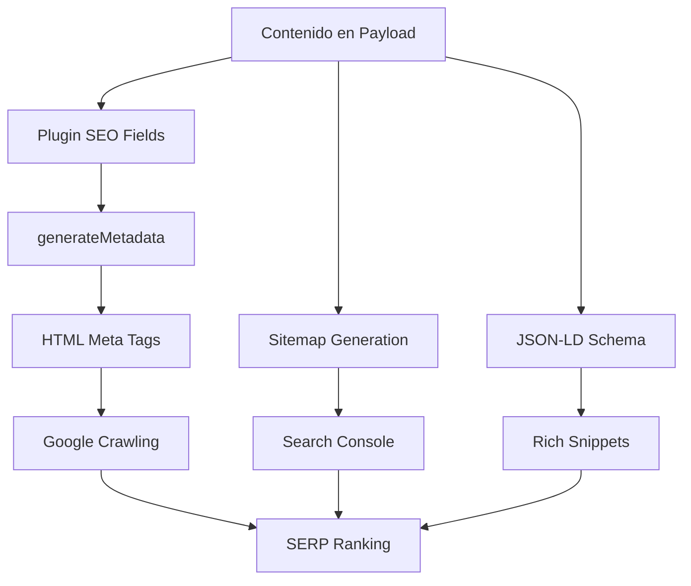

# Guía Completa: SEO y Optimización para Motores de Búsqueda 🔍

## Tabla de Contenido
1. [¿Qué es el Sistema SEO?](#qué-es-el-sistema-seo)
2. [Arquitectura SEO Integral](#arquitectura-seo-integral)
3. [Paso 1: Configuración del Plugin SEO](#paso-1-configuración-del-plugin-seo)
4. [Paso 2: Metadata Dinámico](#paso-2-metadata-dinámico)
5. [Paso 3: Sitemaps Automáticos](#paso-3-sitemaps-automáticos)
6. [Paso 4: Robots.txt y Crawling](#paso-4-robotstxt-y-crawling)
7. [Paso 5: Schema.org y JSON-LD](#paso-5-schemaorg-y-json-ld)
8. [Casos de Uso Avanzados](#casos-de-uso-avanzados)
9. [Optimización de Performance](#optimización-de-performance)
10. [Ejemplos Prácticos](#ejemplos-prácticos)
11. [Troubleshooting y Monitoreo](#troubleshooting-y-monitoreo)

---

## ¿Qué es el Sistema SEO?

### Definición
El **Sistema SEO** optimiza automáticamente el contenido para motores de búsqueda, generando metadata, sitemaps, structured data y configuraciones que mejoran el posicionamiento y la visibilidad en Google y otros buscadores.

### Problemas que Resuelve
- **Visibilidad**: Mejora el ranking en resultados de búsqueda
- **Automatización**: Genera metadata sin intervención manual
- **Structured Data**: Rich snippets para mejor presentación
- **Performance**: Optimizaciones técnicas para Core Web Vitals
- **Mantenimiento**: Sistema centralizado y escalable

### Flujo Completo del Sistema



---

## Arquitectura SEO Integral

### Componentes Principales

1. **@payloadcms/plugin-seo**: Plugin oficial para campos SEO
2. **generateMetadata**: Función Next.js para metadata dinámico
3. **Sitemap Generator**: Sistema automático de sitemaps
4. **Robots.txt**: Configuración de crawling
5. **JSON-LD Generator**: Structured data automático
6. **Image Optimization**: Optimización para rendimiento

### Estado Actual vs Planificado

#### ✅ **Implementado**
- `@payloadcms/plugin-seo` fields para páginas
- `generateMetadata` para páginas dinámicas + granjas
- `sitemap.ts` agrega entradas estáticas + dinámicas
- `robots.txt` route referenciando sitemap
- URLs canónicas vía `alternates.canonical`

#### 🚀 **Planificado**
- JSON-LD para granjas/productos
- hreflang / i18n
- División de sitemaps grandes
- Core Web Vitals optimization
- Advanced schema markup

---

## Paso 1: Configuración del Plugin SEO

### 1.1 Instalación y Configuración Base

**Archivo**: `src/payload.config.ts`

```typescript
import { seoPlugin } from '@payloadcms/plugin-seo'
import { buildConfig } from 'payload'

export default buildConfig({
  plugins: [
    seoPlugin({
      collections: [
        'pages',
        'products', 
        'farms',
        'posts' // Si tienes blog
      ],
      globals: [
        'home',
        'header',
        'footer'
      ],
      uploadsCollection: 'media',
      generateTitle: ({ doc }) => {
        // Generar título automático si no se especifica
        return doc?.title || doc?.name || 'Farmshop Finder'
      },
      generateDescription: ({ doc }) => {
        // Generar descripción automática
        if (doc?.excerpt) return doc.excerpt
        if (doc?.description) return doc.description
        if (doc?.content) {
          // Extraer texto plano del contenido rico
          return extractTextFromRichText(doc.content).substring(0, 160)
        }
        return 'Discover local farmers and fresh products in your area'
      },
      generateImage: ({ doc }) => {
        // Usar imagen principal como imagen SEO
        return doc?.featuredImage || doc?.image || doc?.images?.[0]
      },
      generateURL: ({ doc, collection }) => {
        const baseUrl = process.env.NEXT_PUBLIC_BASE_URL || 'https://farmshop-finder.com'
        
        switch (collection.slug) {
          case 'products':
            return `${baseUrl}/products/${doc.slug}`
          case 'farms':
            return `${baseUrl}/farms/${doc.slug}`
          case 'pages':
            return doc.slug === 'home' ? baseUrl : `${baseUrl}/${doc.slug}`
          default:
            return `${baseUrl}/${collection.slug}/${doc.slug}`
        }
      }
    })
  ],
  // ... resto de configuración
})

// Utility para extraer texto de RichText
function extractTextFromRichText(richText: any): string {
  if (!richText || !richText.root || !richText.root.children) {
    return ''
  }
  
  const extractText = (nodes: any[]): string => {
    return nodes.map(node => {
      if (node.type === 'text') {
        return node.text || ''
      }
      if (node.children) {
        return extractText(node.children)
      }
      return ''
    }).join(' ')
  }
  
  return extractText(richText.root.children).trim()
}
```

### 1.2 Configuración Avanzada por Collection

**Archivo**: `src/collections/Products.ts`

```typescript
import type { CollectionConfig } from 'payload'
import { seoPlugin } from '@payloadcms/plugin-seo'

export const Products: CollectionConfig = {
  slug: 'products',
  fields: [
    {
      name: 'name',
      type: 'text',
      required: true,
    },
    {
      name: 'description',
      type: 'textarea',
      required: true,
      admin: {
        description: 'También se usa para meta description si no se especifica en SEO'
      }
    },
    {
      name: 'price',
      type: 'number',
      required: true,
    },
    {
      name: 'images',
      type: 'array',
      fields: [
        {
          name: 'image',
          type: 'upload',
          relationTo: 'media',
          required: true,
        }
      ],
      minRows: 1,
    },
    {
      name: 'category',
      type: 'select',
      options: [
        { label: 'Vegetables', value: 'vegetables' },
        { label: 'Fruits', value: 'fruits' },
        { label: 'Dairy', value: 'dairy' },
        { label: 'Meat', value: 'meat' }
      ]
    },
    {
      name: 'farm',
      type: 'relationship',
      relationTo: 'farms',
      required: true,
    },
    // El plugin SEO agregará automáticamente:
    // - meta.title
    // - meta.description  
    // - meta.image
    // - meta.keywords
  ]
}
```

### 1.3 SEO para Collections Específicas

**Archivo**: `src/collections/Farms.ts`

```typescript
export const Farms: CollectionConfig = {
  slug: 'farms',
  fields: [
    {
      name: 'name',
      type: 'text',
      required: true,
    },
    {
      name: 'description',
      type: 'richText',
      required: true,
    },
    {
      name: 'location',
      type: 'group',
      fields: [
        {
          name: 'address',
          type: 'text',
          required: true,
        },
        {
          name: 'city',
          type: 'text',
          required: true,
        },
        {
          name: 'state',
          type: 'text',
          required: true,
        }
      ]
    },
    {
      name: 'featuredImage',
      type: 'upload',
      relationTo: 'media',
      required: true,
    },
    // Campos SEO adicionales específicos para granjas
    {
      name: 'seoKeywords',
      type: 'text',
      admin: {
        description: 'Palabras clave específicas para esta granja (ej: "granja orgánica madrid")'
      }
    }
  ],
  hooks: {
    beforeValidate: [
      ({ data }) => {
        // Auto-generar keywords basadas en ubicación y productos
        if (!data.seoKeywords && data.location) {
          const keywords = [
            'granja local',
            data.location.city?.toLowerCase(),
            data.location.state?.toLowerCase(),
            'productos frescos',
            'orgánico'
          ].filter(Boolean).join(', ')
          
          data.seoKeywords = keywords
        }
      }
    ]
  }
}
```

**¿Por qué esta configuración?**
- **Automatización**: Genera metadata sin intervención manual
- **Flexibilidad**: Permite override manual cuando sea necesario
- **Consistencia**: Mismos patrones SEO en todas las collections
- **Performance**: Optimizaciones automáticas de imágenes

---

## Paso 2: Metadata Dinámico

### 2.1 Metadata para Páginas de Producto

**Archivo**: `src/app/(frontend)/products/[slug]/page.tsx`

```tsx
import React from 'react'
import { Metadata } from 'next'
import { getPayload } from 'payload'
import config from '../../../../../payload.config'

interface ProductPageProps {
  params: { slug: string }
}

export async function generateMetadata({ params }: ProductPageProps): Promise<Metadata> {
  const payload = await getPayload({ config })
  
  const product = await payload.find({
    collection: 'products',
    where: { slug: { equals: params.slug } },
    limit: 1,
    depth: 2 // Incluir relaciones
  })

  if (!product.docs.length) {
    return {
      title: 'Product Not Found | Farmshop Finder',
      description: 'The requested product could not be found.',
      robots: { index: false, follow: false }
    }
  }

  const productData = product.docs[0]
  const farm = productData.farm
  
  // Usar datos SEO del plugin o generar automáticamente
  const title = productData.meta?.title || 
    `${productData.name} - Fresh from ${farm.name} | Farmshop Finder`
  
  const description = productData.meta?.description || 
    `${productData.description} Available fresh from ${farm.name} in ${farm.location?.city}. Order now for local delivery.`

  // Construir structured data para producto
  const structuredData = {
    "@context": "https://schema.org",
    "@type": "Product",
    "name": productData.name,
    "description": productData.description,
    "image": productData.images?.map(img => 
      typeof img.image === 'object' ? img.image.url : ''
    ).filter(Boolean),
    "offers": {
      "@type": "Offer",
      "price": productData.price,
      "priceCurrency": "USD",
      "availability": productData.inStock ? "InStock" : "OutOfStock",
      "seller": {
        "@type": "Organization",
        "name": farm.name,
        "address": {
          "@type": "PostalAddress",
          "addressLocality": farm.location?.city,
          "addressRegion": farm.location?.state,
          "streetAddress": farm.location?.address
        }
      }
    },
    "brand": {
      "@type": "Brand",
      "name": farm.name
    },
    "category": productData.category,
    "aggregateRating": productData.reviews?.length ? {
      "@type": "AggregateRating",
      "ratingValue": calculateAverageRating(productData.reviews),
      "reviewCount": productData.reviews.length
    } : undefined
  }

  return {
    title,
    description,
    keywords: productData.meta?.keywords || [
      productData.name,
      productData.category,
      'fresh',
      'local',
      farm.location?.city,
      'organic'
    ].filter(Boolean).join(', '),
    
    // Open Graph
    openGraph: {
      title,
      description,
      type: 'website',
      url: `${process.env.NEXT_PUBLIC_BASE_URL}/products/${params.slug}`,
      images: productData.images?.map(img => ({
        url: typeof img.image === 'object' ? img.image.url || '' : '',
        width: 1200,
        height: 630,
        alt: productData.name,
      })).filter(img => img.url) || [],
      siteName: 'Farmshop Finder'
    },
    
    // Twitter Card
    twitter: {
      card: 'summary_large_image',
      title,
      description,
      images: productData.images?.[0] ? 
        [typeof productData.images[0].image === 'object' ? 
          productData.images[0].image.url || '' : ''] : [],
      creator: '@farmshopfinder'
    },
    
    // Canonical URL
    alternates: {
      canonical: `${process.env.NEXT_PUBLIC_BASE_URL}/products/${params.slug}`
    },
    
    // Robots
    robots: {
      index: true,
      follow: true,
      googleBot: {
        index: true,
        follow: true,
        'max-image-preview': 'large',
        'max-snippet': -1,
        'max-video-preview': -1,
      }
    },
    
    // Structured Data
    other: {
      'application/ld+json': JSON.stringify(structuredData)
    }
  }
}

function calculateAverageRating(reviews: any[]): number {
  if (!reviews.length) return 0
  const sum = reviews.reduce((acc, review) => acc + (review.rating || 0), 0)
  return sum / reviews.length
}

export default async function ProductPage({ params }: ProductPageProps) {
  // ... implementación del componente
}
```

### 2.2 Metadata para Páginas de Granja

**Archivo**: `src/app/(frontend)/farms/[slug]/page.tsx`

```tsx
export async function generateMetadata({ params }: { params: { slug: string } }): Promise<Metadata> {
  const payload = await getPayload({ config })
  
  const farm = await payload.find({
    collection: 'farms',
    where: { slug: { equals: params.slug } },
    limit: 1,
    depth: 1
  })

  if (!farm.docs.length) {
    return {
      title: 'Farm Not Found | Farmshop Finder',
      robots: { index: false, follow: false }
    }
  }

  const farmData = farm.docs[0]
  
  const title = farmData.meta?.title || 
    `${farmData.name} - Local Farm in ${farmData.location?.city} | Farmshop Finder`
  
  const description = farmData.meta?.description || 
    `Visit ${farmData.name}, a local farm in ${farmData.location?.city}, ${farmData.location?.state}. Fresh, local products available for delivery.`

  // Structured data para LocalBusiness
  const structuredData = {
    "@context": "https://schema.org",
    "@type": "LocalBusiness",
    "@id": `${process.env.NEXT_PUBLIC_BASE_URL}/farms/${params.slug}`,
    "name": farmData.name,
    "description": extractTextFromRichText(farmData.description),
    "image": farmData.featuredImage?.url,
    "address": {
      "@type": "PostalAddress",
      "streetAddress": farmData.location?.address,
      "addressLocality": farmData.location?.city,
      "addressRegion": farmData.location?.state,
      "postalCode": farmData.location?.zipCode,
      "addressCountry": "US"
    },
    "geo": farmData.coordinates ? {
      "@type": "GeoCoordinates",
      "latitude": farmData.coordinates.lat,
      "longitude": farmData.coordinates.lng
    } : undefined,
    "url": `${process.env.NEXT_PUBLIC_BASE_URL}/farms/${params.slug}`,
    "sameAs": [
      farmData.socialMedia?.facebook,
      farmData.socialMedia?.instagram,
      farmData.website
    ].filter(Boolean),
    "openingHours": farmData.hours || undefined,
    "priceRange": farmData.priceRange || "$",
    "aggregateRating": farmData.reviews?.length ? {
      "@type": "AggregateRating",
      "ratingValue": calculateAverageRating(farmData.reviews),
      "reviewCount": farmData.reviews.length
    } : undefined
  }

  return {
    title,
    description,
    keywords: [
      farmData.name,
      farmData.location?.city,
      farmData.location?.state,
      'local farm',
      'fresh produce',
      'organic',
      ...(farmData.seoKeywords?.split(',') || [])
    ].join(', '),
    
    openGraph: {
      title,
      description,
      type: 'place',
      url: `${process.env.NEXT_PUBLIC_BASE_URL}/farms/${params.slug}`,
      images: farmData.featuredImage ? [{
        url: farmData.featuredImage.url,
        width: 1200,
        height: 630,
        alt: farmData.name,
      }] : [],
      siteName: 'Farmshop Finder'
    },
    
    alternates: {
      canonical: `${process.env.NEXT_PUBLIC_BASE_URL}/farms/${params.slug}`
    },
    
    other: {
      'application/ld+json': JSON.stringify(structuredData)
    }
  }
}
```

### 2.3 Metadata para Homepage

**Archivo**: `src/app/(frontend)/page.tsx`

```tsx
export const metadata: Metadata = {
  title: 'Find Local Fresh Products | Farmshop Finder',
  description: 'Discover local farmers and fresh products in your area. Connect directly with producers for the freshest ingredients and support your local community.',
  keywords: 'local farmers, fresh products, organic food, farm to table, local produce, farmers market, fresh vegetables, local delivery',
  
  openGraph: {
    title: 'Farmshop Finder - Find Local Fresh Products',
    description: 'Discover local farmers and fresh products in your area',
    type: 'website',
    url: process.env.NEXT_PUBLIC_BASE_URL,
    images: [
      {
        url: `${process.env.NEXT_PUBLIC_BASE_URL}/og-image.jpg`,
        width: 1200,
        height: 630,
        alt: 'Farmshop Finder - Local Fresh Products',
      }
    ],
    siteName: 'Farmshop Finder'
  },
  
  twitter: {
    card: 'summary_large_image',
    title: 'Farmshop Finder - Find Local Fresh Products',
    description: 'Discover local farmers and fresh products in your area',
    images: [`${process.env.NEXT_PUBLIC_BASE_URL}/og-image.jpg`],
    creator: '@farmshopfinder'
  },
  
  alternates: {
    canonical: process.env.NEXT_PUBLIC_BASE_URL
  },
  
  robots: {
    index: true,
    follow: true,
    googleBot: {
      index: true,
      follow: true,
      'max-image-preview': 'large',
      'max-snippet': -1,
      'max-video-preview': -1,
    }
  },
  
  // Structured data para Organization
  other: {
    'application/ld+json': JSON.stringify({
      "@context": "https://schema.org",
      "@type": "Organization",
      "name": "Farmshop Finder",
      "url": process.env.NEXT_PUBLIC_BASE_URL,
      "logo": `${process.env.NEXT_PUBLIC_BASE_URL}/logo.png`,
      "description": "Platform connecting consumers with local farmers and fresh products",
      "sameAs": [
        "https://facebook.com/farmshopfinder",
        "https://instagram.com/farmshopfinder",
        "https://twitter.com/farmshopfinder"
      ]
    })
  }
}
```

**¿Por qué metadata tan detallado?**
- **Rich Snippets**: Structured data genera resultados enriquecidos
- **Social Sharing**: Open Graph optimiza compartir en redes sociales
- **Mobile**: Twitter Cards mejoran la experiencia móvil
- **Crawling**: Robots meta guía a los motores de búsqueda

---

## Paso 3: Sitemaps Automáticos

### 3.1 Sitemap Principal

**Archivo**: `src/app/sitemap.ts`

```typescript
import { MetadataRoute } from 'next'
import { getPayload } from 'payload'
import config from '../payload.config'

export default async function sitemap(): Promise<MetadataRoute.Sitemap> {
  const payload = await getPayload({ config })
  const baseUrl = process.env.NEXT_PUBLIC_BASE_URL || 'https://farmshop-finder.com'
  
  // URLs estáticas
  const staticUrls: MetadataRoute.Sitemap = [
    {
      url: baseUrl,
      lastModified: new Date(),
      changeFrequency: 'daily',
      priority: 1,
    },
    {
      url: `${baseUrl}/products`,
      lastModified: new Date(),
      changeFrequency: 'daily',
      priority: 0.9,
    },
    {
      url: `${baseUrl}/farms`,
      lastModified: new Date(),
      changeFrequency: 'daily',
      priority: 0.9,
    },
    {
      url: `${baseUrl}/about`,
      lastModified: new Date(),
      changeFrequency: 'monthly',
      priority: 0.5,
    },
    {
      url: `${baseUrl}/contact`,
      lastModified: new Date(),
      changeFrequency: 'monthly',
      priority: 0.5,
    }
  ]

  // Obtener todas las páginas dinámicas
  const [products, farms, pages] = await Promise.all([
    payload.find({
      collection: 'products',
      limit: 1000, // Ajustar según necesidad
      where: {
        _status: { equals: 'published' }
      }
    }),
    payload.find({
      collection: 'farms',
      limit: 1000,
      where: {
        _status: { equals: 'published' }
      }
    }),
    payload.find({
      collection: 'pages',
      limit: 100,
      where: {
        _status: { equals: 'published' }
      }
    })
  ])

  // URLs de productos
  const productUrls: MetadataRoute.Sitemap = products.docs.map((product) => ({
    url: `${baseUrl}/products/${product.slug}`,
    lastModified: new Date(product.updatedAt),
    changeFrequency: 'weekly',
    priority: 0.8,
  }))

  // URLs de granjas
  const farmUrls: MetadataRoute.Sitemap = farms.docs.map((farm) => ({
    url: `${baseUrl}/farms/${farm.slug}`,
    lastModified: new Date(farm.updatedAt),
    changeFrequency: 'weekly',
    priority: 0.8,
  }))

  // URLs de páginas
  const pageUrls: MetadataRoute.Sitemap = pages.docs
    .filter(page => page.slug !== 'home') // Homepage ya está en static
    .map((page) => ({
      url: `${baseUrl}/${page.slug}`,
      lastModified: new Date(page.updatedAt),
      changeFrequency: 'monthly',
      priority: 0.6,
    }))

  return [...staticUrls, ...productUrls, ...farmUrls, ...pageUrls]
}
```

### 3.2 Sitemap de Imágenes

**Archivo**: `src/app/sitemap-images.ts`

```typescript
import { MetadataRoute } from 'next'
import { getPayload } from 'payload'
import config from '../payload.config'

export default async function sitemapImages(): Promise<MetadataRoute.Sitemap> {
  const payload = await getPayload({ config })
  const baseUrl = process.env.NEXT_PUBLIC_BASE_URL || 'https://farmshop-finder.com'

  // Obtener productos con imágenes
  const products = await payload.find({
    collection: 'products',
    limit: 1000,
    where: {
      _status: { equals: 'published' },
      images: { exists: true }
    },
    depth: 2
  })

  const imageUrls: MetadataRoute.Sitemap = []

  products.docs.forEach((product) => {
    if (product.images?.length) {
      product.images.forEach((img: any, index: number) => {
        if (typeof img.image === 'object' && img.image.url) {
          imageUrls.push({
            url: `${baseUrl}/products/${product.slug}#image-${index}`,
            lastModified: new Date(product.updatedAt),
            changeFrequency: 'weekly',
            priority: 0.7,
            images: [
              {
                url: img.image.url,
                caption: img.image.alt || product.name,
                title: product.name,
                geoLocation: product.farm?.location ? 
                  `${product.farm.location.city}, ${product.farm.location.state}` : undefined
              }
            ]
          })
        }
      })
    }
  })

  return imageUrls
}
```

### 3.3 Sitemap Index (para sitios grandes)

**Archivo**: `src/app/sitemap-index.ts`

```typescript
import { MetadataRoute } from 'next'

export default function sitemapIndex(): MetadataRoute.Sitemap {
  const baseUrl = process.env.NEXT_PUBLIC_BASE_URL || 'https://farmshop-finder.com'
  
  return [
    {
      url: `${baseUrl}/sitemap.xml`,
      lastModified: new Date(),
    },
    {
      url: `${baseUrl}/sitemap-products.xml`,
      lastModified: new Date(),
    },
    {
      url: `${baseUrl}/sitemap-farms.xml`,
      lastModified: new Date(),
    },
    {
      url: `${baseUrl}/sitemap-images.xml`,
      lastModified: new Date(),
    }
  ]
}
```

**¿Por qué múltiples sitemaps?**
- **Performance**: Sitemaps más pequeños se procesan más rápido
- **Organización**: Fácil identificar qué contenido está indexado
- **Límites**: Google recomienda máximo 50,000 URLs por sitemap
- **Actualización**: Permite regenerar solo las secciones que cambiaron

---

## Paso 4: Robots.txt y Crawling

### 4.1 Robots.txt Dinámico

**Archivo**: `src/app/robots.ts`

```typescript
import { MetadataRoute } from 'next'

export default function robots(): MetadataRoute.Robots {
  const baseUrl = process.env.NEXT_PUBLIC_BASE_URL || 'https://farmshop-finder.com'
  
  return {
    rules: [
      {
        userAgent: '*',
        allow: [
          '/',
          '/products/',
          '/farms/',
          '/about',
          '/contact'
        ],
        disallow: [
          '/admin/',
          '/dashboard/',
          '/api/',
          '/auth/',
          '/_next/',
          '/temp/',
          '/*.json$',
          '/search?*' // Evitar indexar páginas de búsqueda con parámetros
        ],
        crawlDelay: 1 // 1 segundo entre requests
      },
      {
        userAgent: 'Googlebot',
        allow: '/',
        disallow: [
          '/admin/',
          '/dashboard/',
          '/api/',
          '/auth/'
        ],
        crawlDelay: 0.5 // Googlebot puede ir más rápido
      },
      {
        userAgent: 'Bingbot',
        allow: '/',
        disallow: [
          '/admin/',
          '/dashboard/',
          '/api/',
          '/auth/'
        ],
        crawlDelay: 1
      }
    ],
    sitemap: [
      `${baseUrl}/sitemap.xml`,
      `${baseUrl}/sitemap-products.xml`,
      `${baseUrl}/sitemap-farms.xml`,
      `${baseUrl}/sitemap-images.xml`
    ],
    host: baseUrl
  }
}
```

### 4.2 Headers SEO en Next.js Config

**Archivo**: `next.config.mjs`

```javascript
/** @type {import('next').NextConfig} */
const nextConfig = {
  async headers() {
    return [
      {
        source: '/(.*)',
        headers: [
          {
            key: 'X-DNS-Prefetch-Control',
            value: 'on'
          },
          {
            key: 'X-XSS-Protection',
            value: '1; mode=block'
          },
          {
            key: 'X-Frame-Options',
            value: 'SAMEORIGIN'
          },
          {
            key: 'X-Content-Type-Options',
            value: 'nosniff'
          },
          {
            key: 'Referrer-Policy',
            value: 'origin-when-cross-origin'
          }
        ]
      },
      // Headers específicos para imágenes
      {
        source: '/media/(.*)',
        headers: [
          {
            key: 'Cache-Control',
            value: 'public, max-age=31536000, immutable'
          }
        ]
      }
    ]
  },
  
  // Optimizaciones de imágenes
  images: {
    formats: ['image/webp', 'image/avif'],
    deviceSizes: [640, 750, 828, 1080, 1200, 1920, 2048, 3840],
    imageSizes: [16, 32, 48, 64, 96, 128, 256, 384],
    dangerouslyAllowSVG: true,
    contentSecurityPolicy: "default-src 'self'; script-src 'none'; sandbox;",
  }
}

export default nextConfig
```

### 4.3 Configuración de Crawling Budget

```typescript
// src/lib/seoOptimizations.ts
export const SEO_CONFIG = {
  // Limitar crawling en desarrollo
  isDevelopment: process.env.NODE_ENV === 'development',
  
  // Configuración de cache
  cacheHeaders: {
    static: 'public, max-age=31536000, immutable',
    dynamic: 'public, max-age=3600, stale-while-revalidate=86400',
    api: 'public, max-age=300, stale-while-revalidate=600'
  },
  
  // Configuración de prioridades
  sitemap: {
    priorities: {
      homepage: 1.0,
      mainCategories: 0.9,
      products: 0.8,
      farms: 0.8,
      staticPages: 0.6,
      blog: 0.7
    },
    changeFrequencies: {
      homepage: 'daily',
      products: 'weekly',
      farms: 'weekly',
      staticPages: 'monthly',
      blog: 'weekly'
    }
  }
}
```

**¿Por qué configuración tan específica?**
- **Crawl Budget**: Optimiza cómo Google usa su presupuesto de crawling
- **Performance**: Headers de cache mejoran Core Web Vitals
- **Seguridad**: Headers de seguridad mejoran confianza del usuario
- **Priorización**: Guía a buscadores hacia contenido más importante

---

## Paso 5: Schema.org y JSON-LD

### 5.1 Schema para E-commerce

**Archivo**: `src/lib/schema/product.ts`

```typescript
import { Product, Farm } from '../../payload-types'

export function generateProductSchema(product: Product, farm: Farm) {
  return {
    "@context": "https://schema.org",
    "@type": "Product",
    "@id": `${process.env.NEXT_PUBLIC_BASE_URL}/products/${product.slug}`,
    "name": product.name,
    "description": product.description,
    "image": product.images?.map(img => 
      typeof img.image === 'object' ? img.image.url : ''
    ).filter(Boolean),
    "brand": {
      "@type": "Brand",
      "name": farm.name,
      "@id": `${process.env.NEXT_PUBLIC_BASE_URL}/farms/${farm.slug}`
    },
    "manufacturer": {
      "@type": "Organization",
      "name": farm.name,
      "address": {
        "@type": "PostalAddress",
        "streetAddress": farm.location?.address,
        "addressLocality": farm.location?.city,
        "addressRegion": farm.location?.state,
        "postalCode": farm.location?.zipCode,
        "addressCountry": "US"
      }
    },
    "offers": {
      "@type": "Offer",
      "price": product.price,
      "priceCurrency": "USD",
      "availability": product.inStock ? 
        "https://schema.org/InStock" : 
        "https://schema.org/OutOfStock",
      "seller": {
        "@type": "Organization",
        "name": farm.name
      },
      "priceValidUntil": new Date(Date.now() + 30 * 24 * 60 * 60 * 1000).toISOString(), // 30 días
      "itemCondition": "https://schema.org/NewCondition",
      "shippingDetails": {
        "@type": "OfferShippingDetails",
        "shippingRate": {
          "@type": "MonetaryAmount",
          "value": product.shippingCost || 0,
          "currency": "USD"
        },
        "deliveryTime": {
          "@type": "ShippingDeliveryTime",
          "handlingTime": {
            "@type": "QuantitativeValue",
            "minValue": 1,
            "maxValue": 2,
            "unitCode": "DAY"
          },
          "transitTime": {
            "@type": "QuantitativeValue",
            "minValue": 1,
            "maxValue": 3,
            "unitCode": "DAY"
          }
        }
      }
    },
    "category": product.category,
    "gtin": product.gtin || undefined,
    "mpn": product.mpn || undefined,
    "weight": product.weight ? {
      "@type": "QuantitativeValue",
      "value": product.weight,
      "unitCode": product.weightUnit || "LB"
    } : undefined,
    "nutritionInformation": product.nutrition ? {
      "@type": "NutritionInformation",
      "calories": product.nutrition.calories,
      "fatContent": product.nutrition.fat,
      "proteinContent": product.nutrition.protein,
      "carbohydrateContent": product.nutrition.carbs
    } : undefined,
    "aggregateRating": product.reviews?.length ? {
      "@type": "AggregateRating",
      "ratingValue": calculateAverageRating(product.reviews),
      "ratingCount": product.reviews.length,
      "bestRating": 5,
      "worstRating": 1
    } : undefined,
    "review": product.reviews?.map(review => ({
      "@type": "Review",
      "author": {
        "@type": "Person",
        "name": review.author?.name || "Anonymous"
      },
      "reviewRating": {
        "@type": "Rating",
        "ratingValue": review.rating,
        "bestRating": 5,
        "worstRating": 1
      },
      "reviewBody": review.comment,
      "datePublished": review.createdAt
    }))
  }
}
```

### 5.2 Schema para Local Business

**Archivo**: `src/lib/schema/farm.ts`

```typescript
export function generateFarmSchema(farm: Farm) {
  return {
    "@context": "https://schema.org",
    "@type": "LocalBusiness",
    "@id": `${process.env.NEXT_PUBLIC_BASE_URL}/farms/${farm.slug}`,
    "name": farm.name,
    "description": extractTextFromRichText(farm.description),
    "image": farm.featuredImage?.url,
    "address": {
      "@type": "PostalAddress",
      "streetAddress": farm.location?.address,
      "addressLocality": farm.location?.city,
      "addressRegion": farm.location?.state,
      "postalCode": farm.location?.zipCode,
      "addressCountry": "US"
    },
    "geo": farm.coordinates ? {
      "@type": "GeoCoordinates",
      "latitude": farm.coordinates.lat,
      "longitude": farm.coordinates.lng
    } : undefined,
    "url": `${process.env.NEXT_PUBLIC_BASE_URL}/farms/${farm.slug}`,
    "telephone": farm.phone,
    "email": farm.email,
    "sameAs": [
      farm.socialMedia?.facebook,
      farm.socialMedia?.instagram,
      farm.website
    ].filter(Boolean),
    "openingHours": farm.hours || [
      "Mo-Fr 08:00-17:00",
      "Sa 08:00-14:00"
    ],
    "priceRange": farm.priceRange || "$",
    "paymentAccepted": ["Cash", "Credit Card", "Debit Card"],
    "currenciesAccepted": "USD",
    "areaServed": {
      "@type": "GeoCircle",
      "geoMidpoint": {
        "@type": "GeoCoordinates",
        "latitude": farm.coordinates?.lat,
        "longitude": farm.coordinates?.lng
      },
      "geoRadius": farm.deliveryRadius || 25000 // metros
    },
    "makesOffer": farm.products?.map(product => ({
      "@type": "Offer",
      "itemOffered": {
        "@type": "Product",
        "name": product.name,
        "category": product.category
      }
    })),
    "aggregateRating": farm.reviews?.length ? {
      "@type": "AggregateRating",
      "ratingValue": calculateAverageRating(farm.reviews),
      "ratingCount": farm.reviews.length,
      "bestRating": 5,
      "worstRating": 1
    } : undefined,
    "potentialAction": {
      "@type": "OrderAction",
      "target": {
        "@type": "EntryPoint",
        "urlTemplate": `${process.env.NEXT_PUBLIC_BASE_URL}/farms/${farm.slug}/order`,
        "inLanguage": "en-US",
        "actionPlatform": [
          "http://schema.org/DesktopWebPlatform",
          "http://schema.org/MobileWebPlatform"
        ]
      },
      "deliveryMethod": [
        "http://purl.org/goodrelations/v1#DeliveryModePickup",
        "http://purl.org/goodrelations/v1#DeliveryModeDirectDownload"
      ]
    }
  }
}
```

### 5.3 Schema para Breadcrumbs

**Archivo**: `src/lib/schema/breadcrumbs.ts`

```typescript
interface BreadcrumbItem {
  name: string
  url: string
}

export function generateBreadcrumbSchema(items: BreadcrumbItem[]) {
  return {
    "@context": "https://schema.org",
    "@type": "BreadcrumbList",
    "itemListElement": items.map((item, index) => ({
      "@type": "ListItem",
      "position": index + 1,
      "name": item.name,
      "item": item.url
    }))
  }
}

// Uso en página de producto
export function getProductBreadcrumbs(product: Product, farm: Farm): BreadcrumbItem[] {
  return [
    {
      name: "Home",
      url: process.env.NEXT_PUBLIC_BASE_URL!
    },
    {
      name: "Products",
      url: `${process.env.NEXT_PUBLIC_BASE_URL}/products`
    },
    {
      name: product.category,
      url: `${process.env.NEXT_PUBLIC_BASE_URL}/products?category=${product.category}`
    },
    {
      name: product.name,
      url: `${process.env.NEXT_PUBLIC_BASE_URL}/products/${product.slug}`
    }
  ]
}
```

**¿Por qué Schema.org tan detallado?**
- **Rich Snippets**: Resultados más atractivos en Google
- **Voice Search**: Mejor comprensión para asistentes de voz
- **Knowledge Graph**: Posibilidad de aparecer en panel de conocimiento
- **Local SEO**: Esencial para búsquedas locales

---

## Casos de Uso Avanzados

### 6.1 SEO Multiidioma

```typescript
// src/app/[locale]/layout.tsx para i18n
import { Metadata } from 'next'

interface LocaleLayoutProps {
  children: React.ReactNode
  params: { locale: string }
}

export async function generateMetadata({ params }: { params: { locale: string } }): Promise<Metadata> {
  const baseUrl = process.env.NEXT_PUBLIC_BASE_URL
  
  return {
    alternates: {
      canonical: `${baseUrl}/${params.locale}`,
      languages: {
        'en-US': `${baseUrl}/en`,
        'es-ES': `${baseUrl}/es`,
        'fr-FR': `${baseUrl}/fr`,
        'x-default': `${baseUrl}/en`
      }
    },
    openGraph: {
      locale: params.locale,
      alternateLocale: ['en-US', 'es-ES', 'fr-FR']
    }
  }
}
```

### 6.2 SEO A/B Testing

```typescript
// src/lib/seoTesting.ts
export function getSEOVariant(pathname: string): 'control' | 'variant' {
  // Simple hash para consistencia
  const hash = pathname.split('').reduce((a, b) => {
    a = ((a << 5) - a) + b.charCodeAt(0)
    return a & a
  }, 0)
  
  return Math.abs(hash) % 100 < 50 ? 'control' : 'variant'
}

export function getTestTitle(baseTitle: string, pathname: string): string {
  const variant = getSEOVariant(pathname)
  
  if (variant === 'variant') {
    return `${baseTitle} - Buy Local, Fresh & Organic`
  }
  
  return baseTitle
}
```

### 6.3 SEO Analytics y Tracking

```typescript
// src/lib/seoAnalytics.ts
export function trackSEOEvent(event: string, data: any) {
  // Google Analytics 4
  if (typeof gtag !== 'undefined') {
    gtag('event', event, {
      event_category: 'SEO',
      event_label: data.page || window.location.pathname,
      custom_parameter_1: data.title,
      custom_parameter_2: data.meta_description
    })
  }
  
  // Search Console API (para datos avanzados)
  if (process.env.NODE_ENV === 'production') {
    fetch('/api/seo-analytics', {
      method: 'POST',
      headers: { 'Content-Type': 'application/json' },
      body: JSON.stringify({
        event,
        data,
        timestamp: new Date().toISOString(),
        url: window.location.href
      })
    }).catch(console.error)
  }
}
```

---

## Optimización de Performance

### 7.1 Core Web Vitals

```typescript
// src/lib/webVitals.ts
import { getCLS, getFID, getFCP, getLCP, getTTFB } from 'web-vitals'

export function trackWebVitals() {
  getCLS(console.log)
  getFID(console.log)
  getFCP(console.log)
  getLCP(console.log)
  getTTFB(console.log)
}

// En _app.tsx o layout.tsx
if (typeof window !== 'undefined') {
  trackWebVitals()
}
```

### 7.2 Optimización de Imágenes SEO

```tsx
// src/components/SEOImage.tsx
import Image from 'next/image'
import { Media } from '../payload-types'

interface SEOImageProps {
  media: Media
  alt: string
  priority?: boolean
  sizes?: string
}

export function SEOImage({ media, alt, priority = false, sizes }: SEOImageProps) {
  if (!media?.url) return null
  
  return (
    <Image
      src={media.url}
      alt={alt}
      width={media.width || 800}
      height={media.height || 600}
      priority={priority}
      sizes={sizes || "(max-width: 768px) 100vw, (max-width: 1200px) 50vw, 33vw"}
      style={{
        width: '100%',
        height: 'auto',
      }}
      // SEO optimizations
      quality={85}
      placeholder="blur"
      blurDataURL="data:image/jpeg;base64,/9j/4AAQSkZJRgABAQAAAQABAAD/2wBDAAYEBQYFBAYGBQYHBwYIChAKCgkJChQODwwQFxQYGBcUFhYaHSUfGhsjHBYWICwgIyYnKSopGR8tMC0oMCUoKSj/2wBDAQcHBwoIChMKChMoGhYaKCgoKCgoKCgoKCgoKCgoKCgoKCgoKCgoKCgoKCgoKCgoKCgoKCgoKCgoKCgoKCgoKCj/wAARCAABAAEDASIAAhEBAxEB/8QAFQABAQAAAAAAAAAAAAAAAAAAAAv/xAAhEAACAQMDBQAAAAAAAAAAAAABAgMABAUGIWGRkqGx0f/EABUBAQEAAAAAAAAAAAAAAAAAAAMF/8QAGhEAAgIDAAAAAAAAAAAAAAAAAAECEgMRkf/aAAwDAQACEQMRAD8AltJagyeH0AthI5xdrLcNM91BF5pX2HaH9bcfaSXWGaRmknyJ/9k="
    />
  )
}
```

### 7.3 Caché de Metadata

```typescript
// src/lib/metadataCache.ts
import { LRUCache } from 'lru-cache'

const metadataCache = new LRUCache<string, any>({
  max: 500,
  ttl: 1000 * 60 * 15, // 15 minutos
})

export async function getCachedMetadata(key: string, generator: () => Promise<any>) {
  const cached = metadataCache.get(key)
  if (cached) return cached
  
  const metadata = await generator()
  metadataCache.set(key, metadata)
  return metadata
}
```

---

## Ejemplos Prácticos

### 8.1 Página de Categoría SEO-Optimizada

```tsx
// src/app/(frontend)/products/category/[category]/page.tsx
export async function generateMetadata({ params }: { params: { category: string } }): Promise<Metadata> {
  const payload = await getPayload({ config })
  
  // Obtener información de la categoría
  const products = await payload.find({
    collection: 'products',
    where: { category: { equals: params.category } },
    limit: 10
  })
  
  const categoryNames = {
    vegetables: 'Fresh Vegetables',
    fruits: 'Fresh Fruits',
    dairy: 'Dairy Products',
    meat: 'Fresh Meat'
  }
  
  const categoryName = categoryNames[params.category] || params.category
  const count = products.totalDocs
  
  return {
    title: `${categoryName} - ${count} Fresh Local Products | Farmshop Finder`,
    description: `Discover ${count} fresh ${categoryName.toLowerCase()} from local farmers. Order online for delivery or pickup. Support local agriculture.`,
    
    openGraph: {
      title: `Fresh Local ${categoryName}`,
      description: `${count} ${categoryName.toLowerCase()} available from local farmers`,
      images: products.docs[0]?.images?.[0] ? [products.docs[0].images[0].image.url] : []
    },
    
    other: {
      'application/ld+json': JSON.stringify({
        "@context": "https://schema.org",
        "@type": "CollectionPage",
        "name": categoryName,
        "description": `Fresh ${categoryName.toLowerCase()} from local farmers`,
        "numberOfItems": count,
        "mainEntity": {
          "@type": "ItemList",
          "numberOfItems": count,
          "itemListElement": products.docs.slice(0, 5).map((product, index) => ({
            "@type": "ListItem",
            "position": index + 1,
            "item": {
              "@type": "Product",
              "name": product.name,
              "url": `${process.env.NEXT_PUBLIC_BASE_URL}/products/${product.slug}`
            }
          }))
        }
      })
    }
  }
}
```

### 8.2 Blog SEO con Featured Snippets

```tsx
// src/app/(frontend)/blog/[slug]/page.tsx
export async function generateMetadata({ params }: { params: { slug: string } }): Promise<Metadata> {
  const post = await getPost(params.slug)
  
  // Extraer FAQ del contenido para featured snippets
  const faqs = extractFAQs(post.content)
  
  const schema = {
    "@context": "https://schema.org",
    "@type": "BlogPosting",
    "headline": post.title,
    "author": {
      "@type": "Person",
      "name": post.author.name
    },
    "datePublished": post.publishedAt,
    "dateModified": post.updatedAt,
    "image": post.featuredImage?.url,
    "publisher": {
      "@type": "Organization",
      "name": "Farmshop Finder",
      "logo": `${process.env.NEXT_PUBLIC_BASE_URL}/logo.png`
    },
    "mainEntityOfPage": `${process.env.NEXT_PUBLIC_BASE_URL}/blog/${params.slug}`,
    "articleSection": post.category,
    "keywords": post.tags?.join(', '),
    
    // FAQ Schema para featured snippets
    "mainEntity": faqs.length > 0 ? {
      "@type": "FAQPage",
      "mainEntity": faqs.map(faq => ({
        "@type": "Question",
        "name": faq.question,
        "acceptedAnswer": {
          "@type": "Answer",
          "text": faq.answer
        }
      }))
    } : undefined
  }
  
  return {
    title: post.meta?.title || `${post.title} | Farmshop Finder Blog`,
    description: post.meta?.description || post.excerpt,
    other: {
      'application/ld+json': JSON.stringify(schema)
    }
  }
}
```

---

## Troubleshooting y Monitoreo

### 9.1 Herramientas de Debug SEO

```typescript
// src/lib/seoDebug.ts
export function debugSEO() {
  if (process.env.NODE_ENV !== 'development') return
  
  console.group('🔍 SEO Debug Info')
  
  // Verificar meta tags
  const title = document.querySelector('title')?.textContent
  const description = document.querySelector('meta[name="description"]')?.getAttribute('content')
  const canonical = document.querySelector('link[rel="canonical"]')?.getAttribute('href')
  
  console.log('Title:', title)
  console.log('Description:', description)
  console.log('Canonical:', canonical)
  
  // Verificar structured data
  const schemas = Array.from(document.querySelectorAll('script[type="application/ld+json"]'))
  schemas.forEach((schema, index) => {
    try {
      const data = JSON.parse(schema.textContent || '')
      console.log(`Schema ${index + 1}:`, data)
    } catch (e) {
      console.error(`Invalid schema ${index + 1}:`, e)
    }
  })
  
  console.groupEnd()
}
```

### 9.2 Monitoreo de Performance SEO

```typescript
// src/lib/seoMonitoring.ts
export class SEOMonitor {
  static async checkPageSpeed(url: string) {
    try {
      const response = await fetch(`https://www.googleapis.com/pagespeedinline/v5/runPagespeed?url=${encodeURIComponent(url)}&key=${process.env.PAGESPEED_API_KEY}`)
      const data = await response.json()
      
      return {
        score: data.lighthouseResult.categories.performance.score * 100,
        fcp: data.lighthouseResult.audits['first-contentful-paint'].displayValue,
        lcp: data.lighthouseResult.audits['largest-contentful-paint'].displayValue,
        cls: data.lighthouseResult.audits['cumulative-layout-shift'].displayValue
      }
    } catch (error) {
      console.error('PageSpeed check failed:', error)
      return null
    }
  }
  
  static async validateStructuredData(url: string) {
    // Usar Rich Results Testing Tool API
    try {
      const response = await fetch('https://searchconsole.googleapis.com/v1/urlTestingTools/richResults:run', {
        method: 'POST',
        headers: {
          'Authorization': `Bearer ${process.env.SEARCH_CONSOLE_TOKEN}`,
          'Content-Type': 'application/json'
        },
        body: JSON.stringify({ inspectionUrl: url })
      })
      
      return await response.json()
    } catch (error) {
      console.error('Structured data validation failed:', error)
      return null
    }
  }
}
```

### 9.3 Alertas SEO Automáticas

```typescript
// src/lib/seoAlerts.ts
export async function checkSEOHealth() {
  const issues = []
  
  // Verificar sitemaps
  try {
    const sitemapResponse = await fetch(`${process.env.NEXT_PUBLIC_BASE_URL}/sitemap.xml`)
    if (!sitemapResponse.ok) {
      issues.push('Sitemap not accessible')
    }
  } catch (error) {
    issues.push('Sitemap check failed')
  }
  
  // Verificar robots.txt
  try {
    const robotsResponse = await fetch(`${process.env.NEXT_PUBLIC_BASE_URL}/robots.txt`)
    if (!robotsResponse.ok) {
      issues.push('Robots.txt not accessible')
    }
  } catch (error) {
    issues.push('Robots.txt check failed')
  }
  
  // Enviar alertas si hay problemas
  if (issues.length > 0) {
    await fetch('/api/seo-alerts', {
      method: 'POST',
      headers: { 'Content-Type': 'application/json' },
      body: JSON.stringify({ issues, timestamp: new Date().toISOString() })
    })
  }
  
  return issues
}
```

---

## Siguiente Paso

Después de implementar el sistema SEO completo:

1. **[21-UI-HeroUI-Guide.md](./21-UI-HeroUI-Guide.md)**: Sistema de componentes UI avanzado
2. **[23-Auth-Advanced-Guide.md](./23-Auth-Advanced-Guide.md)**: Sistema de autenticación avanzado
3. **[Performance-Optimization-Guide.md](./Performance-Optimization-Guide.md)**: Optimización general del sistema
4. **[Analytics-SEO-Monitoring.md](./Analytics-SEO-Monitoring.md)**: Monitoreo y análisis avanzado

---

*Este sistema SEO proporciona una base sólida para la optimización en motores de búsqueda, con automatización inteligente y monitoreo continuo. La implementación de structured data y metadata dinámico asegura máxima visibilidad en SERPs.*
