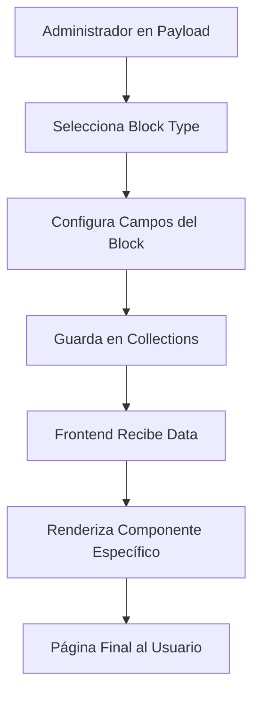

# Guía Completa: Construcción del Sistema de Blocks 🧱

## Tabla de Contenido
1. [¿Qué son los Blocks?](#qué-son-los-blocks)
2. [Arquitectura del Sistema de Blocks](#arquitectura-del-sistema-de-blocks)
3. [Paso 1: Configuración Básica de Blocks](#paso-1-configuración-básica-de-blocks)
4. [Paso 2: Creación de Block Schemas](#paso-2-creación-de-block-schemas)
5. [Paso 3: Implementación de Componentes Frontend](#paso-3-implementación-de-componentes-frontend)
6. [Paso 4: Configuración en Colecciones](#paso-4-configuración-en-colecciones)
7. [Paso 5: Renderizado Dinámico](#paso-5-renderizado-dinámico)
8. [Casos de Uso Avanzados](#casos-de-uso-avanzados)
9. [Creación de Blocks Personalizados](#creación-de-blocks-personalizados)
10. [Ejemplos Prácticos](#ejemplos-prácticos)
11. [Troubleshooting y Optimización](#troubleshooting-y-optimización)

---

## ¿Qué son los Blocks?

### Definición
Los **Blocks** son componentes modulares reutilizables que permiten a los usuarios construir páginas dinámicas mediante la combinación de diferentes elementos de contenido. Actúan como "bloques de construcción" para crear layouts flexibles sin tocar código.

### Problemas que Resuelven
- **Flexibilidad de contenido**: Los usuarios pueden crear páginas complejas sin conocimientos técnicos
- **Reutilización**: Componentes reutilizables reducen duplicación de código
- **Mantenimiento**: Cambios centralizados se reflejan en todas las instancias
- **Escalabilidad**: Fácil agregar nuevos tipos de contenido
- **UX del editor**: Interfaz intuitiva para administradores de contenido

### Flujo Completo del Sistema



---

## Arquitectura del Sistema de Blocks

### Componentes Principales

1. **Block Schemas**: Definiciones de campos y validaciones
2. **Frontend Components**: Componentes React para renderizado
3. **Block Registry**: Sistema de mapeo entre schemas y componentes
4. **Collection Configuration**: Integración en colecciones de Payload
5. **Dynamic Renderer**: Renderizado dinámico basado en tipo

### Estructura de Archivos

```
src/app/(frontend)/blocks/
├── cover/
│   ├── schema.ts          # Definición del block
│   ├── Component.tsx      # Componente de renderizado
│   └── index.ts          # Exportaciones
├── image/
│   ├── schema.ts
│   ├── Component.tsx
│   └── index.ts
├── richText/
│   ├── schema.ts
│   ├── Component.tsx
│   └── index.ts
└── index.ts              # Registry central
```

---

## Paso 1: Configuración Básica de Blocks

### 1.1 Registry Central

**Archivo**: `src/app/(frontend)/blocks/index.ts`

```typescript
import { Cover } from './cover/schema'
import { Image } from './image/schema'
import { RichText } from './richText/schema'

// Registry de todos los blocks disponibles
export const blocks = [
  Cover,
  Image,
  RichText,
  // Agregar nuevos blocks aquí
]

// Tipos para TypeScript
export type BlockType = 
  | 'cover'
  | 'image'
  | 'richText'
```

### 1.2 Configuración en Payload

**Archivo**: `src/collections/Pages.ts`

```typescript
import { blocks } from '../app/(frontend)/blocks'

export const Pages: CollectionConfig = {
  slug: 'pages',
  fields: [
    {
      name: 'title',
      type: 'text',
      required: true,
    },
    {
      name: 'layout',
      type: 'blocks',
      blocks: blocks, // ← Aquí se registran todos los blocks
      required: false,
    },
    // ... otros campos
  ],
}
```

**¿Por qué esta configuración?**
- El campo `layout` de tipo `blocks` permite múltiples bloques
- `blocks: blocks` registra todos los schemas disponibles
- Los usuarios pueden arrastrar y soltar diferentes tipos de blocks

---

## Paso 2: Creación de Block Schemas

### 2.1 Block Schema Básico - Cover

**Archivo**: `src/app/(frontend)/blocks/cover/schema.ts`

```typescript
import { Block } from 'payload'

export const Cover: Block = {
  slug: 'cover',                    // Identificador único
  interfaceName: 'CoverBlockType', // Nombre del tipo TypeScript
  fields: [
    {
      name: 'title',
      label: 'Title',
      type: 'text',
      required: true,
      admin: {
        description: 'Título principal del cover'
      }
    },
    {
      name: 'subtitle',
      label: 'Subtitle',
      type: 'text',
      required: true,
      admin: {
        description: 'Subtítulo o descripción'
      }
    },
    {
      name: 'backgroundImage',
      label: 'Background Image',
      type: 'upload',
      relationTo: 'media',
      required: false,
      admin: {
        description: 'Imagen de fondo opcional'
      }
    },
    {
      name: 'ctaButton',
      label: 'Call to Action',
      type: 'group',
      fields: [
        {
          name: 'text',
          label: 'Button Text',
          type: 'text',
          required: false,
        },
        {
          name: 'link',
          label: 'Button Link',
          type: 'text',
          required: false,
          admin: {
            description: 'URL de destino del botón'
          }
        }
      ]
    }
  ]
}
```

### 2.2 Block Schema Avanzado - Image

**Archivo**: `src/app/(frontend)/blocks/image/schema.ts`

```typescript
import { Block } from 'payload'

export const Image: Block = {
  slug: 'image',
  interfaceName: 'ImageBlockType',
  fields: [
    {
      name: 'image',
      label: 'Image',
      type: 'upload',
      relationTo: 'media',
      required: true,
      admin: {
        description: 'Imagen principal del block'
      }
    },
    {
      name: 'caption',
      label: 'Caption',
      type: 'text',
      required: false,
      admin: {
        description: 'Texto descriptivo debajo de la imagen'
      }
    },
    {
      name: 'size',
      label: 'Image Size',
      type: 'select',
      options: [
        { label: 'Small', value: 'small' },
        { label: 'Medium', value: 'medium' },
        { label: 'Large', value: 'large' },
        { label: 'Full Width', value: 'full' }
      ],
      defaultValue: 'medium',
      admin: {
        description: 'Tamaño de visualización de la imagen'
      }
    },
    {
      name: 'alignment',
      label: 'Alignment',
      type: 'select',
      options: [
        { label: 'Left', value: 'left' },
        { label: 'Center', value: 'center' },
        { label: 'Right', value: 'right' }
      ],
      defaultValue: 'center'
    }
  ]
}
```

### 2.3 Block Schema RichText

**Archivo**: `src/app/(frontend)/blocks/richText/schema.ts`

```typescript
import { Block } from 'payload'

export const RichText: Block = {
  slug: 'richText',
  interfaceName: 'RichTextBlockType',
  fields: [
    {
      name: 'content',
      label: 'Content',
      type: 'richText',
      required: true,
      admin: {
        description: 'Contenido de texto enriquecido'
      }
    },
    {
      name: 'maxWidth',
      label: 'Max Width',
      type: 'select',
      options: [
        { label: 'Narrow', value: 'narrow' },
        { label: 'Normal', value: 'normal' },
        { label: 'Wide', value: 'wide' },
        { label: 'Full Width', value: 'full' }
      ],
      defaultValue: 'normal'
    }
  ]
}
```

**¿Por qué estos campos específicos?**
- `slug`: Identificador único del block type
- `interfaceName`: Genera tipos TypeScript automáticamente
- `fields`: Define la estructura de datos del block
- `admin.description`: Ayuda a los editores entender cada campo

---

## Paso 3: Implementación de Componentes Frontend

### 3.1 Componente Cover

**Archivo**: `src/app/(frontend)/blocks/cover/Component.tsx`

```tsx
import React from 'react'
import { Button } from '@heroui/button'
import { Card } from '@heroui/card'
import { Media } from '../../../collections/Media'

export interface CoverBlockType {
  blockType: 'cover'
  title: string
  subtitle: string
  backgroundImage?: Media
  ctaButton?: {
    text?: string
    link?: string
  }
}

interface CoverBlockProps {
  data: CoverBlockType
}

export const CoverBlock: React.FC<CoverBlockProps> = ({ data }) => {
  const { title, subtitle, backgroundImage, ctaButton } = data

  return (
    <Card
      className="w-full min-h-[400px] relative overflow-hidden"
      style={{
        backgroundImage: backgroundImage?.url 
          ? `url(${backgroundImage.url})` 
          : undefined,
        backgroundSize: 'cover',
        backgroundPosition: 'center',
      }}
    >
      {/* Overlay para mejor legibilidad */}
      <div className="absolute inset-0 bg-black/40" />
      
      {/* Contenido */}
      <div className="relative z-10 flex flex-col items-center justify-center h-full p-8 text-center text-white">
        <h1 className="text-4xl md:text-6xl font-bold mb-4">
          {title}
        </h1>
        
        <p className="text-xl md:text-2xl mb-8 max-w-2xl">
          {subtitle}
        </p>
        
        {ctaButton?.text && ctaButton?.link && (
          <Button
            as="a"
            href={ctaButton.link}
            size="lg"
            color="primary"
            className="font-semibold"
          >
            {ctaButton.text}
          </Button>
        )}
      </div>
    </Card>
  )
}
```

### 3.2 Componente Image

**Archivo**: `src/app/(frontend)/blocks/image/Component.tsx`

```tsx
import React from 'react'
import { Image as HeroImage } from '@heroui/image'
import { Media } from '../../../collections/Media'

export interface ImageBlockType {
  blockType: 'image'
  image: Media
  caption?: string
  size: 'small' | 'medium' | 'large' | 'full'
  alignment: 'left' | 'center' | 'right'
}

interface ImageBlockProps {
  data: ImageBlockType
}

export const ImageBlock: React.FC<ImageBlockProps> = ({ data }) => {
  const { image, caption, size, alignment } = data

  // Mapeo de tamaños a clases CSS
  const sizeClasses = {
    small: 'max-w-xs',
    medium: 'max-w-md',
    large: 'max-w-2xl',
    full: 'w-full'
  }

  // Mapeo de alignment a clases CSS
  const alignmentClasses = {
    left: 'mr-auto',
    center: 'mx-auto',
    right: 'ml-auto'
  }

  return (
    <div className={`${sizeClasses[size]} ${alignmentClasses[alignment]}`}>
      <HeroImage
        src={image.url || ''}
        alt={image.alt || caption || ''}
        className="w-full h-auto rounded-lg shadow-md"
      />
      
      {caption && (
        <p className="text-sm text-gray-600 mt-2 text-center italic">
          {caption}
        </p>
      )}
    </div>
  )
}
```

### 3.3 Componente RichText

**Archivo**: `src/app/(frontend)/blocks/richText/Component.tsx`

```tsx
import React from 'react'
import { RichText } from '../../../module/richText/RichText'
import { SerializedEditorState, SerializedLexicalNode } from '@payloadcms/richtext-lexical/lexical'

export interface RichTextBlockType {
  blockType: 'richText'
  content: SerializedEditorState<SerializedLexicalNode>
  maxWidth: 'narrow' | 'normal' | 'wide' | 'full'
}

interface RichTextBlockProps {
  data: RichTextBlockType
}

export const RichTextBlock: React.FC<RichTextBlockProps> = ({ data }) => {
  const { content, maxWidth } = data

  // Mapeo de maxWidth a clases CSS
  const widthClasses = {
    narrow: 'max-w-lg',
    normal: 'max-w-2xl',
    wide: 'max-w-4xl',
    full: 'w-full'
  }

  return (
    <div className={`${widthClasses[maxWidth]} mx-auto prose prose-lg`}>
      <RichText data={content} />
    </div>
  )
}
```

### 3.4 Index de Exportaciones

**Archivo**: `src/app/(frontend)/blocks/cover/index.ts`

```typescript
export { Cover } from './schema'
export { CoverBlock } from './Component'
export type { CoverBlockType } from './Component'
```

**Archivo**: `src/app/(frontend)/blocks/image/index.ts`

```typescript
export { Image } from './schema'
export { ImageBlock } from './Component'
export type { ImageBlockType } from './Component'
```

**Archivo**: `src/app/(frontend)/blocks/richText/index.ts`

```typescript
export { RichText } from './schema'
export { RichTextBlock } from './Component'
export type { RichTextBlockType } from './Component'
```

---

## Paso 4: Configuración en Colecciones

### 4.1 Integración en Pages Collection

**Archivo**: `src/collections/Pages.ts`

```typescript
import type { CollectionConfig } from 'payload'
import { blocks } from '../app/(frontend)/blocks'
import { slugField } from '../fields/slug'

export const Pages: CollectionConfig = {
  slug: 'pages',
  admin: {
    useAsTitle: 'title',
    defaultColumns: ['title', 'slug', 'updatedAt'],
  },
  fields: [
    {
      name: 'title',
      type: 'text',
      required: true,
      admin: {
        description: 'Título de la página que aparecerá en el navegador'
      }
    },
    slugField(),
    {
      name: 'layout',
      type: 'blocks',
      blocks: blocks,
      required: false,
      admin: {
        description: 'Construye tu página arrastrando y soltando blocks'
      }
    },
    {
      name: 'seo',
      type: 'group',
      fields: [
        {
          name: 'title',
          type: 'text',
          admin: {
            description: 'Título SEO (opcional, usa el título de página por defecto)'
          }
        },
        {
          name: 'description',
          type: 'textarea',
          admin: {
            description: 'Descripción meta para motores de búsqueda'
          }
        }
      ]
    }
  ]
}
```

### 4.2 Integración en Home Collection

**Archivo**: `src/collections/Home.ts`

```typescript
import type { CollectionConfig } from 'payload'
import { blocks } from '../app/(frontend)/blocks'

export const Home: CollectionConfig = {
  slug: 'home',
  admin: {
    useAsTitle: 'title',
  },
  fields: [
    {
      name: 'title',
      type: 'text',
      required: true,
      defaultValue: 'Homepage',
    },
    {
      name: 'hero',
      type: 'blocks',
      blocks: blocks,
      minRows: 1,
      maxRows: 1,
      admin: {
        description: 'Sección hero de la página principal'
      }
    },
    {
      name: 'content',
      type: 'blocks',
      blocks: blocks,
      admin: {
        description: 'Contenido principal de la homepage'
      }
    }
  ]
}
```

**¿Por qué esta estructura?**
- `minRows/maxRows`: Controla cuántos blocks pueden agregarse
- Separar `hero` y `content` permite diferentes layouts
- La flexibilidad permite cambios sin tocar código

---

## Paso 5: Renderizado Dinámico

### 5.1 Block Renderer Central

**Archivo**: `src/app/(frontend)/components/BlockRenderer.tsx`

```tsx
import React from 'react'
import { CoverBlock, CoverBlockType } from '../blocks/cover'
import { ImageBlock, ImageBlockType } from '../blocks/image'
import { RichTextBlock, RichTextBlockType } from '../blocks/richText'

// Union type de todos los blocks
type BlockData = 
  | CoverBlockType
  | ImageBlockType 
  | RichTextBlockType

interface BlockRendererProps {
  blocks: BlockData[]
  className?: string
}

export const BlockRenderer: React.FC<BlockRendererProps> = ({ 
  blocks, 
  className = '' 
}) => {
  if (!blocks || blocks.length === 0) {
    return null
  }

  return (
    <div className={`space-y-8 ${className}`}>
      {blocks.map((block, index) => {
        switch (block.blockType) {
          case 'cover':
            return <CoverBlock key={index} data={block} />
          
          case 'image':
            return <ImageBlock key={index} data={block} />
          
          case 'richText':
            return <RichTextBlock key={index} data={block} />
          
          default:
            console.warn(`Block type "${(block as any).blockType}" not found`)
            return null
        }
      })}
    </div>
  )
}
```

### 5.2 Uso en Pages

**Archivo**: `src/app/(frontend)/[slug]/page.tsx`

```tsx
import React from 'react'
import { Metadata } from 'next'
import { getPayload } from 'payload'
import config from '../../../payload.config'
import { BlockRenderer } from '../components/BlockRenderer'

interface PageProps {
  params: {
    slug: string
  }
}

export default async function Page({ params }: PageProps) {
  const payload = await getPayload({ config })
  
  // Obtener página por slug
  const page = await payload.find({
    collection: 'pages',
    where: {
      slug: {
        equals: params.slug
      }
    },
    limit: 1
  })

  if (!page.docs.length) {
    return <div>Page not found</div>
  }

  const pageData = page.docs[0]

  return (
    <div className="container mx-auto px-4 py-8">
      {/* Título de la página */}
      <h1 className="text-4xl font-bold mb-8 text-center">
        {pageData.title}
      </h1>
      
      {/* Renderizar blocks dinámicamente */}
      <BlockRenderer blocks={pageData.layout || []} />
    </div>
  )
}

// Generar metadata SEO
export async function generateMetadata({ params }: PageProps): Promise<Metadata> {
  const payload = await getPayload({ config })
  
  const page = await payload.find({
    collection: 'pages',
    where: { slug: { equals: params.slug } },
    limit: 1
  })

  if (!page.docs.length) {
    return {
      title: 'Page Not Found'
    }
  }

  const pageData = page.docs[0]

  return {
    title: pageData.seo?.title || pageData.title,
    description: pageData.seo?.description || `Page: ${pageData.title}`,
  }
}
```

### 5.3 Uso en Homepage

**Archivo**: `src/app/(frontend)/page.tsx`

```tsx
import React from 'react'
import { getPayload } from 'payload'
import config from '../../payload.config'
import { BlockRenderer } from './components/BlockRenderer'

export default async function HomePage() {
  const payload = await getPayload({ config })
  
  // Obtener contenido de homepage
  const home = await payload.findGlobal({
    slug: 'homeConfig'
  })

  return (
    <div className="min-h-screen">
      {/* Hero Section */}
      {home.hero && (
        <section className="mb-0">
          <BlockRenderer blocks={home.hero} />
        </section>
      )}
      
      {/* Main Content */}
      {home.content && (
        <section className="container mx-auto px-4 py-8">
          <BlockRenderer blocks={home.content} />
        </section>
      )}
    </div>
  )
}
```

---

## Casos de Uso Avanzados

### 6.1 Block con Conditional Fields

```typescript
// Schema avanzado con campos condicionales
export const AdvancedCover: Block = {
  slug: 'advancedCover',
  interfaceName: 'AdvancedCoverBlockType',
  fields: [
    {
      name: 'style',
      type: 'select',
      options: [
        { label: 'Minimal', value: 'minimal' },
        { label: 'Video Background', value: 'video' },
        { label: 'Image Background', value: 'image' }
      ],
      defaultValue: 'minimal'
    },
    {
      name: 'backgroundImage',
      type: 'upload',
      relationTo: 'media',
      admin: {
        condition: (data) => data.style === 'image'
      }
    },
    {
      name: 'backgroundVideo',
      type: 'upload',
      relationTo: 'media',
      admin: {
        condition: (data) => data.style === 'video'
      }
    }
  ]
}
```

### 6.2 Block con Nested Blocks

```typescript
export const Section: Block = {
  slug: 'section',
  interfaceName: 'SectionBlockType',
  fields: [
    {
      name: 'sectionTitle',
      type: 'text',
      admin: {
        description: 'Título de la sección'
      }
    },
    {
      name: 'columns',
      type: 'array',
      fields: [
        {
          name: 'width',
          type: 'select',
          options: [
            { label: '1/3', value: 'w-1/3' },
            { label: '1/2', value: 'w-1/2' },
            { label: '2/3', value: 'w-2/3' },
            { label: 'Full', value: 'w-full' }
          ]
        },
        {
          name: 'content',
          type: 'blocks',
          blocks: [Image, RichText] // Nested blocks
        }
      ]
    }
  ]
}
```

---

## Creación de Blocks Personalizados

### 7.1 Block de Testimonios

```typescript
// Schema
export const Testimonial: Block = {
  slug: 'testimonial',
  interfaceName: 'TestimonialBlockType',
  fields: [
    {
      name: 'quote',
      type: 'textarea',
      required: true,
      admin: {
        description: 'Texto del testimonio'
      }
    },
    {
      name: 'author',
      type: 'group',
      fields: [
        {
          name: 'name',
          type: 'text',
          required: true
        },
        {
          name: 'title',
          type: 'text',
          admin: {
            description: 'Título o cargo del autor'
          }
        },
        {
          name: 'avatar',
          type: 'upload',
          relationTo: 'media'
        }
      ]
    },
    {
      name: 'rating',
      type: 'number',
      min: 1,
      max: 5,
      admin: {
        description: 'Calificación de 1 a 5 estrellas'
      }
    }
  ]
}
```

```tsx
// Component
export const TestimonialBlock: React.FC<{ data: TestimonialBlockType }> = ({ 
  data 
}) => {
  const { quote, author, rating } = data

  return (
    <Card className="max-w-2xl mx-auto p-6">
      <div className="flex items-center mb-4">
        {[...Array(rating)].map((_, i) => (
          <span key={i} className="text-yellow-400 text-xl">★</span>
        ))}
      </div>
      
      <blockquote className="text-lg italic mb-4">
        "{quote}"
      </blockquote>
      
      <div className="flex items-center">
        {author.avatar && (
          
        )}
        <div>
          <p className="font-semibold">{author.name}</p>
          {author.title && (
            <p className="text-gray-600 text-sm">{author.title}</p>
          )}
        </div>
      </div>
    </Card>
  )
}
```

### 7.2 Block de FAQ

```typescript
export const FAQ: Block = {
  slug: 'faq',
  interfaceName: 'FAQBlockType',
  fields: [
    {
      name: 'title',
      type: 'text',
      defaultValue: 'Frequently Asked Questions'
    },
    {
      name: 'questions',
      type: 'array',
      fields: [
        {
          name: 'question',
          type: 'text',
          required: true
        },
        {
          name: 'answer',
          type: 'richText',
          required: true
        }
      ],
      minRows: 1,
      admin: {
        description: 'Agrega preguntas y respuestas'
      }
    }
  ]
}
```

```tsx
// Component con Accordion de HeroUI
import { Accordion, AccordionItem } from '@heroui/accordion'

export const FAQBlock: React.FC<{ data: FAQBlockType }> = ({ data }) => {
  const { title, questions } = data

  return (
    <div className="max-w-4xl mx-auto">
      <h2 className="text-3xl font-bold text-center mb-8">{title}</h2>
      
      <Accordion>
        {questions.map((item, index) => (
          <AccordionItem 
            key={index} 
            title={item.question}
            className="mb-2"
          >
            <RichText data={item.answer} />
          </AccordionItem>
        ))}
      </Accordion>
    </div>
  )
}
```

---

## Ejemplos Prácticos

### 8.1 Página de Landing Completa

Estructura de blocks para una landing page típica:

```json
{
  "layout": [
    {
      "blockType": "cover",
      "title": "Encuentra Productos Locales Frescos",
      "subtitle": "Conectamos productores con consumidores en tu área",
      "backgroundImage": { "url": "/hero-bg.jpg" },
      "ctaButton": {
        "text": "Explorar Productos",
        "link": "/products"
      }
    },
    {
      "blockType": "richText",
      "content": "...", // Texto explicativo
      "maxWidth": "normal"
    },
    {
      "blockType": "image",
      "image": { "url": "/features.jpg" },
      "size": "large",
      "alignment": "center",
      "caption": "Productos frescos de granjas locales"
    },
    {
      "blockType": "testimonial",
      "quote": "La mejor plataforma para encontrar productos orgánicos",
      "author": {
        "name": "María González",
        "title": "Cliente satisfecha"
      },
      "rating": 5
    }
  ]
}
```

### 8.2 Página de Producto con Información Detallada

```json
{
  "layout": [
    {
      "blockType": "section",
      "sectionTitle": "Detalles del Producto",
      "columns": [
        {
          "width": "w-1/2",
          "content": [
            {
              "blockType": "image",
              "image": { "url": "/product-main.jpg" },
              "size": "full"
            }
          ]
        },
        {
          "width": "w-1/2", 
          "content": [
            {
              "blockType": "richText",
              "content": "...", // Descripción del producto
              "maxWidth": "full"
            }
          ]
        }
      ]
    },
    {
      "blockType": "faq",
      "title": "Preguntas sobre el Producto",
      "questions": [
        {
          "question": "¿Es orgánico?",
          "answer": "Sí, todos nuestros productos son certificados orgánicos..."
        }
      ]
    }
  ]
}
```

---

## Troubleshooting y Optimización

### 9.1 Problemas Comunes

#### Error: "Block type not found"

**Problema**: El renderer no encuentra el componente del block.

**Solución**:
```typescript
// Verificar que el block esté registrado
import { blocks } from '../blocks'
console.log('Registered blocks:', blocks.map(b => b.slug))

// Verificar que el componente esté importado en BlockRenderer
switch (block.blockType) {
  case 'myNewBlock': // ← Agregar el nuevo caso
    return <MyNewBlockComponent key={index} data={block} />
}
```

#### Error: "TypeScript types mismatch"

**Problema**: Los tipos no coinciden entre schema y componente.

**Solución**:
```bash
# Regenerar tipos de Payload
npm run generate:types

# Verificar que interfaceName coincida
export const MyBlock: Block = {
  slug: 'myBlock',
  interfaceName: 'MyBlockType', // ← Debe coincidir con el componente
}
```

### 9.2 Optimizaciones de Performance

#### Lazy Loading de Componentes

```tsx
import { lazy, Suspense } from 'react'

// Lazy load de blocks pesados
const HeavyBlock = lazy(() => import('../blocks/heavy/Component'))

export const BlockRenderer: React.FC<BlockRendererProps> = ({ blocks }) => {
  return (
    <div className="space-y-8">
      {blocks.map((block, index) => {
        switch (block.blockType) {
          case 'heavy':
            return (
              <Suspense key={index} fallback={<div>Loading...</div>}>
                <HeavyBlock data={block} />
              </Suspense>
            )
          // ... otros casos
        }
      })}
    </div>
  )
}
```

#### Memo para Blocks Estáticos

```tsx
import { memo } from 'react'

export const ImageBlock = memo<ImageBlockProps>(({ data }) => {
  // Component implementation
}, (prevProps, nextProps) => {
  // Custom comparison
  return prevProps.data.image.url === nextProps.data.image.url
})
```

### 9.3 Testing de Blocks

```tsx
// tests/blocks/CoverBlock.test.tsx
import { render, screen } from '@testing-library/react'
import { CoverBlock } from '../../../src/app/(frontend)/blocks/cover'

describe('CoverBlock', () => {
  const mockData = {
    blockType: 'cover',
    title: 'Test Title',
    subtitle: 'Test Subtitle',
    backgroundImage: {
      url: '/test-image.jpg',
      alt: 'Test'
    },
    ctaButton: {
      text: 'Test Button',
      link: '/test-link'
    }
  }

  it('renders title and subtitle', () => {
    render(<CoverBlock data={mockData} />)
    
    expect(screen.getByText('Test Title')).toBeInTheDocument()
    expect(screen.getByText('Test Subtitle')).toBeInTheDocument()
  })

  it('renders CTA button when provided', () => {
    render(<CoverBlock data={mockData} />)
    
    const button = screen.getByRole('link', { name: 'Test Button' })
    expect(button).toHaveAttribute('href', '/test-link')
  })
})
```

---

## Siguiente Paso

Después de implementar el sistema de Blocks:

1. **[18-RichText-Step-by-Step.md](./18-RichText-Step-by-Step.md)**: Configuración avanzada del editor RichText
2. **[19-Media-Supabase-Guide.md](./19-Media-Supabase-Guide.md)**: Configuración de almacenamiento de archivos
3. **[20-Layout-Routing-Guide.md](./20-Layout-Routing-Guide.md)**: Layouts públicos vs privados
4. **[21-UI-HeroUI-Guide.md](./21-UI-HeroUI-Guide.md)**: Sistema de componentes UI avanzado

---

*Este sistema de Blocks proporciona una base flexible y escalable para crear contenido dinámico. La arquitectura modular permite agregar nuevos tipos de blocks fácilmente sin afectar el sistema existente.*