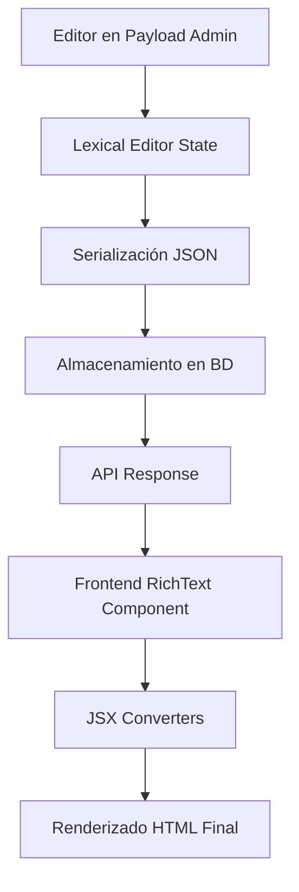

# Guía Completa: Sistema RichText Editor y Renderizado 📝

## Tabla de Contenido
1. [¿Qué es el Sistema RichText?](#qué-es-el-sistema-richtext)
2. [Arquitectura Editor vs Renderizado](#arquitectura-editor-vs-renderizado)
3. [Paso 1: Configuración del Editor Lexical](#paso-1-configuración-del-editor-lexical)
4. [Paso 2: Implementación del Renderizador Frontend](#paso-2-implementación-del-renderizador-frontend)
5. [Paso 3: Configuración en Collections](#paso-3-configuración-en-collections)
6. [Paso 4: Customización de Convertidores](#paso-4-customización-de-convertidores)
7. [Paso 5: Plugins y Extensiones](#paso-5-plugins-y-extensiones)
8. [Casos de Uso Avanzados](#casos-de-uso-avanzados)
9. [Diferencias: Editor vs Cliente](#diferencias-editor-vs-cliente)
10. [Ejemplos Prácticos](#ejemplos-prácticos)
11. [Troubleshooting y Optimización](#troubleshooting-y-optimización)

---

## ¿Qué es el Sistema RichText?

### Definición
El **Sistema RichText** permite crear y mostrar contenido rico con formato (negritas, cursivas, enlaces, imágenes, etc.) utilizando el editor Lexical de Payload CMS en el backend y un renderizador optimizado en el frontend.

### Problemas que Resuelve
- **Edición rica**: Los usuarios pueden crear contenido formateado sin conocer HTML
- **Seguridad**: Previene XSS y otros ataques mediante sanitización
- **Consistencia**: Formato uniforme en toda la aplicación
- **Performance**: Renderizado optimizado del lado del cliente
- **Flexibilidad**: Extensible con plugins y componentes personalizados

### Flujo Completo del Sistema



---

## Arquitectura Editor vs Renderizado

### Diferencias Clave

| Aspecto | Editor (Payload Admin) | Renderizado (Frontend) |
|---------|----------------------|----------------------|
| **Propósito** | Crear/editar contenido | Mostrar contenido al usuario |
| **Librería** | `@payloadcms/richtext-lexical` | `@payloadcms/richtext-lexical/react` |
| **Interactividad** | Total (edición) | Solo lectura |
| **Performance** | No crítica | Crítica (UX) |
| **Personalización** | Toolbar, plugins | Convertidores JSX |

### Estructura de Archivos

```
src/
├── payload.config.ts          # Configuración del editor
├── module/richText/
│   ├── RichText.tsx          # Componente de renderizado
│   ├── jsxConverters.ts      # Convertidores personalizados
│   └── plugins/              # Plugins del editor
├── collections/
│   └── [Collection].ts       # Campos richText en colecciones
└── app/(frontend)/
    └── components/           # Uso en componentes
```

---

## Paso 1: Configuración del Editor Lexical

### 1.1 Configuración Base en Payload

**Archivo**: `src/payload.config.ts`

```typescript
import { lexicalEditor } from '@payloadcms/richtext-lexical'
import { buildConfig } from 'payload'

export default buildConfig({
  // Configuración del editor RichText
  editor: lexicalEditor({
    features: ({ defaultFeatures }) => [
      ...defaultFeatures,
      // Features básicos incluidos por defecto:
      // - Bold, Italic, Underline
      // - Headings (H1-H6)
      // - Lists (ordered/unordered)
      // - Links
      // - Paragraphs
    ]
  }),
  
  // ... resto de configuración
})
```

### 1.2 Configuración Avanzada del Editor

**Archivo**: `src/payload.config.ts`

```typescript
import { 
  lexicalEditor,
  BlocksFeature,
  LinkFeature,
  UploadFeature,
  BoldFeature,
  ItalicFeature,
  UnderlineFeature,
  HeadingFeature,
  ParagraphFeature,
  OrderedListFeature,
  UnorderedListFeature,
  ChecklistFeature,
  QuoteFeature,
  HorizontalRuleFeature,
  InlineCodeFeature,
  CodeFeature
} from '@payloadcms/richtext-lexical'

export default buildConfig({
  editor: lexicalEditor({
    features: ({ defaultFeatures }) => [
      // Funciones básicas de texto
      BoldFeature(),
      ItalicFeature(),
      UnderlineFeature(),
      InlineCodeFeature(),
      
      // Estructura de contenido
      HeadingFeature({
        enabledHeadingSizes: ['h1', 'h2', 'h3', 'h4']
      }),
      ParagraphFeature(),
      
      // Listas
      OrderedListFeature(),
      UnorderedListFeature(),
      ChecklistFeature(),
      
      // Elementos especiales
      QuoteFeature(),
      HorizontalRuleFeature(),
      CodeFeature({
        languages: [
          { label: 'JavaScript', value: 'javascript' },
          { label: 'TypeScript', value: 'typescript' },
          { label: 'HTML', value: 'html' },
          { label: 'CSS', value: 'css' },
          { label: 'JSON', value: 'json' }
        ]
      }),
      
      // Enlaces con validación
      LinkFeature({
        fields: [
          {
            name: 'rel',
            label: 'Rel Attribute',
            type: 'select',
            hasMany: true,
            options: ['noopener', 'noreferrer', 'nofollow'],
            admin: {
              description: 'Atributos de seguridad para enlaces externos'
            }
          }
        ]
      }),
      
      // Carga de imágenes
      UploadFeature({
        collections: {
          media: {
            fields: [
              {
                name: 'caption',
                type: 'text',
                admin: {
                  description: 'Descripción de la imagen'
                }
              }
            ]
          }
        }
      }),
      
      // Blocks anidados (opcional)
      BlocksFeature({
        blocks: [
          // Importar blocks específicos si es necesario
        ]
      }),
    ]
  })
})
```

### 1.3 Configuración de Toolbar Personalizada

```typescript
import { lexicalEditor } from '@payloadcms/richtext-lexical'

export default buildConfig({
  editor: lexicalEditor({
    features: ({ defaultFeatures }) => [
      ...defaultFeatures,
    ],
    // Configuración de la toolbar
    admin: {
      toolbarGroups: [
        ['bold', 'italic', 'underline'],
        ['h1', 'h2', 'h3'],
        ['unorderedList', 'orderedList'],
        ['link', 'upload'],
        ['quote', 'code']
      ]
    }
  })
})
```

**¿Por qué esta configuración?**
- **Features modulares**: Solo incluye las funciones necesarias
- **Validación de enlaces**: Previene enlaces maliciosos
- **Soporte de código**: Útil para documentación técnica
- **Toolbar organizada**: Mejora la experiencia del editor

---

## Paso 2: Implementación del Renderizador Frontend

### 2.1 Componente Base RichText

**Archivo**: `src/module/richText/RichText.tsx`

```tsx
import React from 'react'
import { RichText as RichTextBase } from '@payloadcms/richtext-lexical/react'
import { SerializedEditorState, SerializedLexicalNode } from '@payloadcms/richtext-lexical/lexical'
import { jsxConverters } from './jsxConverters'

export interface RichTextProps {
  data: SerializedEditorState<SerializedLexicalNode> | undefined | null
  className?: string
  enableContainer?: boolean
}

export const RichText: React.FC<RichTextProps> = ({ 
  data, 
  className = '',
  enableContainer = false 
}) => {
  // Validación de datos
  if (!data || !data.root || !data.root.children) {
    return null
  }

  return (
    <div className={`rich-text-content ${className}`}>
      <RichTextBase 
        converters={jsxConverters}
        data={data} 
        disableContainer={!enableContainer}
      />
    </div>
  )
}
```

### 2.2 Convertidores JSX Personalizados

**Archivo**: `src/module/richText/jsxConverters.ts`

```tsx
import React from 'react'
import { DefaultNodeTypes, SerializedLexicalNode } from '@payloadcms/richtext-lexical/lexical'
import { JSXConverters } from '@payloadcms/richtext-lexical/react'
import { Button } from '@heroui/button'
import { Code } from '@heroui/code'
import { Link } from '@heroui/link'
import { Image } from '@heroui/image'

export const jsxConverters: JSXConverters<DefaultNodeTypes> = {
  // Convertidor para párrafos
  paragraph: ({ node, children }) => (
    <p className="mb-4 text-base leading-relaxed text-gray-700 dark:text-gray-300">
      {children}
    </p>
  ),

  // Convertidores para headings
  heading: ({ node, children }) => {
    const Tag = node.tag as keyof JSX.IntrinsicElements
    const headingClasses = {
      h1: 'text-4xl font-bold mb-6 mt-8 text-gray-900 dark:text-white',
      h2: 'text-3xl font-semibold mb-5 mt-7 text-gray-900 dark:text-white',
      h3: 'text-2xl font-semibold mb-4 mt-6 text-gray-900 dark:text-white',
      h4: 'text-xl font-medium mb-3 mt-5 text-gray-900 dark:text-white',
      h5: 'text-lg font-medium mb-3 mt-4 text-gray-900 dark:text-white',
      h6: 'text-base font-medium mb-2 mt-3 text-gray-900 dark:text-white'
    }

    return React.createElement(
      Tag,
      { className: headingClasses[Tag] || headingClasses.h2 },
      children
    )
  },

  // Convertidor para texto en negrita
  bold: ({ children }) => (
    <strong className="font-semibold text-gray-900 dark:text-white">
      {children}
    </strong>
  ),

  // Convertidor para texto en cursiva
  italic: ({ children }) => (
    <em className="italic text-gray-700 dark:text-gray-300">
      {children}
    </em>
  ),

  // Convertidor para texto subrayado
  underline: ({ children }) => (
    <u className="underline decoration-2 underline-offset-2">
      {children}
    </u>
  ),

  // Convertidor para código inline
  inlineCode: ({ children }) => (
    <Code size="sm" className="mx-1">
      {children}
    </Code>
  ),

  // Convertidor para bloques de código
  code: ({ node, children }) => (
    <div className="my-6">
      <Code 
        className="block w-full p-4 text-sm" 
        language={node.language || 'text'}
      >
        {children}
      </Code>
    </div>
  ),

  // Convertidor para citas
  quote: ({ children }) => (
    <blockquote className="border-l-4 border-blue-500 pl-4 py-2 my-6 italic text-gray-600 dark:text-gray-400 bg-gray-50 dark:bg-gray-800 rounded-r-lg">
      {children}
    </blockquote>
  ),

  // Convertidor para líneas horizontales
  horizontalRule: () => (
    <hr className="my-8 border-t border-gray-300 dark:border-gray-600" />
  ),

  // Convertidor para listas ordenadas
  orderedList: ({ children }) => (
    <ol className="list-decimal list-inside mb-4 ml-4 space-y-2">
      {children}
    </ol>
  ),

  // Convertidor para listas no ordenadas
  unorderedList: ({ children }) => (
    <ul className="list-disc list-inside mb-4 ml-4 space-y-2">
      {children}
    </ul>
  ),

  // Convertidor para elementos de lista
  listItem: ({ children }) => (
    <li className="text-gray-700 dark:text-gray-300">
      {children}
    </li>
  ),

  // Convertidor para checklist
  checklistItem: ({ node, children }) => (
    <div className="flex items-center mb-2">
      <input 
        type="checkbox" 
        checked={node.checked} 
        disabled 
        className="mr-3 h-4 w-4 text-blue-600"
      />
      <span className={node.checked ? 'line-through text-gray-500' : ''}>
        {children}
      </span>
    </div>
  ),

  // Convertidor para enlaces
  link: ({ node, children }) => {
    const { url, newTab, rel } = node.fields

    return (
      <Link
        href={url}
        target={newTab ? '_blank' : undefined}
        rel={rel?.join(' ') || undefined}
        className="text-blue-600 hover:text-blue-800 dark:text-blue-400 dark:hover:text-blue-300"
      >
        {children}
      </Link>
    )
  },

  // Convertidor para uploads/imágenes
  upload: ({ node }) => {
    const { value, fields } = node
    
    if (!value || typeof value === 'string') {
      return null
    }

    return (
      <figure className="my-6">
        <Image
          src={value.url || ''}
          alt={value.alt || fields?.caption || ''}
          className="w-full rounded-lg shadow-md"
        />
        {fields?.caption && (
          <figcaption className="text-sm text-gray-600 dark:text-gray-400 text-center mt-2 italic">
            {fields.caption}
          </figcaption>
        )}
      </figure>
    )
  }
}
```

### 2.3 Variante con Estilos Tipográficos

**Archivo**: `src/module/richText/RichTextTypography.tsx`

```tsx
import React from 'react'
import { RichText as RichTextBase } from '@payloadcms/richtext-lexical/react'
import { SerializedEditorState, SerializedLexicalNode } from '@payloadcms/richtext-lexical/lexical'
import { jsxConverters } from './jsxConverters'

interface RichTextTypographyProps {
  data: SerializedEditorState<SerializedLexicalNode> | undefined | null
  variant?: 'article' | 'compact' | 'large'
  className?: string
}

export const RichTextTypography: React.FC<RichTextTypographyProps> = ({ 
  data, 
  variant = 'article',
  className = '' 
}) => {
  if (!data) return null

  const variantClasses = {
    article: 'prose prose-lg prose-gray dark:prose-invert max-w-none',
    compact: 'prose prose-sm prose-gray dark:prose-invert max-w-none',
    large: 'prose prose-xl prose-gray dark:prose-invert max-w-none'
  }

  return (
    <div className={`${variantClasses[variant]} ${className}`}>
      <RichTextBase 
        converters={jsxConverters}
        data={data} 
        disableContainer
      />
    </div>
  )
}
```

**¿Por qué convertidores personalizados?**
- **Consistencia visual**: Todos los elementos siguen el design system
- **Responsividad**: Adaptado para diferentes tamaños de pantalla
- **Accesibilidad**: Cumple estándares WCAG
- **Performance**: Renderizado optimizado con componentes HeroUI

---

## Paso 3: Configuración en Collections

### 3.1 Campo RichText Básico

**Archivo**: `src/collections/Posts.ts`

```typescript
import type { CollectionConfig } from 'payload'

export const Posts: CollectionConfig = {
  slug: 'posts',
  fields: [
    {
      name: 'title',
      type: 'text',
      required: true,
    },
    {
      name: 'content',
      type: 'richText',
      required: true,
      admin: {
        description: 'Contenido principal del post'
      }
    },
    {
      name: 'excerpt',
      type: 'richText',
      admin: {
        description: 'Resumen del post (opcional)',
        // Toolbar simplificada para excerpt
        editorOptions: {
          features: ['bold', 'italic', 'link']
        }
      }
    }
  ]
}
```

### 3.2 Campo RichText con Configuración Avanzada

```typescript
export const Articles: CollectionConfig = {
  slug: 'articles',
  fields: [
    {
      name: 'content',
      type: 'richText',
      required: true,
      admin: {
        description: 'Contenido del artículo con todas las funciones disponibles'
      }
    },
    {
      name: 'summary',
      type: 'richText',
      admin: {
        description: 'Resumen ejecutivo (solo texto básico)',
        editorOptions: {
          features: [
            'bold',
            'italic', 
            'paragraph'
          ]
        }
      }
    },
    {
      name: 'technicalNotes',
      type: 'richText',
      admin: {
        description: 'Notas técnicas con soporte de código',
        editorOptions: {
          features: [
            'bold',
            'italic',
            'code',
            'inlineCode',
            'heading',
            'paragraph',
            'orderedList',
            'unorderedList'
          ]
        }
      }
    }
  ]
}
```

### 3.3 RichText con Validaciones

```typescript
export const Documentation: CollectionConfig = {
  slug: 'documentation',
  fields: [
    {
      name: 'content',
      type: 'richText',
      required: true,
      validate: (val) => {
        // Validar que el contenido tenga al menos un heading
        if (!val || !val.root || !val.root.children) {
          return 'Content is required'
        }

        const hasHeading = val.root.children.some((child: any) => 
          child.type === 'heading'
        )

        if (!hasHeading) {
          return 'Content must include at least one heading'
        }

        return true
      },
      admin: {
        description: 'Documentación debe incluir al menos un encabezado'
      }
    }
  ]
}
```

**¿Por qué diferentes configuraciones?**
- **Contexto específico**: Cada uso necesita funciones diferentes
- **UX del editor**: Toolbars simplificadas mejoran la experiencia
- **Consistencia**: Validaciones aseguran calidad del contenido
- **Performance**: Menos features = mejor rendimiento del editor

---

## Paso 4: Customización de Convertidores

### 4.1 Convertidor para Call-to-Action

```tsx
// En jsxConverters.ts
import { Button } from '@heroui/button'

// Extender tipos para custom nodes
interface CTANode extends SerializedLexicalNode {
  type: 'cta'
  text: string
  url: string
  variant: 'primary' | 'secondary'
}

export const jsxConverters: JSXConverters<DefaultNodeTypes | CTANode> = {
  // ... otros convertidores

  // Convertidor personalizado para CTA
  cta: ({ node }) => {
    const { text, url, variant } = node as CTANode
    
    return (
      <div className="my-6 text-center">
        <Button
          as="a"
          href={url}
          color={variant === 'primary' ? 'primary' : 'secondary'}
          size="lg"
          className="px-8 py-3"
        >
          {text}
        </Button>
      </div>
    )
  }
}
```

### 4.2 Convertidor para Alertas/Notices

```tsx
import { Alert } from '@heroui/alert'

interface AlertNode extends SerializedLexicalNode {
  type: 'alert'
  alertType: 'info' | 'warning' | 'success' | 'error'
  title?: string
  children: SerializedLexicalNode[]
}

export const jsxConverters = {
  // ... otros convertidores

  alert: ({ node, children }) => {
    const { alertType, title } = node as AlertNode
    
    const alertColors = {
      info: 'primary',
      warning: 'warning', 
      success: 'success',
      error: 'danger'
    }

    return (
      <Alert 
        color={alertColors[alertType]}
        title={title}
        className="my-4"
      >
        {children}
      </Alert>
    )
  }
}
```

### 4.3 Convertidor para Tablas Responsivas

```tsx
interface TableNode extends SerializedLexicalNode {
  type: 'table'
  children: TableRowNode[]
}

interface TableRowNode extends SerializedLexicalNode {
  type: 'tablerow'
  children: TableCellNode[]
}

interface TableCellNode extends SerializedLexicalNode {
  type: 'tablecell'
  headerCell?: boolean
  children: SerializedLexicalNode[]
}

export const jsxConverters = {
  // ... otros convertidores

  table: ({ children }) => (
    <div className="overflow-x-auto my-6">
      <table className="min-w-full border-collapse border border-gray-300 dark:border-gray-600">
        {children}
      </table>
    </div>
  ),

  tablerow: ({ children }) => (
    <tr className="border-b border-gray-200 dark:border-gray-700">
      {children}
    </tr>
  ),

  tablecell: ({ node, children }) => {
    const { headerCell } = node as TableCellNode
    const Tag = headerCell ? 'th' : 'td'
    const classes = headerCell 
      ? 'bg-gray-100 dark:bg-gray-800 font-semibold text-left p-3 border border-gray-300 dark:border-gray-600'
      : 'p-3 border border-gray-300 dark:border-gray-600'

    return React.createElement(Tag, { className: classes }, children)
  }
}
```

---

## Paso 5: Plugins y Extensiones

### 5.1 Plugin de Autoguardado

**Archivo**: `src/module/richText/plugins/AutoSavePlugin.ts`

```typescript
import { useLexicalComposerContext } from '@lexical/react/LexicalComposerContext'
import { useEffect } from 'react'
import { debounce } from 'lodash'

interface AutoSavePluginProps {
  onSave: (content: string) => void
  delay?: number
}

export const AutoSavePlugin: React.FC<AutoSavePluginProps> = ({ 
  onSave, 
  delay = 2000 
}) => {
  const [editor] = useLexicalComposerContext()

  useEffect(() => {
    const debouncedSave = debounce((content: string) => {
      onSave(content)
    }, delay)

    const removeListener = editor.registerUpdateListener(({ editorState }) => {
      const json = JSON.stringify(editorState.toJSON())
      debouncedSave(json)
    })

    return () => {
      removeListener()
      debouncedSave.cancel()
    }
  }, [editor, onSave, delay])

  return null
}
```

### 5.2 Plugin de Contador de Palabras

```typescript
export const WordCountPlugin: React.FC = () => {
  const [editor] = useLexicalComposerContext()
  const [wordCount, setWordCount] = useState(0)

  useEffect(() => {
    const removeListener = editor.registerUpdateListener(({ editorState }) => {
      editorState.read(() => {
        const root = $getRoot()
        const text = root.getTextContent()
        const words = text.trim().split(/\s+/).filter(word => word.length > 0)
        setWordCount(words.length)
      })
    })

    return removeListener
  }, [editor])

  return (
    <div className="text-sm text-gray-500 mt-2">
      Words: {wordCount}
    </div>
  )
}
```

### 5.3 Plugin de Validación en Tiempo Real

```typescript
interface ValidationPluginProps {
  rules: ValidationRule[]
  onValidationChange: (isValid: boolean, errors: string[]) => void
}

interface ValidationRule {
  name: string
  validate: (content: string) => boolean
  message: string
}

export const ValidationPlugin: React.FC<ValidationPluginProps> = ({
  rules,
  onValidationChange
}) => {
  const [editor] = useLexicalComposerContext()

  useEffect(() => {
    const removeListener = editor.registerUpdateListener(({ editorState }) => {
      editorState.read(() => {
        const text = $getRoot().getTextContent()
        const errors: string[] = []

        rules.forEach(rule => {
          if (!rule.validate(text)) {
            errors.push(rule.message)
          }
        })

        onValidationChange(errors.length === 0, errors)
      })
    })

    return removeListener
  }, [editor, rules, onValidationChange])

  return null
}
```

---

## Casos de Uso Avanzados

### 6.1 RichText con Preview en Tiempo Real

```tsx
import { useState } from 'react'
import { Tabs, Tab } from '@heroui/tabs'

interface RichTextEditorWithPreviewProps {
  initialValue?: any
  onChange: (value: any) => void
}

export const RichTextEditorWithPreview: React.FC<RichTextEditorWithPreviewProps> = ({
  initialValue,
  onChange
}) => {
  const [content, setContent] = useState(initialValue)

  const handleChange = (newContent: any) => {
    setContent(newContent)
    onChange(newContent)
  }

  return (
    <Tabs aria-label="Rich Text Editor">
      <Tab key="edit" title="Edit">
        <div className="min-h-[400px] border rounded-lg p-4">
          {/* Aquí iría el editor de Payload */}
          {/* Este ejemplo es conceptual */}
        </div>
      </Tab>
      
      <Tab key="preview" title="Preview">
        <div className="min-h-[400px] border rounded-lg p-4">
          <RichText data={content} />
        </div>
      </Tab>
    </Tabs>
  )
}
```

### 6.2 RichText con Límites de Contenido

```tsx
interface LimitedRichTextProps {
  data: any
  maxWords?: number
  maxCharacters?: number
  showCounts?: boolean
}

export const LimitedRichText: React.FC<LimitedRichTextProps> = ({
  data,
  maxWords,
  maxCharacters,
  showCounts = true
}) => {
  const getText = (data: any): string => {
    // Extraer texto plano del contenido RichText
    if (!data || !data.root) return ''
    
    // Implementar extracción de texto aquí
    return '' // Simplificado para el ejemplo
  }

  const text = getText(data)
  const wordCount = text.trim().split(/\s+/).length
  const charCount = text.length

  const isWordLimitExceeded = maxWords && wordCount > maxWords
  const isCharLimitExceeded = maxCharacters && charCount > maxCharacters

  return (
    <div>
      <RichText data={data} />
      
      {showCounts && (
        <div className="mt-2 text-sm space-x-4">
          {maxWords && (
            <span className={isWordLimitExceeded ? 'text-red-500' : 'text-gray-500'}>
              Words: {wordCount}/{maxWords}
            </span>
          )}
          {maxCharacters && (
            <span className={isCharLimitExceeded ? 'text-red-500' : 'text-gray-500'}>
              Characters: {charCount}/{maxCharacters}
            </span>
          )}
        </div>
      )}
    </div>
  )
}
```

---

## Diferencias: Editor vs Cliente

### Editor (Payload Admin Panel)

#### Características del Editor:
```typescript
// Configuración para el editor en payload.config.ts
export default buildConfig({
  editor: lexicalEditor({
    features: ({ defaultFeatures }) => [
      // Features completas para editores
      ...defaultFeatures,
      UploadFeature(),
      BlocksFeature(),
      // ... todas las funciones
    ]
  })
})
```

#### Funcionalidades del Editor:
- **Interactividad completa**: Click, drag & drop, selección múltiple
- **Toolbar dinámica**: Cambia según contexto y selección
- **Validación en tiempo real**: Errores inmediatos
- **Autoguardado**: Previene pérdida de datos
- **Undo/Redo**: Historial de cambios
- **Plugins avanzados**: Autocompletado, spell-check, etc.

### Cliente (Frontend Rendering)

#### Características del Renderizado:
```tsx
// Configuración para renderizado
export const RichText = ({ data }) => {
  return (
    <RichTextBase 
      converters={jsxConverters}  // ← Convertidores personalizados
      data={data} 
      disableContainer           // ← Solo contenido, sin editor
    />
  )
}
```

#### Funcionalidades del Cliente:
- **Solo lectura**: No editable por el usuario final
- **Performance optimizada**: Renderizado estático
- **SEO friendly**: HTML semántico para motores de búsqueda
- **Responsive**: Adaptado a diferentes dispositivos
- **Accesibilidad**: Cumple estándares WCAG

### Tabla Comparativa Detallada

| Aspecto | Editor (Admin) | Cliente (Frontend) |
|---------|---------------|-------------------|
| **Bundle Size** | ~500KB | ~50KB |
| **Interactividad** | Completa | Solo lectura |
| **Performance** | Media | Alta |
| **Personalización** | Plugins/Features | Convertidores JSX |
| **Validación** | Tiempo real | Pre-renderizado |
| **SEO** | No relevante | Crítico |
| **Accesibilidad** | Editor específica | WCAG compliant |

---

## Ejemplos Prácticos

### 8.1 Blog Post Completo

```tsx
// Página de blog post
export default async function BlogPost({ params }: { params: { slug: string } }) {
  const payload = await getPayload({ config })
  
  const post = await payload.find({
    collection: 'posts',
    where: { slug: { equals: params.slug } },
    limit: 1
  })

  if (!post.docs.length) {
    return <div>Post not found</div>
  }

  const postData = post.docs[0]

  return (
    <article className="max-w-4xl mx-auto px-4 py-8">
      {/* Header */}
      <header className="mb-8">
        <h1 className="text-4xl font-bold mb-4">{postData.title}</h1>
        <div className="text-gray-600 mb-6">
          Published on {new Date(postData.createdAt).toLocaleDateString()}
        </div>
        
        {/* Excerpt */}
        {postData.excerpt && (
          <div className="bg-gray-50 dark:bg-gray-800 p-4 rounded-lg mb-6">
            <RichTextTypography 
              data={postData.excerpt} 
              variant="compact"
            />
          </div>
        )}
      </header>

      {/* Main Content */}
      <main>
        <RichTextTypography 
          data={postData.content} 
          variant="article"
          className="leading-relaxed"
        />
      </main>
    </article>
  )
}
```

### 8.2 Documentación Técnica

```tsx
// Componente para documentación
interface DocPageProps {
  data: {
    title: string
    content: any
    technicalNotes?: any
  }
}

export const DocPage: React.FC<DocPageProps> = ({ data }) => {
  return (
    <div className="grid grid-cols-1 lg:grid-cols-3 gap-8">
      {/* Contenido principal */}
      <div className="lg:col-span-2">
        <h1 className="text-3xl font-bold mb-6">{data.title}</h1>
        <RichTextTypography 
          data={data.content}
          variant="article"
        />
      </div>

      {/* Sidebar con notas técnicas */}
      <div className="lg:col-span-1">
        {data.technicalNotes && (
          <div className="bg-blue-50 dark:bg-blue-900/20 p-4 rounded-lg">
            <h3 className="font-semibold mb-3 text-blue-900 dark:text-blue-100">
              Technical Notes
            </h3>
            <RichTextTypography 
              data={data.technicalNotes}
              variant="compact"
              className="prose-blue"
            />
          </div>
        )}
      </div>
    </div>
  )
}
```

### 8.3 Sistema de Comentarios con RichText

```tsx
interface CommentWithRichTextProps {
  comment: {
    author: string
    content: any
    createdAt: string
  }
}

export const CommentWithRichText: React.FC<CommentWithRichTextProps> = ({ 
  comment 
}) => {
  return (
    <div className="border-b border-gray-200 dark:border-gray-700 pb-4 mb-4">
      <div className="flex items-center mb-2">
        <span className="font-semibold">{comment.author}</span>
        <span className="text-gray-500 text-sm ml-2">
          {new Date(comment.createdAt).toLocaleDateString()}
        </span>
      </div>
      
      {/* Contenido limitado para comentarios */}
      <LimitedRichText 
        data={comment.content}
        maxWords={500}
        showCounts={false}
      />
    </div>
  )
}
```

---

## Troubleshooting y Optimización

### 9.1 Problemas Comunes

#### Error: "Cannot read property 'root' of undefined"

**Problema**: Datos de RichText corruptos o vacíos.

**Solución**:
```tsx
export const RichText = ({ data }) => {
  // Validación robusta
  if (!data || !data.root || !data.root.children || data.root.children.length === 0) {
    return <div className="text-gray-500 italic">No content available</div>
  }

  return <RichTextBase data={data} converters={jsxConverters} />
}
```

#### Error: "Converter not found for node type"

**Problema**: Falta convertidor para un tipo de nodo.

**Solución**:
```tsx
export const jsxConverters = {
  // ... convertidores existentes

  // Fallback para nodos desconocidos
  default: ({ node, children }) => {
    console.warn(`No converter found for node type: ${node.type}`)
    return <div className="bg-yellow-100 p-2 rounded">Unknown content type</div>
  }
}
```

### 9.2 Optimizaciones de Performance

#### Lazy Loading del Editor

```tsx
import { lazy, Suspense } from 'react'

const LazyRichTextEditor = lazy(() => import('./RichTextEditor'))

export const RichTextEditorWrapper = (props) => {
  return (
    <Suspense fallback={<div>Loading editor...</div>}>
      <LazyRichTextEditor {...props} />
    </Suspense>
  )
}
```

#### Memoización del Renderizado

```tsx
import { memo } from 'react'

export const RichText = memo<RichTextProps>(({ data, className }) => {
  // Component implementation
}, (prevProps, nextProps) => {
  // Comparación personalizada
  return JSON.stringify(prevProps.data) === JSON.stringify(nextProps.data)
})
```

#### Optimización de Convertidores

```tsx
// Usar useMemo para convertidores costosos
const optimizedConverters = useMemo(() => ({
  ...jsxConverters,
  upload: memo(({ node }) => {
    // Convertidor optimizado para imágenes
  })
}), [])
```

### 9.3 Testing del Sistema RichText

```tsx
// tests/richText/RichText.test.tsx
import { render, screen } from '@testing-library/react'
import { RichText } from '../../../src/module/richText/RichText'

describe('RichText Component', () => {
  const mockData = {
    root: {
      children: [
        {
          type: 'paragraph',
          children: [
            { type: 'text', text: 'Hello world' }
          ]
        }
      ]
    }
  }

  it('renders text content correctly', () => {
    render(<RichText data={mockData} />)
    expect(screen.getByText('Hello world')).toBeInTheDocument()
  })

  it('handles empty data gracefully', () => {
    render(<RichText data={null} />)
    // Should not crash
  })

  it('applies custom className', () => {
    render(<RichText data={mockData} className="custom-class" />)
    expect(document.querySelector('.custom-class')).toBeInTheDocument()
  })
})
```

---

## Siguiente Paso

Después de implementar el sistema RichText:

1. **[19-Media-Supabase-Guide.md](./19-Media-Supabase-Guide.md)**: Configuración de almacenamiento de archivos con Supabase
2. **[20-Layout-Routing-Guide.md](./20-Layout-Routing-Guide.md)**: Layouts públicos vs privados
3. **[21-UI-HeroUI-Guide.md](./21-UI-HeroUI-Guide.md)**: Sistema de componentes UI avanzado
4. **[17-Blocks-Step-by-Step.md](./17-Blocks-Step-by-Step.md)**: Integración con sistema de Blocks

---

*Este sistema RichText proporciona una experiencia de edición rica y un renderizado optimizado para el frontend. La separación clara entre editor y renderizado asegura performance óptima y máxima flexibilidad.*