# Guía Completa: Sistema de Media con Supabase Storage 📁

## Tabla de Contenido
1. [¿Qué es el Sistema de Media?](#qué-es-el-sistema-de-media)
2. [Arquitectura Supabase vs S3](#arquitectura-supabase-vs-s3)
3. [Paso 1: Configuración Base de Media Collection](#paso-1-configuración-base-de-media-collection)
4. [Paso 2: Configuración de Supabase Storage](#paso-2-configuración-de-supabase-storage)
5. [Paso 3: Organización por Tipos de Archivo](#paso-3-organización-por-tipos-de-archivo)
6. [Paso 4: Validaciones y Restricciones](#paso-4-validaciones-y-restricciones)
7. [Paso 5: Optimización y Transformaciones](#paso-5-optimización-y-transformaciones)
8. [Casos de Uso Avanzados](#casos-de-uso-avanzados)
9. [Configuraciones Alternativas](#configuraciones-alternativas)
10. [Ejemplos Prácticos](#ejemplos-prácticos)
11. [Troubleshooting y Optimización](#troubleshooting-y-optimización)

---

## ¿Qué es el Sistema de Media?

### Definición
El **Sistema de Media** gestiona la carga, almacenamiento y servicio de archivos (imágenes, videos, documentos, audio) en la aplicación, utilizando Supabase Storage como backend y proporcionando una interfaz optimizada para administradores y usuarios.

### Problemas que Resuelve
- **Almacenamiento escalable**: Manejo de archivos sin límites del servidor
- **Performance**: CDN global para entrega rápida de archivos
- **Organización**: Estructura clara de carpetas y tipos de archivo
- **Seguridad**: Control de acceso y validaciones de archivo
- **Optimización**: Transformaciones automáticas de imágenes
- **Costo**: Alternativa económica a AWS S3

### Flujo Completo del Sistema

```mermaid
graph TD
    A[Usuario sube archivo] --> B[Validaciones Payload]
    B --> C[Procesamiento Sharp]
    C --> D[Supabase Storage Upload]
    D --> E[Metadata en MongoDB]
    E --> F[URL pública generada]
    F --> G[Archivo disponible en CDN]
    G --> H[Componente Frontend]
```



---

## Arquitectura Supabase vs S3

### Comparación de Proveedores

| Aspecto | Supabase Storage | AWS S3 | Cloudinary |
|---------|------------------|---------|------------|
| **Costo** | Muy económico | Medio | Caro |
| **Simplicidad** | Alta | Media | Alta |
| **Transformaciones** | Básicas | Requiere Lambda | Avanzadas |
| **CDN** | Incluido | Requiere CloudFront | Incluido |
| **Dashboard** | Excelente | Complejo | Excelente |

### Estructura de Archivos Recomendada

```
supabase-bucket/
├── images/
│   ├── avatars/
│   ├── products/
│   ├── farms/
│   └── general/
├── documents/
│   ├── pdfs/
│   ├── contracts/
│   └── reports/
├── videos/
│   ├── promotional/
│   ├── tutorials/
│   └── testimonials/
└── audio/
    ├── podcasts/
    └── recordings/
```

---

## Paso 1: Configuración Base de Media Collection

### 1.1 Collection Básica (Estado Actual)

**Archivo**: `src/collections/Media.ts`

```typescript
import type { CollectionConfig } from 'payload'

export const Media: CollectionConfig = {
  slug: 'media',
  access: {
    read: () => true,
  },
  fields: [
    {
      name: 'alt',
      type: 'text',
    },
  ],
  upload: true,
}
```

### 1.2 Collection Avanzada con Metadata

**Archivo**: `src/collections/Media.ts`

```typescript
import type { CollectionConfig } from 'payload'

export const Media: CollectionConfig = {
  slug: 'media',
  access: {
    read: () => true,
    create: ({ req: { user } }) => !!user,
    update: ({ req: { user } }) => !!user,
    delete: ({ req: { user } }) => !!user,
  },
  fields: [
    {
      name: 'alt',
      type: 'text',
      required: true,
      admin: {
        description: 'Texto alternativo para accesibilidad (obligatorio para imágenes)'
      }
    },
    {
      name: 'caption',
      type: 'text',
      admin: {
        description: 'Descripción o pie de foto'
      }
    },
    {
      name: 'fileType',
      type: 'select',
      options: [
        { label: 'Image', value: 'image' },
        { label: 'Document', value: 'document' },
        { label: 'Video', value: 'video' },
        { label: 'Audio', value: 'audio' },
        { label: 'Other', value: 'other' }
      ],
      admin: {
        description: 'Tipo de archivo (se asigna automáticamente)'
      }
    },
    {
      name: 'category',
      type: 'select',
      options: [
        { label: 'Product Photos', value: 'products' },
        { label: 'Farm Photos', value: 'farms' },
        { label: 'User Avatars', value: 'avatars' },
        { label: 'Marketing Materials', value: 'marketing' },
        { label: 'Documents', value: 'documents' },
        { label: 'General', value: 'general' }
      ],
      admin: {
        description: 'Categoría para organización'
      }
    },
    {
      name: 'tags',
      type: 'text',
      hasMany: true,
      admin: {
        description: 'Etiquetas para búsqueda y organización'
      }
    },
    {
      name: 'photographer',
      type: 'text',
      admin: {
        description: 'Créditos del fotógrafo o creador'
      }
    },
    {
      name: 'license',
      type: 'select',
      options: [
        { label: 'All Rights Reserved', value: 'copyright' },
        { label: 'Creative Commons', value: 'cc' },
        { label: 'Public Domain', value: 'public' },
        { label: 'Royalty Free', value: 'royalty-free' }
      ],
      defaultValue: 'copyright'
    }
  ],
  upload: {
    staticURL: '/media',
    staticDir: 'media',
    adminThumbnail: 'thumbnail',
    mimeTypes: [
      'image/*',
      'application/pdf',
      'video/mp4',
      'video/quicktime',
      'audio/mpeg',
      'audio/wav'
    ],
    imageSizes: [
      {
        name: 'thumbnail',
        width: 300,
        height: 300,
        position: 'centre',
        formatOptions: {
          format: 'webp',
          options: { quality: 80 }
        }
      },
      {
        name: 'card',
        width: 640,
        height: 480,
        position: 'centre',
        formatOptions: {
          format: 'webp',
          options: { quality: 85 }
        }
      },
      {
        name: 'feature',
        width: 1024,
        height: 768,
        position: 'centre',
        formatOptions: {
          format: 'webp',
          options: { quality: 90 }
        }
      }
    ]
  },
  hooks: {
    beforeChange: [
      async ({ data, req }) => {
        // Auto-detectar tipo de archivo
        if (req.file) {
          const mimeType = req.file.mimetype
          
          if (mimeType.startsWith('image/')) {
            data.fileType = 'image'
          } else if (mimeType.startsWith('video/')) {
            data.fileType = 'video'
          } else if (mimeType.startsWith('audio/')) {
            data.fileType = 'audio'
          } else if (mimeType === 'application/pdf') {
            data.fileType = 'document'
          } else {
            data.fileType = 'other'
          }
        }

        return data
      }
    ]
  }
}
```

**¿Por qué esta configuración avanzada?**
- **Metadatos ricos**: Mejor organización y búsqueda
- **Validaciones**: Previene archivos no deseados
- **Múltiples tamaños**: Optimización para diferentes usos
- **Hooks automáticos**: Menos trabajo manual para editores

---

## Paso 2: Configuración de Supabase Storage

### 2.1 Configuración del Payload con Supabase

**Archivo**: `src/payload.config.ts`

```typescript
import { buildConfig } from 'payload'
import { supabaseStorage } from '@payloadcms/storage-supabase'

export default buildConfig({
  // ... otras configuraciones

  plugins: [
    supabaseStorage({
      collections: {
        media: {
          prefix: 'farmshop-media', // Prefijo para organización
          bucket: 'media-files',
          // Configuración por defecto: todos los archivos en una carpeta
        }
      },
      supabaseUrl: process.env.SUPABASE_URL!,
      supabaseKey: process.env.SUPABASE_ANON_KEY!,
    }),
  ],
})
```

### 2.2 Variables de Entorno

**Archivo**: `.env.local`

```env
# Supabase Configuration
SUPABASE_URL=https://your-project.supabase.co
SUPABASE_ANON_KEY=your-anon-key
SUPABASE_SERVICE_ROLE_KEY=your-service-role-key

# Bucket Configuration
SUPABASE_BUCKET_NAME=media-files
SUPABASE_CDN_URL=https://your-project.supabase.co/storage/v1/object/public
```

### 2.3 Configuración Avanzada con Separación de Archivos

```typescript
import { supabaseStorage } from '@payloadcms/storage-supabase'

export default buildConfig({
  plugins: [
    supabaseStorage({
      collections: {
        media: {
          prefix: ({ doc }) => {
            // Organizar por tipo de archivo
            const category = doc.category || 'general'
            const fileType = doc.fileType || 'other'
            
            return `${fileType}/${category}`
          },
          bucket: 'media-files',
          generateFileURL: ({ filename, prefix }) => {
            // URL personalizada con CDN
            const fullPath = prefix ? `${prefix}/${filename}` : filename
            return `${process.env.SUPABASE_CDN_URL}/${process.env.SUPABASE_BUCKET_NAME}/${fullPath}`
          }
        }
      },
      supabaseUrl: process.env.SUPABASE_URL!,
      supabaseKey: process.env.SUPABASE_SERVICE_ROLE_KEY!, // Service role para operaciones admin
    }),
  ],
})
```

### 2.4 Setup de Bucket en Supabase

**SQL para configurar el bucket (ejecutar en Supabase SQL Editor):**

```sql
-- Crear bucket para media files
INSERT INTO storage.buckets (id, name, public) 
VALUES ('media-files', 'media-files', true);

-- Configurar políticas de acceso público para lectura
CREATE POLICY "Public read access" ON storage.objects 
FOR SELECT USING (bucket_id = 'media-files');

-- Política para upload (solo usuarios autenticados)
CREATE POLICY "Authenticated upload access" ON storage.objects 
FOR INSERT WITH CHECK (
  bucket_id = 'media-files' 
  AND auth.role() = 'authenticated'
);

-- Política para update/delete (solo usuarios autenticados)
CREATE POLICY "Authenticated update access" ON storage.objects 
FOR UPDATE USING (
  bucket_id = 'media-files' 
  AND auth.role() = 'authenticated'
);

CREATE POLICY "Authenticated delete access" ON storage.objects 
FOR DELETE USING (
  bucket_id = 'media-files' 
  AND auth.role() = 'authenticated'
);
```

**¿Por qué Supabase Storage?**
- **Costo efectivo**: 1GB gratis, después muy económico
- **Simplicidad**: Setup en minutos vs horas con AWS
- **CDN incluido**: Entrega global sin configuración adicional
- **Dashboard intuitivo**: Fácil manejo de archivos
- **RLS integrada**: Seguridad a nivel de fila

---

## Paso 3: Organización por Tipos de Archivo

### 3.1 Separación Automática por Tipo

**Archivo**: `src/collections/Media.ts` (configuración de hooks avanzada)

```typescript
export const Media: CollectionConfig = {
  // ... configuración base

  hooks: {
    beforeChange: [
      async ({ data, req }) => {
        if (req.file) {
          const mimeType = req.file.mimetype
          const fileSize = req.file.size
          
          // Detectar tipo y asignar categoría automáticamente
          if (mimeType.startsWith('image/')) {
            data.fileType = 'image'
            
            // Validar tamaño para imágenes
            if (fileSize > 10 * 1024 * 1024) { // 10MB
              throw new Error('Image files must be smaller than 10MB')
            }
            
          } else if (mimeType.startsWith('video/')) {
            data.fileType = 'video'
            
            // Validar tamaño para videos
            if (fileSize > 100 * 1024 * 1024) { // 100MB
              throw new Error('Video files must be smaller than 100MB')
            }
            
          } else if (mimeType.startsWith('audio/')) {
            data.fileType = 'audio'
            
            if (fileSize > 50 * 1024 * 1024) { // 50MB
              throw new Error('Audio files must be smaller than 50MB')
            }
            
          } else if (mimeType === 'application/pdf') {
            data.fileType = 'document'
            data.category = 'documents'
            
            if (fileSize > 25 * 1024 * 1024) { // 25MB
              throw new Error('PDF files must be smaller than 25MB')
            }
          }

          // Generar alt text automático si no se proporciona
          if (!data.alt && data.fileType === 'image') {
            const filename = req.file.name || req.file.filename || 'image'
            data.alt = filename.replace(/\.[^/.]+$/, '').replace(/[-_]/g, ' ')
          }
        }

        return data
      }
    ]
  }
}
```

### 3.2 Función de Prefijo Inteligente

```typescript
// En payload.config.ts
const generatePrefix = ({ doc, req }) => {
  const fileType = doc.fileType || 'other'
  const category = doc.category || 'general'
  
  // Estructura jerárquica
  let prefix = fileType
  
  // Subcategorías por tipo
  switch (fileType) {
    case 'image':
      prefix = `images/${category}`
      break
    case 'video':
      prefix = `videos/${category}`
      break
    case 'audio':
      prefix = `audio/${category}`
      break
    case 'document':
      prefix = `documents/${category}`
      break
    default:
      prefix = `other/${category}`
  }
  
  // Agregar fecha para organización temporal
  const date = new Date()
  const year = date.getFullYear()
  const month = String(date.getMonth() + 1).padStart(2, '0')
  
  return `${prefix}/${year}/${month}`
}

// Uso en la configuración
supabaseStorage({
  collections: {
    media: {
      prefix: generatePrefix,
      bucket: 'media-files',
    }
  },
  // ... resto de configuración
})
```

### 3.3 Resultado de Organización

```
media-files/
├── images/
│   ├── products/
│   │   ├── 2024/
│   │   │   ├── 01/
│   │   │   │   ├── organic-tomatoes.webp
│   │   │   │   └── fresh-lettuce.webp
│   │   │   └── 02/
│   │   └── 2023/
│   ├── farms/
│   │   └── 2024/01/
│   │       ├── sunshine-farm-hero.webp
│   │       └── greenhouse-interior.webp
│   └── avatars/
│       └── 2024/01/
│           ├── user-123.webp
│           └── user-456.webp
├── videos/
│   ├── promotional/
│   │   └── 2024/01/
│   │       └── farm-tour.mp4
│   └── tutorials/
│       └── 2024/01/
│           └── how-to-plant.mp4
├── documents/
│   ├── contracts/
│   │   └── 2024/01/
│   │       └── farm-agreement.pdf
│   └── reports/
│       └── 2024/01/
│           └── harvest-report.pdf
└── audio/
    └── podcasts/
        └── 2024/01/
            └── farmer-interview.mp3
```

---

## Paso 4: Validaciones y Restricciones

### 4.1 Validaciones por Tipo de Archivo

```typescript
// src/utils/mediaValidations.ts
export const mediaValidations = {
  image: {
    maxSize: 10 * 1024 * 1024, // 10MB
    allowedTypes: ['image/jpeg', 'image/png', 'image/webp', 'image/gif'],
    validate: (file: any) => {
      if (!mediaValidations.image.allowedTypes.includes(file.mimetype)) {
        throw new Error('Only JPEG, PNG, WebP, and GIF images are allowed')
      }
      
      if (file.size > mediaValidations.image.maxSize) {
        throw new Error('Image must be smaller than 10MB')
      }
      
      return true
    }
  },
  
  video: {
    maxSize: 100 * 1024 * 1024, // 100MB
    allowedTypes: ['video/mp4', 'video/quicktime', 'video/webm'],
    validate: (file: any) => {
      if (!mediaValidations.video.allowedTypes.includes(file.mimetype)) {
        throw new Error('Only MP4, MOV, and WebM videos are allowed')
      }
      
      if (file.size > mediaValidations.video.maxSize) {
        throw new Error('Video must be smaller than 100MB')
      }
      
      return true
    }
  },
  
  document: {
    maxSize: 25 * 1024 * 1024, // 25MB
    allowedTypes: ['application/pdf', 'application/msword', 'application/vnd.openxmlformats-officedocument.wordprocessingml.document'],
    validate: (file: any) => {
      if (!mediaValidations.document.allowedTypes.includes(file.mimetype)) {
        throw new Error('Only PDF and Word documents are allowed')
      }
      
      if (file.size > mediaValidations.document.maxSize) {
        throw new Error('Document must be smaller than 25MB')
      }
      
      return true
    }
  }
}
```

### 4.2 Hook de Validación Avanzada

```typescript
// En Media collection
export const Media: CollectionConfig = {
  // ... configuración base
  
  hooks: {
    beforeValidate: [
      async ({ data, req }) => {
        if (req.file) {
          const mimeType = req.file.mimetype
          
          // Validar por tipo detectado
          if (mimeType.startsWith('image/')) {
            mediaValidations.image.validate(req.file)
          } else if (mimeType.startsWith('video/')) {
            mediaValidations.video.validate(req.file)
          } else if (mimeType.startsWith('application/')) {
            mediaValidations.document.validate(req.file)
          }
          
          // Validaciones adicionales de seguridad
          const filename = req.file.name || req.file.filename || ''
          
          // Prevenir archivos ejecutables
          const dangerousExtensions = ['.exe', '.bat', '.cmd', '.scr', '.com', '.pif']
          const hasExtension = dangerousExtensions.some(ext => 
            filename.toLowerCase().endsWith(ext)
          )
          
          if (hasExtension) {
            throw new Error('Executable files are not allowed')
          }
          
          // Validar nombre de archivo
          if (filename.length > 255) {
            throw new Error('Filename is too long (max 255 characters)')
          }
        }
        
        return data
      }
    ],
    
    beforeChange: [
      async ({ data, req }) => {
        // Generar metadata adicional
        if (req.file) {
          data.uploadedBy = req.user?.id
          data.uploadedAt = new Date().toISOString()
          data.originalFilename = req.file.name || req.file.filename
          data.fileSize = req.file.size
          data.mimeType = req.file.mimetype
        }
        
        return data
      }
    ]
  }
}
```

### 4.3 Validaciones del Cliente

```tsx
// src/components/FileUploader.tsx
import { useState } from 'react'
import { mediaValidations } from '../utils/mediaValidations'

interface FileUploaderProps {
  onUpload: (file: File) => void
  acceptedTypes?: string[]
  maxSize?: number
}

export const FileUploader: React.FC<FileUploaderProps> = ({
  onUpload,
  acceptedTypes = ['image/*'],
  maxSize = 10 * 1024 * 1024
}) => {
  const [error, setError] = useState<string | null>(null)

  const handleFileSelect = (event: React.ChangeEvent<HTMLInputElement>) => {
    const file = event.target.files?.[0]
    if (!file) return

    setError(null)

    try {
      // Validaciones del cliente
      if (file.size > maxSize) {
        throw new Error(`File size must be less than ${maxSize / (1024 * 1024)}MB`)
      }

      const isValidType = acceptedTypes.some(type => {
        if (type.endsWith('/*')) {
          return file.type.startsWith(type.slice(0, -1))
        }
        return file.type === type
      })

      if (!isValidType) {
        throw new Error(`File type ${file.type} is not allowed`)
      }

      onUpload(file)
    } catch (err) {
      setError(err.message)
    }
  }

  return (
    <div>
      <input
        type="file"
        onChange={handleFileSelect}
        accept={acceptedTypes.join(',')}
        className="block w-full text-sm text-gray-500
          file:mr-4 file:py-2 file:px-4
          file:rounded-full file:border-0
          file:text-sm file:font-semibold
          file:bg-blue-50 file:text-blue-700
          hover:file:bg-blue-100"
      />
      {error && (
        <p className="mt-2 text-sm text-red-600">{error}</p>
      )}
    </div>
  )
}
```

---

## Paso 5: Optimización y Transformaciones

### 5.1 Configuración de Sharp para Optimización

```typescript
// En payload.config.ts
import sharp from 'sharp'

export default buildConfig({
  sharp,
  
  // ... otras configuraciones
})
```

### 5.2 Tamaños de Imagen Optimizados

```typescript
// En Media collection
export const Media: CollectionConfig = {
  upload: {
    imageSizes: [
      {
        name: 'thumbnail',
        width: 300,
        height: 300,
        position: 'centre',
        formatOptions: {
          format: 'webp',
          options: { 
            quality: 80,
            effort: 6 // Mejor compresión
          }
        }
      },
      {
        name: 'card',
        width: 640,
        height: 480,
        position: 'centre',
        crop: 'attention', // Crop inteligente
        formatOptions: {
          format: 'webp',
          options: { quality: 85 }
        }
      },
      {
        name: 'hero',
        width: 1920,
        height: 1080,
        position: 'centre',
        formatOptions: {
          format: 'webp',
          options: { quality: 90 }
        }
      },
      {
        name: 'mobile',
        width: 768,
        height: 576,
        position: 'centre',
        formatOptions: {
          format: 'webp',
          options: { quality: 80 }
        }
      },
      // Formato fallback para compatibilidad
      {
        name: 'card_jpg',
        width: 640,
        height: 480,
        position: 'centre',
        formatOptions: {
          format: 'jpg',
          options: { quality: 90 }
        }
      }
    ]
  }
}
```

### 5.3 Optimización Automática de Videos

```typescript
// Hook para procesar videos (requiere ffmpeg)
const processVideo = async (file: any) => {
  if (!file.mimetype.startsWith('video/')) return

  // Nota: Esto requeriría configuración adicional de ffmpeg
  // En producción, considerar servicios como Cloudinary o Transloadit
  
  const outputPath = file.path.replace('.mp4', '_optimized.mp4')
  
  // Comando conceptual - requiere implementación real
  // await exec(`ffmpeg -i ${file.path} -c:v libx264 -crf 23 -c:a aac -b:a 128k ${outputPath}`)
  
  return outputPath
}
```

### 5.4 Componente de Imagen Responsiva

```tsx
// src/components/ResponsiveImage.tsx
import { Image } from '@heroui/image'
import { Media } from '../payload-types'

interface ResponsiveImageProps {
  media: Media
  size?: 'thumbnail' | 'card' | 'hero' | 'mobile'
  className?: string
  loading?: 'lazy' | 'eager'
}

export const ResponsiveImage: React.FC<ResponsiveImageProps> = ({
  media,
  size = 'card',
  className = '',
  loading = 'lazy'
}) => {
  if (!media || typeof media === 'string') {
    return null
  }

  // Generar URLs para diferentes tamaños
  const generateSrcSet = () => {
    const sizes = media.sizes
    if (!sizes) return undefined

    const srcSetEntries = []
    
    if (sizes.thumbnail) {
      srcSetEntries.push(`${sizes.thumbnail.url} 300w`)
    }
    if (sizes.card) {
      srcSetEntries.push(`${sizes.card.url} 640w`)
    }
    if (sizes.mobile) {
      srcSetEntries.push(`${sizes.mobile.url} 768w`)
    }
    if (sizes.hero) {
      srcSetEntries.push(`${sizes.hero.url} 1920w`)
    }

    return srcSetEntries.join(', ')
  }

  const getSrcUrl = () => {
    if (media.sizes?.[size]?.url) {
      return media.sizes[size].url
    }
    return media.url || ''
  }

  return (
    <Image
      src={getSrcUrl()}
      srcSet={generateSrcSet()}
      sizes="(max-width: 768px) 100vw, (max-width: 1200px) 50vw, 33vw"
      alt={media.alt || ''}
      className={className}
      loading={loading}
    />
  )
}
```

---

## Casos de Uso Avanzados

### 6.1 Galería de Productos con Lazy Loading

```tsx
// src/components/ProductGallery.tsx
import { useState } from 'react'
import { ResponsiveImage } from './ResponsiveImage'
import { Modal, ModalContent } from '@heroui/modal'

interface ProductGalleryProps {
  images: Media[]
}

export const ProductGallery: React.FC<ProductGalleryProps> = ({ images }) => {
  const [selectedImage, setSelectedImage] = useState<Media | null>(null)
  const [modalOpen, setModalOpen] = useState(false)

  return (
    <div>
      {/* Grid de miniaturas */}
      <div className="grid grid-cols-2 md:grid-cols-3 lg:grid-cols-4 gap-4">
        {images.map((image, index) => (
          <div
            key={image.id}
            className="cursor-pointer hover:opacity-80 transition-opacity"
            onClick={() => {
              setSelectedImage(image)
              setModalOpen(true)
            }}
          >
            <ResponsiveImage
              media={image}
              size="card"
              loading={index < 4 ? 'eager' : 'lazy'} // Primeras 4 eager
              className="w-full h-48 object-cover rounded-lg"
            />
          </div>
        ))}
      </div>

      {/* Modal para imagen completa */}
      <Modal 
        isOpen={modalOpen} 
        onClose={() => setModalOpen(false)}
        size="5xl"
      >
        <ModalContent>
          {selectedImage && (
            <ResponsiveImage
              media={selectedImage}
              size="hero"
              className="w-full h-auto"
            />
          )}
        </ModalContent>
      </Modal>
    </div>
  )
}
```

### 6.2 Upload con Preview y Progreso

```tsx
// src/components/AdvancedFileUploader.tsx
import { useState, useCallback } from 'react'
import { Progress } from '@heroui/progress'
import { Button } from '@heroui/button'
import { Card, CardBody } from '@heroui/card'

interface UploadProgress {
  file: File
  progress: number
  status: 'uploading' | 'completed' | 'error'
  error?: string
  preview?: string
}

export const AdvancedFileUploader: React.FC = () => {
  const [uploads, setUploads] = useState<UploadProgress[]>([])

  const generatePreview = useCallback((file: File): Promise<string> => {
    return new Promise((resolve) => {
      const reader = new FileReader()
      reader.onload = (e) => resolve(e.target?.result as string)
      reader.readAsDataURL(file)
    })
  }, [])

  const uploadFile = async (file: File) => {
    const uploadId = Date.now().toString()
    
    // Generar preview si es imagen
    let preview: string | undefined
    if (file.type.startsWith('image/')) {
      preview = await generatePreview(file)
    }

    // Agregar a la lista de uploads
    const newUpload: UploadProgress = {
      file,
      progress: 0,
      status: 'uploading',
      preview
    }

    setUploads(prev => [...prev, newUpload])

    try {
      // Simular upload con progreso
      const formData = new FormData()
      formData.append('file', file)

      const xhr = new XMLHttpRequest()

      xhr.upload.onprogress = (event) => {
        if (event.lengthComputable) {
          const progress = (event.loaded / event.total) * 100
          setUploads(prev => 
            prev.map(upload => 
              upload.file === file 
                ? { ...upload, progress }
                : upload
            )
          )
        }
      }

      xhr.onload = () => {
        if (xhr.status === 200) {
          setUploads(prev => 
            prev.map(upload => 
              upload.file === file 
                ? { ...upload, status: 'completed', progress: 100 }
                : upload
            )
          )
        } else {
          throw new Error('Upload failed')
        }
      }

      xhr.onerror = () => {
        setUploads(prev => 
          prev.map(upload => 
            upload.file === file 
              ? { ...upload, status: 'error', error: 'Upload failed' }
              : upload
          )
        )
      }

      xhr.open('POST', '/api/upload')
      xhr.send(formData)

    } catch (error) {
      setUploads(prev => 
        prev.map(upload => 
          upload.file === file 
            ? { ...upload, status: 'error', error: error.message }
            : upload
        )
      )
    }
  }

  const handleFileSelect = (event: React.ChangeEvent<HTMLInputElement>) => {
    const files = Array.from(event.target.files || [])
    files.forEach(uploadFile)
  }

  return (
    <div className="space-y-4">
      <input
        type="file"
        multiple
        onChange={handleFileSelect}
        accept="image/*,video/*,.pdf"
        className="hidden"
        id="file-upload"
      />
      
      <Button
        as="label"
        htmlFor="file-upload"
        color="primary"
        className="cursor-pointer"
      >
        Select Files
      </Button>

      {/* Lista de uploads */}
      <div className="space-y-2">
        {uploads.map((upload, index) => (
          <Card key={index}>
            <CardBody className="flex flex-row items-center space-x-4">
              {/* Preview */}
              {upload.preview && (
                
              )}
              
              {/* File info */}
              <div className="flex-1">
                <p className="font-medium">{upload.file.name}</p>
                <p className="text-sm text-gray-500">
                  {(upload.file.size / 1024 / 1024).toFixed(2)} MB
                </p>
                
                {/* Progress */}
                {upload.status === 'uploading' && (
                  <Progress 
                    value={upload.progress} 
                    className="mt-2"
                    color="primary"
                  />
                )}
                
                {upload.status === 'error' && (
                  <p className="text-red-500 text-sm mt-1">{upload.error}</p>
                )}
                
                {upload.status === 'completed' && (
                  <p className="text-green-500 text-sm mt-1">Upload completed</p>
                )}
              </div>
            </CardBody>
          </Card>
        ))}
      </div>
    </div>
  )
}
```

---

## Configuraciones Alternativas

### 7.1 Configuración con AWS S3

Para comparación, aquí está la configuración equivalente con S3:

```typescript
// payload.config.ts con S3
import { s3Storage } from '@payloadcms/storage-s3'

export default buildConfig({
  plugins: [
    s3Storage({
      collections: {
        media: {
          prefix: ({ doc }) => {
            const category = doc.category || 'general'
            const fileType = doc.fileType || 'other'
            return `${fileType}/${category}`
          },
        }
      },
      bucket: process.env.S3_BUCKET!,
      config: {
        credentials: {
          accessKeyId: process.env.S3_ACCESS_KEY_ID!,
          secretAccessKey: process.env.S3_SECRET_ACCESS_KEY!,
        },
        region: process.env.S3_REGION!,
      },
    }),
  ],
})
```

### 7.2 Configuración Híbrida (Local + Cloud)

```typescript
// Configuración que usa almacenamiento local en desarrollo
const isDevelopment = process.env.NODE_ENV === 'development'

const storagePlugin = isDevelopment 
  ? undefined // Usar almacenamiento local
  : supabaseStorage({
      // ... configuración de Supabase para producción
    })

export default buildConfig({
  plugins: storagePlugin ? [storagePlugin] : [],
  // ... resto de configuración
})
```

### 7.3 Configuración con Multiple Buckets

```typescript
// Diferentes buckets para diferentes tipos
supabaseStorage({
  collections: {
    media: {
      bucket: ({ doc }) => {
        switch (doc.fileType) {
          case 'video':
            return 'videos-bucket'
          case 'document':
            return 'documents-bucket'
          default:
            return 'images-bucket'
        }
      },
      prefix: ({ doc }) => doc.category || 'general'
    }
  },
  // ... resto de configuración
})
```

---

## Ejemplos Prácticos

### 8.1 Componente de Avatar con Fallback

```tsx
// src/components/Avatar.tsx
import { ResponsiveImage } from './ResponsiveImage'
import { Media } from '../payload-types'

interface AvatarProps {
  media?: Media | string | null
  name?: string
  size?: 'sm' | 'md' | 'lg' | 'xl'
  className?: string
}

export const Avatar: React.FC<AvatarProps> = ({
  media,
  name = '',
  size = 'md',
  className = ''
}) => {
  const sizes = {
    sm: 'w-8 h-8 text-xs',
    md: 'w-12 h-12 text-sm',
    lg: 'w-16 h-16 text-base',
    xl: 'w-24 h-24 text-lg'
  }

  // Si hay media válida, mostrar imagen
  if (media && typeof media === 'object' && media.url) {
    return (
      <div className={`${sizes[size]} rounded-full overflow-hidden ${className}`}>
        <ResponsiveImage
          media={media}
          size="thumbnail"
          className="w-full h-full object-cover"
        />
      </div>
    )
  }

  // Fallback con iniciales
  const initials = name
    .split(' ')
    .map(n => n[0])
    .join('')
    .substring(0, 2)
    .toUpperCase()

  return (
    <div 
      className={`
        ${sizes[size]} 
        rounded-full 
        bg-gradient-to-br from-blue-500 to-purple-600 
        flex items-center justify-center 
        text-white font-semibold
        ${className}
      `}
    >
      {initials || '?'}
    </div>
  )
}
```

### 8.2 Galería de Media con Filtros

```tsx
// src/components/MediaGallery.tsx
import { useState, useMemo } from 'react'
import { Tabs, Tab } from '@heroui/tabs'
import { Input } from '@heroui/input'
import { ResponsiveImage } from './ResponsiveImage'

interface MediaGalleryProps {
  items: Media[]
}

export const MediaGallery: React.FC<MediaGalleryProps> = ({ items }) => {
  const [selectedType, setSelectedType] = useState<string>('all')
  const [searchTerm, setSearchTerm] = useState('')

  const filteredItems = useMemo(() => {
    let filtered = items

    // Filtrar por tipo
    if (selectedType !== 'all') {
      filtered = filtered.filter(item => item.fileType === selectedType)
    }

    // Filtrar por búsqueda
    if (searchTerm) {
      const term = searchTerm.toLowerCase()
      filtered = filtered.filter(item => 
        item.alt?.toLowerCase().includes(term) ||
        item.caption?.toLowerCase().includes(term) ||
        item.tags?.some(tag => tag.toLowerCase().includes(term))
      )
    }

    return filtered
  }, [items, selectedType, searchTerm])

  const typeCount = useMemo(() => {
    const counts = items.reduce((acc, item) => {
      acc[item.fileType || 'other'] = (acc[item.fileType || 'other'] || 0) + 1
      return acc
    }, {} as Record<string, number>)
    
    return counts
  }, [items])

  return (
    <div className="space-y-6">
      {/* Controles */}
      <div className="flex flex-col sm:flex-row gap-4">
        <Input
          placeholder="Search media..."
          value={searchTerm}
          onChange={(e) => setSearchTerm(e.target.value)}
          className="flex-1"
        />
      </div>

      {/* Tabs por tipo */}
      <Tabs 
        selectedKey={selectedType}
        onSelectionChange={(key) => setSelectedType(key as string)}
      >
        <Tab key="all" title={`All (${items.length})`} />
        <Tab key="image" title={`Images (${typeCount.image || 0})`} />
        <Tab key="video" title={`Videos (${typeCount.video || 0})`} />
        <Tab key="document" title={`Documents (${typeCount.document || 0})`} />
      </Tabs>

      {/* Grid de media */}
      <div className="grid grid-cols-1 sm:grid-cols-2 md:grid-cols-3 lg:grid-cols-4 gap-4">
        {filteredItems.map((item) => (
          <div key={item.id} className="relative group">
            {item.fileType === 'image' ? (
              <ResponsiveImage
                media={item}
                size="card"
                className="w-full h-48 object-cover rounded-lg"
              />
            ) : (
              <div className="w-full h-48 bg-gray-100 dark:bg-gray-800 rounded-lg flex items-center justify-center">
                <div className="text-center">
                  <div className="text-2xl mb-2">
                    {item.fileType === 'video' ? '🎥' : 
                     item.fileType === 'document' ? '📄' : '📁'}
                  </div>
                  <p className="text-sm font-medium">{item.fileType}</p>
                </div>
              </div>
            )}
            
            {/* Overlay con información */}
            <div className="absolute inset-0 bg-black/60 opacity-0 group-hover:opacity-100 transition-opacity rounded-lg flex items-end">
              <div className="p-3 text-white w-full">
                <p className="font-medium text-sm truncate">{item.alt}</p>
                {item.caption && (
                  <p className="text-xs opacity-90 truncate">{item.caption}</p>
                )}
              </div>
            </div>
          </div>
        ))}
      </div>

      {filteredItems.length === 0 && (
        <div className="text-center py-8 text-gray-500">
          No media found matching your criteria
        </div>
      )}
    </div>
  )
}
```

---

## Troubleshooting y Optimización

### 9.1 Problemas Comunes

#### Error: "Storage bucket not found"

**Problema**: Bucket no configurado correctamente en Supabase.

**Solución**:
```sql
-- Verificar buckets existentes
SELECT * FROM storage.buckets;

-- Crear bucket si no existe
INSERT INTO storage.buckets (id, name, public) 
VALUES ('media-files', 'media-files', true);
```

#### Error: "Permission denied"

**Problema**: Políticas RLS no configuradas.

**Solución**:
```sql
-- Verificar políticas existentes
SELECT * FROM pg_policies WHERE schemaname = 'storage';

-- Crear política de lectura pública
CREATE POLICY "Public read access" ON storage.objects 
FOR SELECT USING (bucket_id = 'media-files');
```

#### Error: "File too large"

**Problema**: Archivo excede límites de Supabase.

**Solución**:
```typescript
// Configurar límites en validaciones
const MAX_FILE_SIZE = 50 * 1024 * 1024 // 50MB (límite de Supabase)

if (file.size > MAX_FILE_SIZE) {
  throw new Error('File exceeds maximum allowed size of 50MB')
}
```

### 9.2 Optimizaciones de Performance

#### Lazy Loading de Imágenes

```tsx
// Implementar intersection observer
import { useEffect, useRef, useState } from 'react'

export const LazyImage: React.FC<{ src: string; alt: string }> = ({ 
  src, 
  alt 
}) => {
  const [isLoaded, setIsLoaded] = useState(false)
  const [isInView, setIsInView] = useState(false)
  const imgRef = useRef<HTMLImageElement>(null)

  useEffect(() => {
    const observer = new IntersectionObserver(
      ([entry]) => {
        if (entry.isIntersecting) {
          setIsInView(true)
          observer.disconnect()
        }
      },
      { threshold: 0.1 }
    )

    if (imgRef.current) {
      observer.observe(imgRef.current)
    }

    return () => observer.disconnect()
  }, [])

  return (
    <div ref={imgRef} className="relative">
      {isInView && (
         setIsLoaded(true)}
          className={`transition-opacity duration-300 ${
            isLoaded ? 'opacity-100' : 'opacity-0'
          }`}
        />
      )}
      {!isLoaded && isInView && (
        <div className="absolute inset-0 bg-gray-200 animate-pulse" />
      )}
    </div>
  )
}
```

#### Caché de Imágenes

```typescript
// Service Worker para caché de imágenes
// public/sw.js
const CACHE_NAME = 'media-cache-v1'

self.addEventListener('fetch', (event) => {
  if (event.request.destination === 'image') {
    event.respondWith(
      caches.open(CACHE_NAME).then((cache) => {
        return cache.match(event.request).then((response) => {
          if (response) {
            return response
          }

          return fetch(event.request).then((response) => {
            cache.put(event.request, response.clone())
            return response
          })
        })
      })
    )
  }
})
```

#### Compresión Avanzada

```typescript
// Configuración avanzada de Sharp
export const Media: CollectionConfig = {
  upload: {
    imageSizes: [
      {
        name: 'optimized',
        width: 1200,
        height: 900,
        position: 'centre',
        formatOptions: {
          format: 'webp',
          options: {
            quality: 85,
            effort: 6, // Máxima compresión
            progressive: true,
            mozjpeg: true // Mejor compresión JPEG
          }
        }
      }
    ]
  }
}
```

### 9.3 Monitoreo y Analytics

```typescript
// Hook para tracking de uploads
export const useUploadAnalytics = () => {
  const trackUpload = (file: File, status: 'start' | 'success' | 'error') => {
    // Enviar a analytics (Google Analytics, Mixpanel, etc.)
    gtag('event', 'file_upload', {
      event_category: 'media',
      event_label: file.type,
      value: Math.round(file.size / 1024), // KB
      custom_parameter_status: status
    })
  }

  return { trackUpload }
}
```

---

## Siguiente Paso

Después de implementar el sistema de Media con Supabase:

1. **[20-Layout-Routing-Guide.md](./20-Layout-Routing-Guide.md)**: Layouts públicos vs privados
2. **[21-UI-HeroUI-Guide.md](./21-UI-HeroUI-Guide.md)**: Sistema de componentes UI avanzado
3. **[22-SEO-Advanced-Guide.md](./22-SEO-Advanced-Guide.md)**: SEO y optimización para motores de búsqueda
4. **[17-Blocks-Step-by-Step.md](./17-Blocks-Step-by-Step.md)**: Integración de media con sistema de Blocks

---

*Este sistema de Media con Supabase proporciona una solución escalable, económica y fácil de mantener para el almacenamiento de archivos. La organización automática por tipos y la optimización de imágenes aseguran un rendimiento óptimo.*