# Guía Completa: Layout y Routing (Rutas Públicas vs Privadas) 🛣️

## Tabla de Contenido
1. [¿Qué es el Sistema de Layout y Routing?](#qué-es-el-sistema-de-layout-y-routing)
2. [Arquitectura de Routing en Next.js 15](#arquitectura-de-routing-en-nextjs-15)
3. [Paso 1: Configuración de Layout Base](#paso-1-configuración-de-layout-base)
4. [Paso 2: Rutas Públicas (Frontend)](#paso-2-rutas-públicas-frontend)
5. [Paso 3: Rutas Privadas (Dashboard)](#paso-3-rutas-privadas-dashboard)
6. [Paso 4: Middleware de Autenticación](#paso-4-middleware-de-autenticación)
7. [Paso 5: Layouts Anidados](#paso-5-layouts-anidados)
8. [Casos de Uso Avanzados](#casos-de-uso-avanzados)
9. [Protección de Rutas](#protección-de-rutas)
10. [Ejemplos Prácticos](#ejemplos-prácticos)
11. [Troubleshooting y Optimización](#troubleshooting-y-optimización)

---

## ¿Qué es el Sistema de Layout y Routing?

### Definición
El **Sistema de Layout y Routing** define la estructura de navegación de la aplicación, separando claramente las rutas públicas (accesibles a todos) de las rutas privadas (solo para usuarios autenticados), cada una con sus propios layouts y configuraciones.

### Problemas que Resuelve
- **Separación de contextos**: Layouts diferentes para público vs usuarios registrados
- **Seguridad**: Protección automática de rutas sensibles
- **Performance**: Carga optimizada según el contexto del usuario
- **UX consistente**: Experiencia uniforme dentro de cada área
- **Mantenimiento**: Código organizado por responsabilidades

### Flujo Completo del Sistema

```mermaid
graph TD
    A[Usuario accede a URL] --> B{¿Ruta protegida?}
    B -->|No| C[Layout Público]
    B -->|Sí| D{¿Usuario autenticado?}
    D -->|No| E[Redirect a Login]
    D -->|Sí| F[Layout Privado]
    C --> G[Renderizar Página Pública]
    F --> H[Renderizar Dashboard/Área Privada]
    E --> I[Página de Login]
```



---

## Arquitectura de Routing en Next.js 15

### Estructura de Carpetas App Router

```
src/app/
├── (frontend)/               # Rutas públicas
│   ├── layout.tsx           # Layout público base
│   ├── page.tsx             # Homepage
│   ├── about/
│   │   └── page.tsx         # Página estática
│   ├── products/
│   │   ├── page.tsx         # Lista de productos
│   │   └── [slug]/
│   │       └── page.tsx     # Producto individual
│   ├── farms/
│   │   ├── page.tsx         # Lista de granjas
│   │   └── [slug]/
│   │       └── page.tsx     # Granja individual
│   ├── auth/
│   │   ├── login/
│   │   │   └── page.tsx     # Login
│   │   ├── register/
│   │   │   └── page.tsx     # Registro
│   │   └── forgot-password/
│   │       └── page.tsx     # Recuperar contraseña
│   └── blocks/              # Componentes de bloques
├── (dashboard)/             # Rutas privadas
│   ├── layout.tsx           # Layout dashboard
│   ├── page.tsx             # Dashboard home
│   ├── profile/
│   │   └── page.tsx         # Perfil de usuario
│   ├── orders/
│   │   ├── page.tsx         # Lista de pedidos
│   │   └── [id]/
│   │       └── page.tsx     # Detalle de pedido
│   ├── cart/
│   │   └── page.tsx         # Carrito
│   └── settings/
│       └── page.tsx         # Configuraciones
├── api/                     # API Routes
├── globals.css              # Estilos globales
├── layout.tsx               # Root layout
└── middleware.ts            # Middleware de autenticación
```

### Convenciones de Naming

- `(frontend)`: Route groups - no afecta URL
- `(dashboard)`: Route groups - agrupa rutas privadas
- `[slug]`: Dynamic routes - parámetros dinámicos
- `page.tsx`: Archivo de página
- `layout.tsx`: Layout para ese segmento
- `loading.tsx`: UI de carga
- `error.tsx`: UI de error

---

## Paso 1: Configuración de Layout Base

### 1.1 Root Layout (Configuración Global)

**Archivo**: `src/app/layout.tsx`

```tsx
import React from 'react'
import type { Metadata } from 'next'
import './globals.css'

export const metadata: Metadata = {
  title: {
    template: '%s | Farmshop Finder',
    default: 'Farmshop Finder - Find Local Fresh Products'
  },
  description: 'Connect with local farmers and find fresh products in your area',
  keywords: ['local farmers', 'fresh products', 'organic food', 'farm to table'],
  authors: [{ name: 'Farmshop Finder Team' }],
  creator: 'Farmshop Finder',
  openGraph: {
    type: 'website',
    locale: 'en_US',
    url: 'https://farmshop-finder.com',
    title: 'Farmshop Finder',
    description: 'Find Local Fresh Products',
    siteName: 'Farmshop Finder'
  },
  twitter: {
    card: 'summary_large_image',
    title: 'Farmshop Finder',
    description: 'Find Local Fresh Products',
    creator: '@farmshopfinder'
  },
  robots: {
    index: true,
    follow: true,
    googleBot: {
      index: true,
      follow: true,
      'max-video-preview': -1,
      'max-image-preview': 'large',
      'max-snippet': -1,
    },
  }
}

export default function RootLayout({
  children,
}: {
  children: React.ReactNode
}) {
  return (
    <html lang="en" suppressHydrationWarning>
      <body className="antialiased">
        {children}
      </body>
    </html>
  )
}
```

### 1.2 Layout Público (Frontend)

**Archivo**: `src/app/(frontend)/layout.tsx`

```tsx
import React from 'react'
import './styles.css'
import { HeroUIProviderWrapper as HeroUIProvider } from './providers/heroUIProvider'
import { QueryProvider } from './providers/queryProvider'
import { AuthProvider } from './providers/authProvider'

import HeaderServer from './blocks/globals/Header/Server'
import FooterServer from './blocks/globals/Footer/Server'

export default async function PublicLayout({
  children
}: {
  children: React.ReactNode
}) {
  return (
    <QueryProvider>
      <AuthProvider>
        <HeroUIProvider>
          <div className="flex flex-col min-h-screen bg-background">
            {/* Header público */}
            <HeaderServer />
            
            {/* Contenido principal */}
            <main className="flex-1 flex flex-col">
              {children}
            </main>
            
            {/* Footer público */}
            <FooterServer />
          </div>
        </HeroUIProvider>
      </AuthProvider>
    </QueryProvider>
  )
}
```

### 1.3 Layout Privado (Dashboard)

**Archivo**: `src/app/(dashboard)/layout.tsx`

```tsx
import React from 'react'
import { redirect } from 'next/navigation'
import { getCurrentUser } from '@/lib/auth'
import { HeroUIProviderWrapper as HeroUIProvider } from '../(frontend)/providers/heroUIProvider'
import { QueryProvider } from '../(frontend)/providers/queryProvider'
import DashboardSidebar from './components/DashboardSidebar'
import DashboardHeader from './components/DashboardHeader'

export default async function DashboardLayout({
  children
}: {
  children: React.ReactNode
}) {
  // Verificar autenticación en el servidor
  const user = await getCurrentUser()
  
  if (!user) {
    redirect('/auth/login?redirect=/dashboard')
  }

  return (
    <QueryProvider>
      <HeroUIProvider>
        <div className="flex h-screen bg-gray-50 dark:bg-gray-900">
          {/* Sidebar */}
          <DashboardSidebar user={user} />
          
          {/* Área principal */}
          <div className="flex-1 flex flex-col overflow-hidden">
            {/* Header del dashboard */}
            <DashboardHeader user={user} />
            
            {/* Contenido principal */}
            <main className="flex-1 overflow-y-auto p-6">
              {children}
            </main>
          </div>
        </div>
      </HeroUIProvider>
    </QueryProvider>
  )
}
```

**¿Por qué layouts separados?**
- **Contextos diferentes**: Público vs privado requieren UI distintas
- **Performance**: Solo cargar componentes necesarios
- **Seguridad**: Verificación de autenticación a nivel de layout
- **Mantenimiento**: Separación clara de responsabilidades

---

## Paso 2: Rutas Públicas (Frontend)

### 2.1 Homepage Pública

**Archivo**: `src/app/(frontend)/page.tsx`

```tsx
import React from 'react'
import { Metadata } from 'next/metadata'
import { getPayload } from 'payload'
import config from '../../../payload.config'
import { BlockRenderer } from './components/BlockRenderer'
import HeroSection from './components/HeroSection'
import FeaturedProducts from './components/FeaturedProducts'
import FeaturedFarms from './components/FeaturedFarms'

export const metadata: Metadata = {
  title: 'Find Local Fresh Products',
  description: 'Discover local farmers and fresh products in your area. Connect directly with producers for the freshest ingredients.',
  openGraph: {
    title: 'Farmshop Finder - Find Local Fresh Products',
    description: 'Discover local farmers and fresh products in your area',
    images: ['/og-image.jpg'],
  }
}

export default async function HomePage() {
  const payload = await getPayload({ config })
  
  // Obtener contenido dinámico de la homepage
  const [homeConfig, featuredProducts, featuredFarms] = await Promise.all([
    payload.findGlobal({
      slug: 'homeConfig'
    }),
    payload.find({
      collection: 'products',
      where: {
        featured: { equals: true }
      },
      limit: 6
    }),
    payload.find({
      collection: 'farms',
      where: {
        featured: { equals: true }
      },
      limit: 4
    })
  ])

  return (
    <>
      {/* Hero Section */}
      {homeConfig.hero && (
        <section className="mb-0">
          <BlockRenderer blocks={homeConfig.hero} />
        </section>
      )}

      {/* Featured Products */}
      <section className="py-16 bg-white dark:bg-gray-900">
        <div className="container mx-auto px-4">
          <FeaturedProducts products={featuredProducts.docs} />
        </div>
      </section>

      {/* Featured Farms */}
      <section className="py-16 bg-gray-50 dark:bg-gray-800">
        <div className="container mx-auto px-4">
          <FeaturedFarms farms={featuredFarms.docs} />
        </div>
      </section>

      {/* Content Blocks adicionales */}
      {homeConfig.content && (
        <section className="py-16">
          <div className="container mx-auto px-4">
            <BlockRenderer blocks={homeConfig.content} />
          </div>
        </section>
      )}
    </>
  )
}
```

### 2.2 Páginas de Producto (Dinámicas)

**Archivo**: `src/app/(frontend)/products/page.tsx`

```tsx
import React, { Suspense } from 'react'
import { Metadata } from 'next/metadata'
import ProductsGrid from '../components/ProductsGrid'
import ProductsFilter from '../components/ProductsFilter'
import LoadingSkeleton from '../components/LoadingSkeleton'

export const metadata: Metadata = {
  title: 'Fresh Local Products',
  description: 'Browse our selection of fresh, local products from verified farmers in your area.',
}

interface ProductsPageProps {
  searchParams: {
    category?: string
    location?: string
    search?: string
    page?: string
  }
}

export default function ProductsPage({ searchParams }: ProductsPageProps) {
  return (
    <div className="container mx-auto px-4 py-8">
      <div className="flex flex-col lg:flex-row gap-8">
        {/* Filtros */}
        <aside className="lg:w-64">
          <ProductsFilter />
        </aside>

        {/* Grid de productos */}
        <main className="flex-1">
          <Suspense fallback={<LoadingSkeleton />}>
            <ProductsGrid searchParams={searchParams} />
          </Suspense>
        </main>
      </div>
    </div>
  )
}
```

**Archivo**: `src/app/(frontend)/products/[slug]/page.tsx`

```tsx
import React from 'react'
import { Metadata } from 'next/metadata'
import { notFound } from 'next/navigation'
import { getPayload } from 'payload'
import config from '../../../../../payload.config'
import ProductDetails from '../../components/ProductDetails'
import RelatedProducts from '../../components/RelatedProducts'

interface ProductPageProps {
  params: {
    slug: string
  }
}

export async function generateMetadata({ params }: ProductPageProps): Promise<Metadata> {
  const payload = await getPayload({ config })
  
  const product = await payload.find({
    collection: 'products',
    where: {
      slug: { equals: params.slug }
    },
    limit: 1
  })

  if (!product.docs.length) {
    return {
      title: 'Product Not Found'
    }
  }

  const productData = product.docs[0]

  return {
    title: productData.name,
    description: productData.description || `Fresh ${productData.name} from local farmers`,
    openGraph: {
      title: productData.name,
      description: productData.description,
      images: productData.images?.map(img => 
        typeof img === 'object' ? img.url || '' : ''
      ).filter(Boolean) || [],
    }
  }
}

export default async function ProductPage({ params }: ProductPageProps) {
  const payload = await getPayload({ config })
  
  const product = await payload.find({
    collection: 'products',
    where: {
      slug: { equals: params.slug }
    },
    limit: 1,
    depth: 2 // Incluir relaciones
  })

  if (!product.docs.length) {
    notFound()
  }

  const productData = product.docs[0]

  // Obtener productos relacionados
  const relatedProducts = await payload.find({
    collection: 'products',
    where: {
      category: { equals: productData.category },
      id: { not_equals: productData.id }
    },
    limit: 4
  })

  return (
    <div className="container mx-auto px-4 py-8">
      {/* Detalles del producto */}
      <ProductDetails product={productData} />

      {/* Productos relacionados */}
      {relatedProducts.docs.length > 0 && (
        <section className="mt-16">
          <RelatedProducts products={relatedProducts.docs} />
        </section>
      )}
    </div>
  )
}

// Generar rutas estáticas para productos populares
export async function generateStaticParams() {
  const payload = await getPayload({ config })
  
  const products = await payload.find({
    collection: 'products',
    where: {
      featured: { equals: true }
    },
    limit: 50
  })

  return products.docs.map((product) => ({
    slug: product.slug,
  }))
}
```

### 2.3 Páginas de Autenticación

**Archivo**: `src/app/(frontend)/auth/login/page.tsx`

```tsx
import React from 'react'
import { Metadata } from 'next/metadata'
import { redirect } from 'next/navigation'
import { getCurrentUser } from '@/lib/auth'
import LoginForm from '../../components/auth/LoginForm'

export const metadata: Metadata = {
  title: 'Login',
  description: 'Access your account to manage orders and connect with local farmers.',
  robots: {
    index: false,
    follow: false,
  }
}

interface LoginPageProps {
  searchParams: {
    redirect?: string
    error?: string
  }
}

export default async function LoginPage({ searchParams }: LoginPageProps) {
  // Redirigir si ya está autenticado
  const user = await getCurrentUser()
  
  if (user) {
    redirect(searchParams.redirect || '/dashboard')
  }

  return (
    <div className="min-h-screen flex items-center justify-center bg-gray-50 dark:bg-gray-900 py-12 px-4 sm:px-6 lg:px-8">
      <div className="max-w-md w-full space-y-8">
        <div>
          <h2 className="mt-6 text-center text-3xl font-extrabold text-gray-900 dark:text-white">
            Sign in to your account
          </h2>
          <p className="mt-2 text-center text-sm text-gray-600 dark:text-gray-400">
            Or{' '}
            <a
              href="/auth/register"
              className="font-medium text-blue-600 hover:text-blue-500 dark:text-blue-400"
            >
              create a new account
            </a>
          </p>
        </div>
        
        <LoginForm 
          redirectTo={searchParams.redirect}
          error={searchParams.error}
        />
      </div>
    </div>
  )
}
```

---

## Paso 3: Rutas Privadas (Dashboard)

### 3.1 Dashboard Principal

**Archivo**: `src/app/(dashboard)/page.tsx`

```tsx
import React from 'react'
import { Metadata } from 'next/metadata'
import { getPayload } from 'payload'
import { getCurrentUser } from '@/lib/auth'
import DashboardStats from './components/DashboardStats'
import RecentOrders from './components/RecentOrders'
import QuickActions from './components/QuickActions'

export const metadata: Metadata = {
  title: 'Dashboard',
  description: 'Manage your orders, profile, and preferences.',
  robots: {
    index: false,
    follow: false,
  }
}

export default async function DashboardPage() {
  const user = await getCurrentUser()
  const payload = await getPayload({ config })
  
  // Obtener estadísticas del usuario
  const [recentOrders, userStats] = await Promise.all([
    payload.find({
      collection: 'orders',
      where: {
        user: { equals: user.id }
      },
      sort: '-createdAt',
      limit: 5
    }),
    payload.find({
      collection: 'orders',
      where: {
        user: { equals: user.id }
      }
    })
  ])

  const stats = {
    totalOrders: userStats.totalDocs,
    totalSpent: userStats.docs.reduce((sum, order) => sum + (order.total || 0), 0),
    favoriteProducts: 0, // Implementar después
    favoriteFarms: 0 // Implementar después
  }

  return (
    <div className="space-y-8">
      {/* Bienvenida */}
      <div>
        <h1 className="text-3xl font-bold text-gray-900 dark:text-white">
          Welcome back, {user.firstName || user.email}!
        </h1>
        <p className="mt-2 text-gray-600 dark:text-gray-400">
          Here's what's happening with your account
        </p>
      </div>

      {/* Estadísticas */}
      <DashboardStats stats={stats} />

      {/* Grid de contenido */}
      <div className="grid grid-cols-1 lg:grid-cols-2 gap-8">
        {/* Pedidos recientes */}
        <div>
          <RecentOrders orders={recentOrders.docs} />
        </div>

        {/* Acciones rápidas */}
        <div>
          <QuickActions />
        </div>
      </div>
    </div>
  )
}
```

### 3.2 Perfil de Usuario

**Archivo**: `src/app/(dashboard)/profile/page.tsx`

```tsx
import React from 'react'
import { Metadata } from 'next/metadata'
import { getCurrentUser } from '@/lib/auth'
import ProfileForm from '../components/ProfileForm'
import PasswordChangeForm from '../components/PasswordChangeForm'
import { Tabs, Tab } from '@heroui/tabs'

export const metadata: Metadata = {
  title: 'Profile Settings',
  description: 'Manage your personal information and account settings.',
}

export default async function ProfilePage() {
  const user = await getCurrentUser()

  return (
    <div className="max-w-4xl">
      <div className="mb-8">
        <h1 className="text-3xl font-bold text-gray-900 dark:text-white">
          Profile Settings
        </h1>
        <p className="mt-2 text-gray-600 dark:text-gray-400">
          Manage your personal information and account preferences
        </p>
      </div>

      <Tabs aria-label="Profile settings" className="w-full">
        <Tab key="personal" title="Personal Information">
          <div className="py-6">
            <ProfileForm user={user} />
          </div>
        </Tab>
        
        <Tab key="security" title="Security">
          <div className="py-6">
            <PasswordChangeForm />
          </div>
        </Tab>
        
        <Tab key="preferences" title="Preferences">
          <div className="py-6">
            <div className="text-center text-gray-500 py-8">
              Preferences settings coming soon...
            </div>
          </div>
        </Tab>
      </Tabs>
    </div>
  )
}
```

### 3.3 Gestión de Pedidos

**Archivo**: `src/app/(dashboard)/orders/page.tsx`

```tsx
import React from 'react'
import { Metadata } from 'next/metadata'
import { getPayload } from 'payload'
import { getCurrentUser } from '@/lib/auth'
import OrdersList from '../components/OrdersList'
import OrdersFilter from '../components/OrdersFilter'

export const metadata: Metadata = {
  title: 'My Orders',
  description: 'View and manage your order history.',
}

interface OrdersPageProps {
  searchParams: {
    status?: string
    page?: string
    dateFrom?: string
    dateTo?: string
  }
}

export default async function OrdersPage({ searchParams }: OrdersPageProps) {
  const user = await getCurrentUser()
  const payload = await getPayload({ config })
  
  // Construir filtros
  const filters: any = {
    user: { equals: user.id }
  }
  
  if (searchParams.status) {
    filters.status = { equals: searchParams.status }
  }
  
  if (searchParams.dateFrom || searchParams.dateTo) {
    filters.createdAt = {}
    if (searchParams.dateFrom) {
      filters.createdAt.greater_than_equal = searchParams.dateFrom
    }
    if (searchParams.dateTo) {
      filters.createdAt.less_than_equal = searchParams.dateTo
    }
  }

  const page = parseInt(searchParams.page || '1')
  const limit = 10

  const orders = await payload.find({
    collection: 'orders',
    where: filters,
    sort: '-createdAt',
    page,
    limit,
    depth: 2
  })

  return (
    <div className="space-y-6">
      <div>
        <h1 className="text-3xl font-bold text-gray-900 dark:text-white">
          My Orders
        </h1>
        <p className="mt-2 text-gray-600 dark:text-gray-400">
          Track and manage your order history
        </p>
      </div>

      {/* Filtros */}
      <OrdersFilter />

      {/* Lista de pedidos */}
      <OrdersList 
        orders={orders.docs}
        totalPages={orders.totalPages}
        currentPage={orders.page}
        hasNextPage={orders.hasNextPage}
        hasPrevPage={orders.hasPrevPage}
      />
    </div>
  )
}
```

---

## Paso 4: Middleware de Autenticación

### 4.1 Middleware Principal

**Archivo**: `src/middleware.ts`

```typescript
import { NextRequest, NextResponse } from 'next/server'
import { getToken } from 'next-auth/jwt'

// Rutas que requieren autenticación
const protectedRoutes = [
  '/dashboard',
  '/profile',
  '/orders',
  '/cart',
  '/settings'
]

// Rutas de autenticación
const authRoutes = [
  '/auth/login',
  '/auth/register',
  '/auth/forgot-password'
]

// Rutas públicas (para optimización)
const publicRoutes = [
  '/',
  '/about',
  '/products',
  '/farms',
  '/contact'
]

export async function middleware(request: NextRequest) {
  const { pathname } = request.nextUrl
  const token = await getToken({ 
    req: request, 
    secret: process.env.NEXTAUTH_SECRET 
  })

  // Verificar si es una ruta protegida
  const isProtectedRoute = protectedRoutes.some(route => 
    pathname.startsWith(route)
  )
  
  // Verificar si es una ruta de autenticación
  const isAuthRoute = authRoutes.some(route => 
    pathname.startsWith(route)
  )

  // Si es una ruta protegida y no hay token, redirigir a login
  if (isProtectedRoute && !token) {
    const loginUrl = new URL('/auth/login', request.url)
    loginUrl.searchParams.set('redirect', pathname)
    return NextResponse.redirect(loginUrl)
  }

  // Si está autenticado y intenta acceder a rutas de auth, redirigir a dashboard
  if (isAuthRoute && token) {
    const redirectUrl = request.nextUrl.searchParams.get('redirect') || '/dashboard'
    return NextResponse.redirect(new URL(redirectUrl, request.url))
  }

  // Agregar headers de seguridad
  const response = NextResponse.next()
  
  // Headers de seguridad para rutas protegidas
  if (isProtectedRoute) {
    response.headers.set('X-Frame-Options', 'DENY')
    response.headers.set('X-Content-Type-Options', 'nosniff')
    response.headers.set('Referrer-Policy', 'strict-origin-when-cross-origin')
  }

  return response
}

export const config = {
  matcher: [
    /*
     * Match all request paths except for the ones starting with:
     * - api (API routes)
     * - _next/static (static files)
     * - _next/image (image optimization files)
     * - favicon.ico (favicon file)
     */
    '/((?!api|_next/static|_next/image|favicon.ico).*)',
  ],
}
```

### 4.2 Utility para Verificación de Autenticación

**Archivo**: `src/lib/auth.ts`

```typescript
import { getServerSession } from 'next-auth'
import { authOptions } from '../app/api/auth/[...nextauth]/route'
import { getPayload } from 'payload'
import config from '../payload.config'

export async function getCurrentUser() {
  try {
    const session = await getServerSession(authOptions)
    
    if (!session?.user?.email) {
      return null
    }

    const payload = await getPayload({ config })
    
    const user = await payload.find({
      collection: 'users',
      where: {
        email: { equals: session.user.email }
      },
      limit: 1
    })

    return user.docs[0] || null
  } catch (error) {
    console.error('Error getting current user:', error)
    return null
  }
}

export async function requireAuth() {
  const user = await getCurrentUser()
  
  if (!user) {
    throw new Error('Authentication required')
  }
  
  return user
}

export async function checkPermission(
  action: string, 
  resource: string, 
  user?: any
) {
  if (!user) {
    user = await getCurrentUser()
  }
  
  if (!user) {
    return false
  }

  // Implementar lógica de permisos basada en roles
  // Por ahora, todos los usuarios autenticados tienen permisos básicos
  return true
}
```

### 4.3 Hook para Autenticación en Cliente

**Archivo**: `src/hooks/useAuth.ts`

```typescript
'use client'

import { useSession } from 'next-auth/react'
import { useRouter } from 'next/navigation'
import { useEffect } from 'react'

export function useAuth(redirectTo?: string) {
  const { data: session, status } = useSession()
  const router = useRouter()

  useEffect(() => {
    if (status === 'loading') return // Still loading

    if (!session && redirectTo) {
      router.push(`/auth/login?redirect=${encodeURIComponent(redirectTo)}`)
    }
  }, [session, status, router, redirectTo])

  return {
    user: session?.user,
    isLoading: status === 'loading',
    isAuthenticated: !!session
  }
}

export function useRequireAuth(redirectTo = '/auth/login') {
  const auth = useAuth(redirectTo)
  
  if (!auth.isAuthenticated && !auth.isLoading) {
    return null // Component will redirect
  }
  
  return auth
}
```

---

## Paso 5: Layouts Anidados

### 5.1 Layout de Configuraciones

**Archivo**: `src/app/(dashboard)/settings/layout.tsx`

```tsx
import React from 'react'
import { Tabs, Tab } from '@heroui/tabs'
import SettingsNavigation from '../components/SettingsNavigation'

export default function SettingsLayout({
  children
}: {
  children: React.ReactNode
}) {
  return (
    <div className="max-w-6xl">
      <div className="mb-8">
        <h1 className="text-3xl font-bold text-gray-900 dark:text-white">
          Settings
        </h1>
        <p className="mt-2 text-gray-600 dark:text-gray-400">
          Manage your account settings and preferences
        </p>
      </div>

      <div className="flex flex-col lg:flex-row gap-8">
        {/* Navegación lateral */}
        <aside className="lg:w-64">
          <SettingsNavigation />
        </aside>

        {/* Contenido principal */}
        <main className="flex-1">
          {children}
        </main>
      </div>
    </div>
  )
}
```

### 5.2 Layout de Productos con Filtros

**Archivo**: `src/app/(frontend)/products/layout.tsx`

```tsx
import React from 'react'
import ProductsBreadcrumb from '../components/ProductsBreadcrumb'

export default function ProductsLayout({
  children
}: {
  children: React.ReactNode
}) {
  return (
    <div className="bg-white dark:bg-gray-900 min-h-screen">
      {/* Breadcrumb */}
      <div className="bg-gray-50 dark:bg-gray-800 border-b">
        <div className="container mx-auto px-4 py-4">
          <ProductsBreadcrumb />
        </div>
      </div>

      {/* Contenido principal */}
      {children}
    </div>
  )
}
```

### 5.3 Layout de Blog/Contenido

**Archivo**: `src/app/(frontend)/blog/layout.tsx`

```tsx
import React from 'react'
import BlogSidebar from '../components/BlogSidebar'

export default function BlogLayout({
  children
}: {
  children: React.ReactNode
}) {
  return (
    <div className="container mx-auto px-4 py-8">
      <div className="flex flex-col lg:flex-row gap-8">
        {/* Contenido principal */}
        <main className="flex-1 lg:order-1">
          {children}
        </main>

        {/* Sidebar */}
        <aside className="lg:w-80 lg:order-2">
          <div className="sticky top-8">
            <BlogSidebar />
          </div>
        </aside>
      </div>
    </div>
  )
}
```

---

## Casos de Uso Avanzados

### 6.1 Layout Condicional Basado en Roles

```tsx
// src/app/(dashboard)/admin/layout.tsx
import React from 'react'
import { redirect } from 'next/navigation'
import { getCurrentUser } from '@/lib/auth'
import AdminSidebar from '../components/AdminSidebar'

export default async function AdminLayout({
  children
}: {
  children: React.ReactNode
}) {
  const user = await getCurrentUser()
  
  // Verificar si el usuario es admin
  if (!user || user.role !== 'admin') {
    redirect('/dashboard')
  }

  return (
    <div className="flex h-screen bg-gray-100 dark:bg-gray-900">
      <AdminSidebar />
      <main className="flex-1 overflow-y-auto p-6">
        {children}
      </main>
    </div>
  )
}
```

### 6.2 Layout Responsivo Avanzado

```tsx
// src/app/(frontend)/shop/layout.tsx
import React from 'react'
import { useMediaQuery } from '@/hooks/useMediaQuery'
import MobileShopNavigation from '../components/MobileShopNavigation'
import DesktopShopNavigation from '../components/DesktopShopNavigation'

export default function ShopLayout({
  children
}: {
  children: React.ReactNode
}) {
  return (
    <>
      {/* Navegación móvil */}
      <div className="lg:hidden">
        <MobileShopNavigation />
      </div>

      {/* Layout desktop */}
      <div className="lg:flex">
        {/* Sidebar desktop */}
        <div className="hidden lg:block lg:w-64 lg:bg-white lg:dark:bg-gray-800">
          <DesktopShopNavigation />
        </div>

        {/* Contenido principal */}
        <main className="flex-1 min-h-screen bg-gray-50 dark:bg-gray-900">
          {children}
        </main>
      </div>
    </>
  )
}
```

### 6.3 Layout con Estados de Carga

```tsx
// src/app/(dashboard)/components/DashboardLayoutWithLoading.tsx
import React, { Suspense } from 'react'
import DashboardSkeleton from './DashboardSkeleton'
import ErrorBoundary from './ErrorBoundary'

export default function DashboardLayoutWithLoading({
  children
}: {
  children: React.ReactNode
}) {
  return (
    <ErrorBoundary>
      <Suspense fallback={<DashboardSkeleton />}>
        {children}
      </Suspense>
    </ErrorBoundary>
  )
}
```

---

## Protección de Rutas

### 7.1 HOC para Protección de Componentes

```tsx
// src/components/auth/withAuth.tsx
import React from 'react'
import { useAuth } from '@/hooks/useAuth'
import LoadingSpinner from '../ui/LoadingSpinner'

interface WithAuthOptions {
  redirectTo?: string
  requiredRole?: string
}

export function withAuth<P extends object>(
  Component: React.ComponentType<P>,
  options: WithAuthOptions = {}
) {
  return function AuthenticatedComponent(props: P) {
    const { user, isLoading, isAuthenticated } = useAuth(options.redirectTo)

    if (isLoading) {
      return <LoadingSpinner />
    }

    if (!isAuthenticated) {
      return null // Redirect handled by useAuth
    }

    if (options.requiredRole && user?.role !== options.requiredRole) {
      return (
        <div className="text-center py-8">
          <h2 className="text-2xl font-bold text-red-600">Access Denied</h2>
          <p className="mt-2 text-gray-600">
            You don't have permission to access this page.
          </p>
        </div>
      )
    }

    return <Component {...props} />
  }
}
```

### 7.2 Componente de Ruta Protegida

```tsx
// src/components/auth/ProtectedRoute.tsx
import React from 'react'
import { useRequireAuth } from '@/hooks/useAuth'

interface ProtectedRouteProps {
  children: React.ReactNode
  fallback?: React.ReactNode
  requiredRole?: string
}

export function ProtectedRoute({ 
  children, 
  fallback,
  requiredRole 
}: ProtectedRouteProps) {
  const auth = useRequireAuth()

  if (!auth) {
    return fallback || <div>Redirecting...</div>
  }

  if (requiredRole && auth.user?.role !== requiredRole) {
    return (
      <div className="text-center py-8">
        <h2 className="text-2xl font-bold text-red-600">Access Denied</h2>
        <p className="mt-2 text-gray-600">
          You don't have permission to access this content.
        </p>
      </div>
    )
  }

  return <>{children}</>
}
```

### 7.3 Server Action para Verificación

```typescript
// src/lib/serverAuth.ts
import { redirect } from 'next/navigation'
import { getCurrentUser } from './auth'

export async function requireAuthAction() {
  const user = await getCurrentUser()
  
  if (!user) {
    redirect('/auth/login')
  }
  
  return user
}

export async function requireAdminAction() {
  const user = await requireAuthAction()
  
  if (user.role !== 'admin') {
    redirect('/dashboard')
  }
  
  return user
}
```

---

## Ejemplos Prácticos

### 8.1 Página de Producto con Autenticación Condicional

```tsx
// src/app/(frontend)/products/[slug]/page.tsx
import React from 'react'
import ProductDetails from '../../components/ProductDetails'
import AuthenticatedActions from '../../components/AuthenticatedActions'
import GuestActions from '../../components/GuestActions'
import { getCurrentUser } from '@/lib/auth'

export default async function ProductPage({ params }: { params: { slug: string } }) {
  const user = await getCurrentUser()
  // ... obtener producto

  return (
    <div className="container mx-auto px-4 py-8">
      <ProductDetails product={productData} />
      
      {/* Acciones diferentes según autenticación */}
      {user ? (
        <AuthenticatedActions product={productData} user={user} />
      ) : (
        <GuestActions product={productData} />
      )}
    </div>
  )
}
```

### 8.2 Navigation Component Dinámico

```tsx
// src/components/navigation/DynamicNavigation.tsx
import React from 'react'
import { useSession } from 'next-auth/react'
import PublicNavigation from './PublicNavigation'
import AuthenticatedNavigation from './AuthenticatedNavigation'
import AdminNavigation from './AdminNavigation'

export default function DynamicNavigation() {
  const { data: session } = useSession()

  if (!session) {
    return <PublicNavigation />
  }

  if (session.user.role === 'admin') {
    return <AdminNavigation user={session.user} />
  }

  return <AuthenticatedNavigation user={session.user} />
}
```

### 8.3 Dashboard Modular por Rol

```tsx
// src/app/(dashboard)/page.tsx
import React from 'react'
import { getCurrentUser } from '@/lib/auth'
import CustomerDashboard from './components/CustomerDashboard'
import FarmerDashboard from './components/FarmerDashboard'
import AdminDashboard from './components/AdminDashboard'

export default async function DashboardPage() {
  const user = await getCurrentUser()

  const renderDashboard = () => {
    switch (user.role) {
      case 'admin':
        return <AdminDashboard user={user} />
      case 'farmer':
        return <FarmerDashboard user={user} />
      default:
        return <CustomerDashboard user={user} />
    }
  }

  return (
    <div className="space-y-8">
      <div>
        <h1 className="text-3xl font-bold">
          Welcome, {user.firstName || user.email}!
        </h1>
      </div>
      
      {renderDashboard()}
    </div>
  )
}
```

---

## Troubleshooting y Optimización

### 9.1 Problemas Comunes

#### Error: "Cannot read properties of undefined"

**Problema**: Usuario no definido en componentes que esperan autenticación.

**Solución**:
```tsx
// Siempre verificar user antes de usar
export default function Component() {
  const { user, isLoading } = useAuth()

  if (isLoading) return <Loading />
  if (!user) return <LoginPrompt />

  return <div>Welcome, {user.name}</div>
}
```

#### Error: "Too many redirects"

**Problema**: Bucle de redirecciones en middleware.

**Solución**:
```typescript
// Verificar todas las condiciones en middleware
export async function middleware(request: NextRequest) {
  const pathname = request.nextUrl.pathname
  
  // Evitar procesar rutas estáticas
  if (pathname.startsWith('/_next/') || pathname.includes('.')) {
    return NextResponse.next()
  }
  
  // Resto de lógica...
}
```

#### Error: "Hydration mismatch"

**Problema**: Estado de autenticación diferente entre servidor y cliente.

**Solución**:
```tsx
// Usar estado loading para evitar mismatches
export default function ConditionalContent() {
  const { user, isLoading } = useAuth()

  if (isLoading) {
    return <div>Loading...</div> // Igual en servidor y cliente
  }

  return user ? <AuthenticatedView /> : <PublicView />
}
```

### 9.2 Optimizaciones de Performance

#### Code Splitting por Ruta

```tsx
// Lazy loading de componentes pesados
import { lazy, Suspense } from 'react'

const HeavyDashboard = lazy(() => import('./HeavyDashboard'))

export default function DashboardPage() {
  return (
    <Suspense fallback={<DashboardSkeleton />}>
      <HeavyDashboard />
    </Suspense>
  )
}
```

#### Preloading de Rutas Críticas

```tsx
// En component navigation
import { useRouter } from 'next/navigation'

export default function Navigation() {
  const router = useRouter()

  useEffect(() => {
    // Preload rutas críticas
    router.prefetch('/dashboard')
    router.prefetch('/products')
  }, [router])

  return <nav>...</nav>
}
```

#### Optimización de Session Checks

```typescript
// Caché de verificaciones de usuario
const userCache = new Map()

export async function getCurrentUserCached(cacheKey: string) {
  if (userCache.has(cacheKey)) {
    return userCache.get(cacheKey)
  }

  const user = await getCurrentUser()
  userCache.set(cacheKey, user)
  
  // Limpiar caché después de 5 minutos
  setTimeout(() => userCache.delete(cacheKey), 5 * 60 * 1000)
  
  return user
}
```

### 9.3 Testing de Rutas

```tsx
// tests/routes/ProtectedRoute.test.tsx
import { render, screen } from '@testing-library/react'
import { SessionProvider } from 'next-auth/react'
import ProtectedRoute from '../../src/components/auth/ProtectedRoute'

describe('ProtectedRoute', () => {
  it('shows content for authenticated user', () => {
    const mockSession = {
      user: { id: '1', email: 'test@test.com' }
    }

    render(
      <SessionProvider session={mockSession}>
        <ProtectedRoute>
          <div>Protected Content</div>
        </ProtectedRoute>
      </SessionProvider>
    )

    expect(screen.getByText('Protected Content')).toBeInTheDocument()
  })

  it('redirects unauthenticated user', () => {
    render(
      <SessionProvider session={null}>
        <ProtectedRoute>
          <div>Protected Content</div>
        </ProtectedRoute>
      </SessionProvider>
    )

    expect(screen.getByText('Redirecting...')).toBeInTheDocument()
  })
})
```

---

## Siguiente Paso

Después de implementar el sistema de Layout y Routing:

1. **[21-UI-HeroUI-Guide.md](./21-UI-HeroUI-Guide.md)**: Sistema de componentes UI avanzado
2. **[22-SEO-Advanced-Guide.md](./22-SEO-Advanced-Guide.md)**: SEO y optimización para motores de búsqueda
3. **[23-Auth-Advanced-Guide.md](./23-Auth-Advanced-Guide.md)**: Sistema de autenticación avanzado
4. **[Performance-Optimization-Guide.md](./Performance-Optimization-Guide.md)**: Optimización general del sistema

---

*Este sistema de Layout y Routing proporciona una base sólida para separar contextos públicos y privados, asegurando una experiencia de usuario óptima y un código mantenible. La arquitectura modular permite escalabilidad y fácil extensión.*