# Guía Completa: Configuración del Sistema de Media con Supabase 📁

## Tabla de Contenido
1. [Arquitectura del Sistema de Media](#arquitectura-del-sistema-de-media)
2. [Paso 1: Configuración Básica de Media Collection](#paso-1-configuración-básica-de-media-collection)
3. [Paso 2: Integración con Supabase Storage](#paso-2-integración-con-supabase-storage)
4. [Paso 3: Organización de Archivos por Tipo](#paso-3-organización-de-archivos-por-tipo)
5. [Paso 4: Configuración de Múltiples Collections de Media](#paso-4-configuración-de-múltiples-collections-de-media)
6. [Paso 5: Optimización y Transformaciones](#paso-5-optimización-y-transformaciones)
7. [Paso 6: Implementación en Frontend](#paso-6-implementación-en-frontend)
8. [Casos de Uso Avanzados](#casos-de-uso-avanzados)
9. [Troubleshooting y Optimización](#troubleshooting-y-optimización)

---

## Arquitectura del Sistema de Media

### Flujo Completo del Sistema

```mermaid
graph TD
    A[Usuario Selecciona Archivo] --> B[Validación Frontend]
    B --> C[Upload API Endpoint]
    C --> D[Payload Media Collection]
    D --> E[Storage Adapter]
    E --> F[Supabase Storage Bucket]
    F --> G[URL Pública Generada]
    G --> H[Referencia en Base de Datos]
    H --> I[Uso en Collections]
```



### Componentes del Sistema

1. **Media Collection**: Esquema y validaciones en Payload
2. **Storage Adapter**: Integración con Supabase
3. **Upload Handler**: Lógica de procesamiento de archivos
4. **URL Generator**: Generación de URLs públicas
5. **Frontend Components**: Componentes de upload y display

---

## Paso 1: Configuración Básica de Media Collection

### 1.1 Schema Básico de Media

**Archivo**: `src/collections/Media.ts`

```typescript
import type { CollectionConfig } from 'payload'

export const Media: CollectionConfig = {
  slug: 'media',
  access: {
    read: () => true, // Público para mostrar imágenes
    create: ({ req }) => !!req.user, // Solo usuarios autenticados pueden subir
    update: ({ req }) => !!req.user,
    delete: ({ req }) => !!req.user,
  },
  upload: {
    // Configuración básica de upload
    staticURL: '/media',
    staticDir: 'media',
    
    // Tipos de archivo permitidos
    mimeTypes: ['image/*', 'video/*', 'application/pdf', 'text/*'],
    
    // Límites de archivo
    maxSize: 50 * 1024 * 1024, // 50MB máximo
    
    // Configuración de imágenes
    imageSizes: [
      {
        name: 'thumbnail',
        width: 150,
        height: 150,
        position: 'centre',
        formatOptions: {
          format: 'webp',
          options: { quality: 80 },
        },
      },
      {
        name: 'small',
        width: 400,
        height: 300,
        position: 'centre',
        formatOptions: {
          format: 'webp',
          options: { quality: 85 },
        },
      },
      {
        name: 'medium',
        width: 800,
        height: 600,
        position: 'centre',
        formatOptions: {
          format: 'webp',
          options: { quality: 90 },
        },
      },
      {
        name: 'large',
        width: 1200,
        height: 900,
        position: 'centre',
        formatOptions: {
          format: 'webp',
          options: { quality: 95 },
        },
      },
    ],
  },
  fields: [
    {
      name: 'alt',
      type: 'text',
      required: true,
      admin: {
        description: 'Texto alternativo para accesibilidad (requerido)',
      },
    },
    {
      name: 'caption',
      type: 'text',
      admin: {
        description: 'Descripción opcional de la imagen',
      },
    },
    {
      name: 'category',
      type: 'select',
      options: [
        { label: 'Farm Images', value: 'farm' },
        { label: 'Product Images', value: 'product' },
        { label: 'User Avatars', value: 'avatar' },
        { label: 'Documents', value: 'document' },
        { label: 'General', value: 'general' },
      ],
      defaultValue: 'general',
      admin: {
        description: 'Categoría para organización',
      },
    },
    {
      name: 'tags',
      type: 'array',
      fields: [
        {
          name: 'tag',
          type: 'text',
          required: true,
        },
      ],
      admin: {
        description: 'Tags para búsqueda y organización',
      },
    },
  ],
  hooks: {
    beforeChange: [
      ({ data, req }) => {
        // Auto-generar alt text si está vacío
        if (!data.alt && data.filename) {
          data.alt = data.filename.replace(/\.[^/.]+$/, '').replace(/[-_]/g, ' ')
        }
        return data
      },
    ],
    afterChange: [
      ({ doc, req, operation }) => {
        if (operation === 'create') {
          console.log(`📁 Nueva media creada: ${doc.filename}`)
        }
      },
    ],
  ],
}
```

**¿Por qué esta estructura?**
- **Accesibilidad**: Campo `alt` requerido para cumplir estándares web
- **Organización**: Categorías y tags para gestión eficiente
- **Performance**: Múltiples tamaños de imagen para diferentes usos
- **Seguridad**: Control de acceso granular

---

## Paso 2: Integración con Supabase Storage

### 2.1 Configuración del Supabase Adapter

**Archivo**: `src/utils/supabaseAdapter.ts`

```typescript
import { StorageAdapter } from '@payloadcms/storage-supabase'
import { createClient } from '@supabase/supabase-js'

interface SupabaseAdapterOptions {
  bucket?: string
  projectUrl?: string
  serviceKey?: string
  directory?: string
}

export function createSupabaseAdapter(options: SupabaseAdapterOptions = {}) {
  const {
    bucket = process.env.SUPABASE_BUCKET || 'media',
    projectUrl = process.env.SUPABASE_URL,
    serviceKey = process.env.SUPABASE_SERVICE_KEY,
    directory = '', // Subdirectorio dentro del bucket
  } = options

  if (!projectUrl || !serviceKey) {
    throw new Error('SUPABASE_URL y SUPABASE_SERVICE_KEY son requeridos')
  }

  const supabase = createClient(projectUrl, serviceKey)

  return StorageAdapter({
    bucket,
    supabase,
    options: {
      directory,
      // Configuración de ACL (Access Control List)
      acl: 'public-read', // Archivos públicos por defecto
      
      // Configuración de metadatos
      metadata: (file) => ({
        uploadedAt: new Date().toISOString(),
        originalName: file.name,
        size: file.size,
        type: file.type,
      }),
      
      // Configuración de nombres de archivo
      generateFileName: (file) => {
        // Generar nombre único con timestamp
        const timestamp = Date.now()
        const extension = file.name.split('.').pop()
        const baseName = file.name.replace(/\.[^/.]+$/, '').toLowerCase().replace(/[^a-z0-9]/g, '-')
        return `${timestamp}-${baseName}.${extension}`
      },
    },
  })
}
```

### 2.2 Variables de Entorno para Supabase

**Archivo**: `.env.local`

```bash
# Supabase Configuration
SUPABASE_URL=https://your-project.supabase.co
SUPABASE_SERVICE_KEY=your-service-role-key
SUPABASE_BUCKET=farmshop-media

# Optional: Supabase public key for client-side operations
NEXT_PUBLIC_SUPABASE_URL=https://your-project.supabase.co
NEXT_PUBLIC_SUPABASE_ANON_KEY=your-anon-key

# Storage Configuration
MEDIA_BASE_URL=https://your-project.supabase.co/storage/v1/object/public/farmshop-media
```

### 2.3 Configuración del Bucket en Supabase

**Script SQL para ejecutar en Supabase SQL Editor**:

```sql
-- 1. Crear bucket si no existe
INSERT INTO storage.buckets (id, name, public, file_size_limit, allowed_mime_types)
VALUES (
  'farmshop-media',
  'farmshop-media',
  true,
  52428800, -- 50MB limit
  ARRAY['image/jpeg', 'image/png', 'image/webp', 'image/gif', 'video/mp4', 'video/webm', 'application/pdf', 'text/plain', 'text/csv']
)
ON CONFLICT (id) DO NOTHING;

-- 2. Configurar políticas de acceso público para lectura
CREATE POLICY "Allow public read access" ON storage.objects
FOR SELECT USING (bucket_id = 'farmshop-media');

-- 3. Permitir upload solo a usuarios autenticados (opcional, Payload maneja esto)
CREATE POLICY "Allow authenticated upload" ON storage.objects
FOR INSERT WITH CHECK (bucket_id = 'farmshop-media' AND auth.role() = 'authenticated');

-- 4. Permitir update/delete solo al propietario o admin
CREATE POLICY "Allow owner update/delete" ON storage.objects
FOR UPDATE USING (bucket_id = 'farmshop-media' AND auth.uid() = owner);

CREATE POLICY "Allow owner delete" ON storage.objects
FOR DELETE USING (bucket_id = 'farmshop-media' AND auth.uid() = owner);
```

### 2.4 Integración en Payload Config

**Archivo**: `src/payload.config.ts`

```typescript
import { createSupabaseAdapter } from './utils/supabaseAdapter'

export default buildConfig({
  // ... otras configuraciones
  
  plugins: [
    // Configuración básica para todos los archivos
    createSupabaseAdapter({
      bucket: 'farmshop-media',
      directory: 'uploads', // Subdirectorio base
    }),
    
    // ... otros plugins
  ],
  
  // ... resto de configuración
})
```

---

## Paso 3: Organización de Archivos por Tipo

### 3.1 Configuración de Directorios por Categoría

**Archivo**: `src/utils/mediaHelpers.ts`

```typescript
export function getMediaDirectory(category: string, subType?: string): string {
  const baseDirectories = {
    farm: 'farms',
    product: 'products', 
    avatar: 'avatars',
    document: 'documents',
    general: 'general',
  }
  
  const directory = baseDirectories[category] || 'general'
  
  if (subType) {
    return `${directory}/${subType}`
  }
  
  return directory
}

export function getMediaDirectoryByMimeType(mimeType: string): string {
  if (mimeType.startsWith('image/')) {
    return 'images'
  } else if (mimeType.startsWith('video/')) {
    return 'videos'
  } else if (mimeType.includes('pdf')) {
    return 'documents/pdf'
  } else if (mimeType.includes('text/')) {
    return 'documents/text'
  } else {
    return 'other'
  }
}
```

### 3.2 Hook para Organización Automática

**Expansión de**: `src/collections/Media.ts`

```typescript
import { getMediaDirectory, getMediaDirectoryByMimeType } from '../utils/mediaHelpers'

export const Media: CollectionConfig = {
  // ... configuración anterior
  
  hooks: {
    beforeChange: [
      ({ data, req }) => {
        // Auto-generar alt text si está vacío
        if (!data.alt && data.filename) {
          data.alt = data.filename.replace(/\.[^/.]+$/, '').replace(/[-_]/g, ' ')
        }
        
        // Auto-organizar en directorios basado en categoría y tipo MIME
        if (data.category && data.mimeType) {
          const typeDirectory = getMediaDirectoryByMimeType(data.mimeType)
          const categoryDirectory = getMediaDirectory(data.category)
          data.directory = `${categoryDirectory}/${typeDirectory}`
        }
        
        return data
      },
    ],
    afterChange: [
      ({ doc, req, operation }) => {
        if (operation === 'create') {
          console.log(`📁 Nueva media creada: ${doc.filename} en ${doc.directory || 'root'}`)
        }
      },
    ],
  },
  
  // ... resto de configuración
}
```

---

## Paso 4: Configuración de Múltiples Collections de Media

### 4.1 Collection Específica para Imágenes de Farm

**Archivo**: `src/collections/FarmImages.ts`

```typescript
import type { CollectionConfig } from 'payload'
import { createSupabaseAdapter } from '../utils/supabaseAdapter'

export const FarmImages: CollectionConfig = {
  slug: 'farm-images',
  access: {
    read: () => true,
    create: ({ req }) => {
      // Solo farmers pueden subir imágenes de farms
      return req.user?.role === 'farmer'
    },
    update: ({ req, id }) => {
      // Solo el propietario de la farm puede actualizar
      return {
        farm: {
          equals: req.user?.id,
        },
      }
    },
    delete: ({ req, id }) => {
      return {
        farm: {
          equals: req.user?.id,
        },
      }
    },
  },
  upload: {
    staticURL: '/farm-images',
    staticDir: 'farm-images',
    mimeTypes: ['image/*'], // Solo imágenes
    maxSize: 10 * 1024 * 1024, // 10MB máximo
    imageSizes: [
      {
        name: 'card',
        width: 300,
        height: 200,
        position: 'centre',
        formatOptions: {
          format: 'webp',
          options: { quality: 85 },
        },
      },
      {
        name: 'hero',
        width: 1200,
        height: 600,
        position: 'centre',
        formatOptions: {
          format: 'webp',
          options: { quality: 90 },
        },
      },
    ],
  },
  fields: [
    {
      name: 'farm',
      type: 'relationship',
      relationTo: 'farms',
      required: true,
      admin: {
        description: 'Farm a la que pertenece esta imagen',
      },
    },
    {
      name: 'imageType',
      type: 'select',
      options: [
        { label: 'Farm Logo', value: 'logo' },
        { label: 'Farm Hero Image', value: 'hero' },
        { label: 'Farm Gallery', value: 'gallery' },
        { label: 'Farm Certification', value: 'certification' },
      ],
      required: true,
    },
    {
      name: 'alt',
      type: 'text',
      required: true,
    },
    {
      name: 'description',
      type: 'textarea',
    },
    {
      name: 'isPrimary',
      type: 'checkbox',
      defaultValue: false,
      admin: {
        description: 'Marcar como imagen principal de la farm',
      },
    },
  ],
  hooks: {
    beforeChange: [
      ({ data, req, operation }) => {
        // Auto-asignar farm del usuario autenticado en creación
        if (operation === 'create' && req.user?.role === 'farmer') {
          // Buscar la farm del usuario
          // Nota: Esto requiere lógica adicional para encontrar la farm del usuario
          data.farm = req.user.farmId // Asumiendo que el user tiene farmId
        }
        return data
      },
    ],
    afterChange: [
      async ({ doc, req, operation }) => {
        // Si es imagen primaria, desmarcar otras como primarias
        if (operation === 'create' && doc.isPrimary) {
          await req.payload.update({
            collection: 'farm-images',
            where: {
              and: [
                { farm: { equals: doc.farm } },
                { id: { not_equals: doc.id } },
                { isPrimary: { equals: true } },
              ],
            },
            data: { isPrimary: false },
          })
        }
      },
    ],
  },
}
```

### 4.2 Collection para Documentos

**Archivo**: `src/collections/Documents.ts`

```typescript
import type { CollectionConfig } from 'payload'

export const Documents: CollectionConfig = {
  slug: 'documents',
  access: {
    read: ({ req }) => {
      // Documentos solo visibles para el propietario o admins
      if (req.user?.collection === 'admins') return true
      if (req.user?.collection === 'users') {
        return {
          uploadedBy: { equals: req.user.id },
        }
      }
      return false
    },
    create: ({ req }) => !!req.user,
    update: ({ req }) => {
      if (req.user?.collection === 'admins') return true
      return {
        uploadedBy: { equals: req.user.id },
      }
    },
    delete: ({ req }) => {
      if (req.user?.collection === 'admins') return true
      return {
        uploadedBy: { equals: req.user.id },
      }
    },
  },
  upload: {
    staticURL: '/documents',
    staticDir: 'documents',
    mimeTypes: [
      'application/pdf',
      'text/plain',
      'text/csv',
      'application/msword',
      'application/vnd.openxmlformats-officedocument.wordprocessingml.document',
      'application/vnd.ms-excel',
      'application/vnd.openxmlformats-officedocument.spreadsheetml.sheet',
    ],
    maxSize: 25 * 1024 * 1024, // 25MB máximo
  },
  fields: [
    {
      name: 'title',
      type: 'text',
      required: true,
      admin: {
        description: 'Título descriptivo del documento',
      },
    },
    {
      name: 'documentType',
      type: 'select',
      options: [
        { label: 'Certification', value: 'certification' },
        { label: 'Invoice', value: 'invoice' },
        { label: 'Contract', value: 'contract' },
        { label: 'Report', value: 'report' },
        { label: 'Other', value: 'other' },
      ],
      required: true,
    },
    {
      name: 'description',
      type: 'textarea',
      admin: {
        description: 'Descripción del contenido del documento',
      },
    },
    {
      name: 'uploadedBy',
      type: 'relationship',
      relationTo: 'users',
      required: true,
      admin: {
        readOnly: true,
      },
    },
    {
      name: 'relatedTo',
      type: 'group',
      fields: [
        {
          name: 'type',
          type: 'select',
          options: [
            { label: 'Farm', value: 'farm' },
            { label: 'Product', value: 'product' },
            { label: 'User', value: 'user' },
            { label: 'Other', value: 'other' },
          ],
        },
        {
          name: 'id',
          type: 'text',
          admin: {
            description: 'ID del elemento relacionado',
          },
        },
      ],
    },
    {
      name: 'isPublic',
      type: 'checkbox',
      defaultValue: false,
      admin: {
        description: 'Hacer visible públicamente (ej: certificaciones)',
      },
    },
    {
      name: 'expirationDate',
      type: 'date',
      admin: {
        description: 'Fecha de expiración (opcional, para certificaciones)',
      },
    },
  ],
  hooks: {
    beforeChange: [
      ({ data, req, operation }) => {
        // Auto-asignar usuario que sube el documento
        if (operation === 'create' && req.user) {
          data.uploadedBy = req.user.id
        }
        return data
      },
    ],
  ],
}
```

---

## Paso 5: Optimización y Transformaciones

### 5.1 Configuración Avanzada de Transformaciones

**Archivo**: `src/utils/imageTransforms.ts`

```typescript
import sharp from 'sharp'

export const imageTransforms = {
  // Transformaciones para diferentes tipos de contenido
  farmHero: {
    width: 1200,
    height: 600,
    position: 'centre' as const,
    formatOptions: {
      format: 'webp' as const,
      options: { 
        quality: 90,
        progressive: true,
      },
    },
  },
  
  productCard: {
    width: 300,
    height: 300,
    position: 'centre' as const,
    formatOptions: {
      format: 'webp' as const,
      options: { 
        quality: 85,
        progressive: true,
      },
    },
  },
  
  thumbnail: {
    width: 150,
    height: 150,
    position: 'centre' as const,
    formatOptions: {
      format: 'webp' as const,
      options: { 
        quality: 80,
        progressive: true,
      },
    },
  },
  
  avatar: {
    width: 100,
    height: 100,
    position: 'centre' as const,
    formatOptions: {
      format: 'webp' as const,
      options: { 
        quality: 85,
        progressive: true,
      },
    },
  },
}

// Hook personalizado para optimización de imágenes
export const optimizeImageHook = () => ({
  beforeChange: [
    async ({ data, req }) => {
      if (data.mimeType?.startsWith('image/')) {
        try {
          // Aplicar optimizaciones automáticas
          const metadata = await sharp(data.buffer)
            .metadata()
          
          // Si la imagen es muy grande, redimensionar automáticamente
          if (metadata.width && metadata.width > 2000) {
            console.log(`📸 Redimensionando imagen grande: ${data.filename}`)
            data.buffer = await sharp(data.buffer)
              .resize(2000, null, { 
                withoutEnlargement: true,
                fit: 'inside',
              })
              .webp({ quality: 90 })
              .toBuffer()
          }
        } catch (error) {
          console.error('Error optimizando imagen:', error)
        }
      }
      return data
    },
  ],
})
```

### 5.2 Hook para Limpieza Automática

**Archivo**: `src/hooks/cleanupMedia.ts`

```typescript
import { CollectionAfterDeleteHook } from 'payload'

export const cleanupMediaHook: CollectionAfterDeleteHook = async ({ doc, req }) => {
  try {
    // Eliminar archivo físico cuando se elimina el documento
    if (doc.url) {
      console.log(`🗑️ Limpiando archivo: ${doc.filename}`)
      
      // Si usas Supabase, eliminar del bucket
      const supabase = req.payload.supabase // Asumir configuración global
      if (supabase && doc.filename) {
        const { error } = await supabase.storage
          .from(process.env.SUPABASE_BUCKET || 'media')
          .remove([doc.filename])
        
        if (error) {
          console.error('Error eliminando archivo de Supabase:', error)
        } else {
          console.log('✅ Archivo eliminado de Supabase exitosamente')
        }
      }
    }
  } catch (error) {
    console.error('Error en cleanup de media:', error)
  }
}
```

---

## Paso 6: Implementación en Frontend

### 6.1 Hook para Manejo de Media

**Archivo**: `src/hooks/useMedia.ts`

```tsx
import { useState } from 'react'
import { useMutation, useQueryClient } from '@tanstack/react-query'

interface UploadMediaParams {
  file: File
  category?: string
  alt?: string
  description?: string
}

interface MediaResponse {
  id: string
  url: string
  filename: string
  alt: string
  sizes?: {
    thumbnail?: { url: string; width: number; height: number }
    small?: { url: string; width: number; height: number }
    medium?: { url: string; width: number; height: number }
    large?: { url: string; width: number; height: number }
  }
}

async function uploadMedia(params: UploadMediaParams): Promise<MediaResponse> {
  const formData = new FormData()
  formData.append('file', params.file)
  
  if (params.category) formData.append('category', params.category)
  if (params.alt) formData.append('alt', params.alt)
  if (params.description) formData.append('description', params.description)

  const response = await fetch('/api/media', {
    method: 'POST',
    body: formData,
  })

  if (!response.ok) {
    throw new Error('Error uploading file')
  }

  return response.json()
}

export function useMediaUpload() {
  const [uploadProgress, setUploadProgress] = useState(0)
  const queryClient = useQueryClient()

  const mutation = useMutation({
    mutationFn: uploadMedia,
    onSuccess: (data) => {
      queryClient.invalidateQueries({ queryKey: ['media'] })
      setUploadProgress(0)
      console.log('✅ Media uploaded successfully:', data)
    },
    onError: (error) => {
      setUploadProgress(0)
      console.error('❌ Error uploading media:', error)
    },
  })

  return {
    uploadMedia: mutation.mutate,
    isUploading: mutation.isPending,
    uploadProgress,
    error: mutation.error,
    data: mutation.data,
  }
}
```

### 6.2 Componente de Upload con Preview

**Archivo**: `src/components/MediaUpload.tsx`

```tsx
'use client'

import { useState, useRef } from 'react'
import { Button } from '@heroui/button'
import { Input } from '@heroui/input'
import { Select, SelectItem } from '@heroui/select'
import { Card, CardBody } from '@heroui/card'
import { Progress } from '@heroui/progress'
import { useMediaUpload } from '@/hooks/useMedia'
import { X, Upload, Image as ImageIcon } from 'lucide-react'

interface MediaUploadProps {
  category?: string
  onUploadComplete?: (media: any) => void
  maxFiles?: number
  acceptedTypes?: string[]
}

export function MediaUpload({ 
  category,
  onUploadComplete,
  maxFiles = 1,
  acceptedTypes = ['image/*', 'video/*', 'application/pdf']
}: MediaUploadProps) {
  const [selectedFiles, setSelectedFiles] = useState<File[]>([])
  const [previews, setPreviews] = useState<string[]>([])
  const [alt, setAlt] = useState('')
  const [description, setDescription] = useState('')
  const [selectedCategory, setSelectedCategory] = useState(category || 'general')
  const fileInputRef = useRef<HTMLInputElement>(null)
  
  const { uploadMedia, isUploading, uploadProgress, error } = useMediaUpload()

  const handleFileSelect = (e: React.ChangeEvent<HTMLInputElement>) => {
    const files = Array.from(e.target.files || [])
    
    if (files.length + selectedFiles.length > maxFiles) {
      alert(`Máximo ${maxFiles} archivo(s) permitido(s)`)
      return
    }

    setSelectedFiles(prev => [...prev, ...files])
    
    // Generar previews para imágenes
    files.forEach(file => {
      if (file.type.startsWith('image/')) {
        const reader = new FileReader()
        reader.onload = (e) => {
          setPreviews(prev => [...prev, e.target?.result as string])
        }
        reader.readAsDataURL(file)
      } else {
        setPreviews(prev => [...prev, '']) // Placeholder para no-imágenes
      }
    })
    
    // Auto-generar alt text del nombre del archivo
    if (!alt && files.length === 1) {
      setAlt(files[0].name.replace(/\.[^/.]+$/, '').replace(/[-_]/g, ' '))
    }
  }

  const removeFile = (index: number) => {
    setSelectedFiles(prev => prev.filter((_, i) => i !== index))
    setPreviews(prev => prev.filter((_, i) => i !== index))
  }

  const handleUpload = async () => {
    if (selectedFiles.length === 0) return

    for (const file of selectedFiles) {
      try {
        const result = await uploadMedia({
          file,
          category: selectedCategory,
          alt: alt || file.name,
          description,
        })
        
        onUploadComplete?.(result)
      } catch (error) {
        console.error('Error uploading file:', error)
      }
    }
    
    // Limpiar después del upload
    setSelectedFiles([])
    setPreviews([])
    setAlt('')
    setDescription('')
  }

  return (
    <Card className="w-full max-w-md">
      <CardBody className="space-y-4">
        <div className="text-center">
          <h3 className="text-lg font-semibold">Subir Archivos</h3>
          <p className="text-sm text-gray-600">
            Máximo {maxFiles} archivo(s) - {acceptedTypes.join(', ')}
          </p>
        </div>

        {/* Área de Drop/Upload */}
        <div
          className="border-2 border-dashed border-gray-300 rounded-lg p-6 text-center cursor-pointer hover:border-gray-400 transition-colors"
          onClick={() => fileInputRef.current?.click()}
        >
          <Upload className="mx-auto h-12 w-12 text-gray-400" />
          <p className="mt-2 text-sm text-gray-600">
            Haz clic para seleccionar archivos
          </p>
          <input
            ref={fileInputRef}
            type="file"
            multiple={maxFiles > 1}
            accept={acceptedTypes.join(',')}
            onChange={handleFileSelect}
            className="hidden"
          />
        </div>

        {/* Previews de archivos seleccionados */}
        {selectedFiles.length > 0 && (
          <div className="space-y-2">
            <h4 className="font-medium">Archivos seleccionados:</h4>
            {selectedFiles.map((file, index) => (
              <div key={index} className="flex items-center space-x-3 p-2 bg-gray-50 rounded">
                {previews[index] ? (
                  
                ) : (
                  <div className="w-12 h-12 bg-gray-200 rounded flex items-center justify-center">
                    <ImageIcon className="w-6 h-6 text-gray-400" />
                  </div>
                )}
                
                <div className="flex-1 min-w-0">
                  <p className="text-sm font-medium truncate">{file.name}</p>
                  <p className="text-xs text-gray-500">
                    {(file.size / 1024 / 1024).toFixed(2)} MB
                  </p>
                </div>
                
                <Button
                  size="sm"
                  variant="ghost"
                  isIconOnly
                  onClick={() => removeFile(index)}
                >
                  <X className="w-4 h-4" />
                </Button>
              </div>
            ))}
          </div>
        )}

        {/* Metadatos */}
        {selectedFiles.length > 0 && (
          <div className="space-y-3">
            <Input
              label="Texto Alternativo"
              value={alt}
              onChange={(e) => setAlt(e.target.value)}
              placeholder="Descripción para accesibilidad"
              required
            />
            
            <Input
              label="Descripción (opcional)"
              value={description}
              onChange={(e) => setDescription(e.target.value)}
              placeholder="Descripción detallada"
            />
            
            <Select
              label="Categoría"
              selectedKeys={[selectedCategory]}
              onSelectionChange={(keys) => setSelectedCategory(Array.from(keys)[0] as string)}
            >
              <SelectItem key="farm" value="farm">Farm Images</SelectItem>
              <SelectItem key="product" value="product">Product Images</SelectItem>
              <SelectItem key="avatar" value="avatar">User Avatars</SelectItem>
              <SelectItem key="document" value="document">Documents</SelectItem>
              <SelectItem key="general" value="general">General</SelectItem>
            </Select>
          </div>
        )}

        {/* Progress Bar */}
        {isUploading && (
          <Progress
            value={uploadProgress}
            className="w-full"
            label="Subiendo..."
          />
        )}

        {/* Error Display */}
        {error && (
          <p className="text-red-500 text-sm">
            Error: {error.message}
          </p>
        )}

        {/* Upload Button */}
        <Button
          color="primary"
          fullWidth
          onClick={handleUpload}
          disabled={selectedFiles.length === 0 || isUploading || !alt}
          isLoading={isUploading}
        >
          {isUploading ? 'Subiendo...' : 'Subir Archivos'}
        </Button>
      </CardBody>
    </Card>
  )
}
```

### 6.3 Componente para Mostrar Media

**Archivo**: `src/components/MediaDisplay.tsx`

```tsx
'use client'

import { useState } from 'react'
import { Image } from '@heroui/image'
import { Button } from '@heroui/button'
import { Modal, ModalContent, ModalBody } from '@heroui/modal'
import { Download, Eye, ExternalLink } from 'lucide-react'

interface MediaDisplayProps {
  media: {
    id: string
    url: string
    filename: string
    alt: string
    mimeType?: string
    sizes?: {
      thumbnail?: { url: string }
      small?: { url: string }
      medium?: { url: string }
      large?: { url: string }
    }
  }
  size?: 'thumbnail' | 'small' | 'medium' | 'large' | 'original'
  showControls?: boolean
  className?: string
}

export function MediaDisplay({ 
  media, 
  size = 'medium',
  showControls = false,
  className = ''
}: MediaDisplayProps) {
  const [isModalOpen, setIsModalOpen] = useState(false)
  
  // Determinar URL a usar basado en el tamaño solicitado
  const getMediaUrl = (requestedSize: string) => {
    if (requestedSize === 'original' || !media.sizes) {
      return media.url
    }
    
    const sizeUrl = media.sizes[requestedSize as keyof typeof media.sizes]?.url
    return sizeUrl || media.url
  }
  
  const mediaUrl = getMediaUrl(size)
  const isImage = media.mimeType?.startsWith('image/')
  const isPdf = media.mimeType?.includes('pdf')
  const isVideo = media.mimeType?.startsWith('video/')

  // Render para imágenes
  if (isImage) {
    return (
      <div className={`relative group ${className}`}>
        <Image
          src={mediaUrl}
          alt={media.alt}
          className="w-full h-auto object-cover"
          loading="lazy"
        />
        
        {showControls && (
          <div className="absolute top-2 right-2 opacity-0 group-hover:opacity-100 transition-opacity space-x-1">
            <Button
              size="sm"
              variant="solid"
              color="primary"
              isIconOnly
              onClick={() => setIsModalOpen(true)}
              aria-label="Ver en tamaño completo"
            >
              <Eye className="w-4 h-4" />
            </Button>
            
            <Button
              size="sm"
              variant="solid"
              color="secondary"
              isIconOnly
              as="a"
              href={media.url}
              download={media.filename}
              aria-label="Descargar"
            >
              <Download className="w-4 h-4" />
            </Button>
          </div>
        )}
        
        {/* Modal para vista completa */}
        <Modal 
          isOpen={isModalOpen} 
          onClose={() => setIsModalOpen(false)}
          size="5xl"
        >
          <ModalContent>
            <ModalBody className="p-0">
              <Image
                src={getMediaUrl('large')}
                alt={media.alt}
                className="w-full h-auto max-h-[80vh] object-contain"
              />
            </ModalBody>
          </ModalContent>
        </Modal>
      </div>
    )
  }
  
  // Render para videos
  if (isVideo) {
    return (
      <div className={`relative ${className}`}>
        <video
          src={media.url}
          controls
          className="w-full h-auto"
          preload="metadata"
        >
          Tu navegador no soporta el elemento video.
        </video>
        
        {showControls && (
          <div className="absolute top-2 right-2">
            <Button
              size="sm"
              variant="solid"
              color="secondary"
              isIconOnly
              as="a"
              href={media.url}
              download={media.filename}
              aria-label="Descargar video"
            >
              <Download className="w-4 h-4" />
            </Button>
          </div>
        )}
      </div>
    )
  }
  
  // Render para PDFs y otros documentos
  return (
    <div className={`border rounded-lg p-4 bg-gray-50 ${className}`}>
      <div className="flex items-center space-x-3">
        <div className="flex-shrink-0">
          <div className="w-12 h-12 bg-red-100 rounded-lg flex items-center justify-center">
            <span className="text-red-600 font-bold text-xs">
              {isPdf ? 'PDF' : 'DOC'}
            </span>
          </div>
        </div>
        
        <div className="flex-1 min-w-0">
          <p className="text-sm font-medium text-gray-900 truncate">
            {media.filename}
          </p>
          <p className="text-sm text-gray-500">
            {media.alt}
          </p>
        </div>
        
        <div className="flex space-x-1">
          {isPdf && (
            <Button
              size="sm"
              variant="ghost"
              isIconOnly
              as="a"
              href={media.url}
              target="_blank"
              rel="noopener noreferrer"
              aria-label="Ver PDF"
            >
              <ExternalLink className="w-4 h-4" />
            </Button>
          )}
          
          <Button
            size="sm"
            variant="ghost"
            isIconOnly
            as="a"
            href={media.url}
            download={media.filename}
            aria-label="Descargar"
          >
            <Download className="w-4 h-4" />
          </Button>
        </div>
      </div>
    </div>
  )
}
```

---

## Casos de Uso Avanzados

### 1. Upload con Drag & Drop

**Archivo**: `src/components/DragDropUpload.tsx`

```tsx
'use client'

import { useState, useRef } from 'react'
import { useMediaUpload } from '@/hooks/useMedia'

export function DragDropUpload({ onUploadComplete }: { onUploadComplete?: (media: any) => void }) {
  const [isDragActive, setIsDragActive] = useState(false)
  const [dragCounter, setDragCounter] = useState(0)
  const dropRef = useRef<HTMLDivElement>(null)
  const { uploadMedia, isUploading } = useMediaUpload()

  const handleDrag = (e: React.DragEvent) => {
    e.preventDefault()
    e.stopPropagation()
  }

  const handleDragIn = (e: React.DragEvent) => {
    e.preventDefault()
    e.stopPropagation()
    setDragCounter(prev => prev + 1)
    if (e.dataTransfer.items && e.dataTransfer.items.length > 0) {
      setIsDragActive(true)
    }
  }

  const handleDragOut = (e: React.DragEvent) => {
    e.preventDefault()
    e.stopPropagation()
    setDragCounter(prev => prev - 1)
    if (dragCounter - 1 === 0) {
      setIsDragActive(false)
    }
  }

  const handleDrop = async (e: React.DragEvent) => {
    e.preventDefault()
    e.stopPropagation()
    setIsDragActive(false)
    setDragCounter(0)

    if (e.dataTransfer.files && e.dataTransfer.files.length > 0) {
      const files = Array.from(e.dataTransfer.files)
      
      for (const file of files) {
        try {
          const result = await uploadMedia({
            file,
            alt: file.name.replace(/\.[^/.]+$/, ''),
          })
          onUploadComplete?.(result)
        } catch (error) {
          console.error('Error uploading dropped file:', error)
        }
      }
    }
  }

  return (
    <div
      ref={dropRef}
      className={`
        border-2 border-dashed rounded-lg p-8 text-center transition-all
        ${isDragActive 
          ? 'border-blue-500 bg-blue-50' 
          : 'border-gray-300 hover:border-gray-400'
        }
        ${isUploading ? 'opacity-50 pointer-events-none' : ''}
      `}
      onDragEnter={handleDragIn}
      onDragLeave={handleDragOut}
      onDragOver={handleDrag}
      onDrop={handleDrop}
    >
      <div className="space-y-2">
        <div className="text-4xl">📁</div>
        <p className="text-lg font-medium">
          {isDragActive 
            ? 'Suelta los archivos aquí' 
            : 'Arrastra archivos aquí para subir'
          }
        </p>
        <p className="text-sm text-gray-500">
          Soporta imágenes, videos y documentos PDF
        </p>
        {isUploading && (
          <p className="text-blue-600">Subiendo archivos...</p>
        )}
      </div>
    </div>
  )
}
```

### 2. Galería de Media con Búsqueda

**Archivo**: `src/components/MediaGallery.tsx`

```tsx
'use client'

import { useState, useMemo } from 'react'
import { useQuery } from '@tanstack/react-query'
import { Input } from '@heroui/input'
import { Select, SelectItem } from '@heroui/select'
import { Button } from '@heroui/button'
import { Spinner } from '@heroui/spinner'
import { MediaDisplay } from './MediaDisplay'
import { Search, Filter } from 'lucide-react'

interface MediaGalleryProps {
  onSelect?: (media: any) => void
  category?: string
  multiSelect?: boolean
}

async function fetchMedia(filters: { 
  search?: string
  category?: string
  page?: number
  limit?: number
}) {
  const params = new URLSearchParams()
  if (filters.search) params.append('search', filters.search)
  if (filters.category) params.append('category', filters.category)
  if (filters.page) params.append('page', filters.page.toString())
  if (filters.limit) params.append('limit', filters.limit.toString())

  const response = await fetch(`/api/media?${params}`)
  if (!response.ok) throw new Error('Error fetching media')
  return response.json()
}

export function MediaGallery({ onSelect, category, multiSelect = false }: MediaGalleryProps) {
  const [search, setSearch] = useState('')
  const [selectedCategory, setSelectedCategory] = useState(category || '')
  const [selectedMedia, setSelectedMedia] = useState<string[]>([])
  const [page, setPage] = useState(1)

  const { data, isLoading, error } = useQuery({
    queryKey: ['media', { search, category: selectedCategory, page }],
    queryFn: () => fetchMedia({ 
      search, 
      category: selectedCategory || undefined, 
      page, 
      limit: 20 
    }),
  })

  const handleMediaSelect = (media: any) => {
    if (multiSelect) {
      setSelectedMedia(prev => {
        const isSelected = prev.includes(media.id)
        const newSelection = isSelected 
          ? prev.filter(id => id !== media.id)
          : [...prev, media.id]
        return newSelection
      })
    } else {
      onSelect?.(media)
    }
  }

  if (isLoading) {
    return (
      <div className="flex justify-center p-8">
        <Spinner size="lg" />
      </div>
    )
  }

  if (error) {
    return (
      <div className="text-center p-8 text-red-500">
        Error cargando media. Intenta nuevamente.
      </div>
    )
  }

  return (
    <div className="space-y-4">
      {/* Filtros */}
      <div className="flex flex-col sm:flex-row gap-4">
        <Input
          placeholder="Buscar archivos..."
          value={search}
          onChange={(e) => setSearch(e.target.value)}
          startContent={<Search className="w-4 h-4 text-gray-400" />}
          className="flex-1"
        />
        
        <Select
          placeholder="Filtrar por categoría"
          selectedKeys={selectedCategory ? [selectedCategory] : []}
          onSelectionChange={(keys) => setSelectedCategory(Array.from(keys)[0] as string || '')}
          className="w-full sm:w-48"
        >
          <SelectItem key="">Todas las categorías</SelectItem>
          <SelectItem key="farm">Farm Images</SelectItem>
          <SelectItem key="product">Product Images</SelectItem>
          <SelectItem key="avatar">User Avatars</SelectItem>
          <SelectItem key="document">Documents</SelectItem>
          <SelectItem key="general">General</SelectItem>
        </Select>
      </div>

      {/* Grid de Media */}
      <div className="grid grid-cols-2 md:grid-cols-3 lg:grid-cols-4 gap-4">
        {data?.docs?.map((media: any) => (
          <div
            key={media.id}
            className={`
              cursor-pointer border-2 rounded-lg overflow-hidden transition-all
              ${multiSelect && selectedMedia.includes(media.id)
                ? 'border-blue-500 ring-2 ring-blue-200'
                : 'border-transparent hover:border-gray-300'
              }
            `}
            onClick={() => handleMediaSelect(media)}
          >
            <MediaDisplay
              media={media}
              size="small"
              showControls={false}
              className="aspect-square"
            />
            
            <div className="p-2 bg-white">
              <p className="text-xs font-medium truncate">{media.filename}</p>
              <p className="text-xs text-gray-500 truncate">{media.alt}</p>
            </div>
          </div>
        ))}
      </div>

      {/* Paginación */}
      {data?.hasNextPage && (
        <div className="text-center">
          <Button
            variant="ghost"
            onClick={() => setPage(prev => prev + 1)}
          >
            Cargar más
          </Button>
        </div>
      )}

      {/* Información de selección múltiple */}
      {multiSelect && selectedMedia.length > 0 && (
        <div className="fixed bottom-4 right-4 bg-blue-600 text-white p-3 rounded-lg shadow-lg">
          {selectedMedia.length} archivo(s) seleccionado(s)
          <Button
            size="sm"
            variant="ghost"
            className="ml-2 text-white"
            onClick={() => onSelect?.(selectedMedia)}
          >
            Usar seleccionados
          </Button>
        </div>
      )}
    </div>
  )
}
```

---

## Troubleshooting y Optimización

### Problemas Comunes y Soluciones

#### 1. **Error: "File too large"**
```typescript
// Solución: Ajustar límites en collection y Supabase
export const Media: CollectionConfig = {
  upload: {
    maxSize: 100 * 1024 * 1024, // 100MB
  },
}
```

#### 2. **Lentitud en uploads grandes**
```typescript
// Solución: Upload chunked y compression
const uploadWithCompression = async (file: File) => {
  if (file.type.startsWith('image/') && file.size > 5 * 1024 * 1024) {
    // Comprimir imágenes grandes
    const compressedFile = await compressImage(file)
    return uploadMedia({ file: compressedFile })
  }
  return uploadMedia({ file })
}
```

#### 3. **URLs no accesibles en producción**
```bash
# Verificar configuración de Supabase policies
# Asegurar que el bucket sea público
# Verificar CORS configuration
```

### Optimizaciones de Performance

#### 1. **Lazy Loading Inteligente**
```tsx
const MediaGrid = ({ items }) => (
  <div className="grid gap-4">
    {items.map((item, index) => (
      <MediaDisplay
        key={item.id}
        media={item}
        size={index < 4 ? 'medium' : 'small'} // Primeras 4 más grandes
        loading={index < 6 ? 'eager' : 'lazy'} // Primeras 6 inmediatas
      />
    ))}
  </div>
)
```

#### 2. **Caching Inteligente**
```typescript
// Cache de URLs con TTL
const mediaUrlCache = new Map<string, { url: string; expires: number }>()

export function getCachedMediaUrl(mediaId: string, size?: string): string | null {
  const cacheKey = `${mediaId}-${size || 'original'}`
  const cached = mediaUrlCache.get(cacheKey)
  
  if (cached && cached.expires > Date.now()) {
    return cached.url
  }
  
  return null
}
```

---

## Siguiente Paso

Después de implementar el sistema de media:

1. **[Blocks-System-Guide.md](./Blocks-System-Guide.md)**: Sistema de bloques para páginas dinámicas
2. **[RichText-Implementation-Guide.md](./RichText-Implementation-Guide.md)**: Editor y renderizado de texto rico
3. **[07-SEO.md](./07-SEO.md)**: Optimización SEO y metadatos

---

*Este sistema de media proporciona una base sólida y escalable para el manejo de archivos. Cada patrón ha sido optimizado para performance, seguridad y experiencia de usuario.*