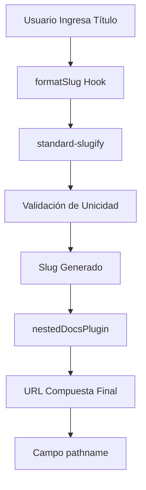

# Guía Completa: Construcción del Slug Factory 🏭

## Tabla de Contenido
1. [¿Qué es el Slug Factory?](#qué-es-el-slug-factory)
2. [Arquitectura del Sistema de Slugs](#arquitectura-del-sistema-de-slugs)
3. [Paso 1: Hook de Formateo de Slugs](#paso-1-hook-de-formateo-de-slugs)
4. [Paso 2: Factory Function del Campo Slug](#paso-2-factory-function-del-campo-slug)
5. [Paso 3: Integración con Nested Docs](#paso-3-integración-con-nested-docs)
6. [Paso 4: Utilities y Helpers](#paso-4-utilities-y-helpers)
7. [Paso 5: Implementación en Colecciones](#paso-5-implementación-en-colecciones)
8. [Casos de Uso Avanzados](#casos-de-uso-avanzados)
9. [Ejemplos Prácticos](#ejemplos-prácticos)
10. [Troubleshooting y Optimización](#troubleshooting-y-optimización)

---

## ¿Qué es el Slug Factory?

### Definición
El **Slug Factory** es un sistema modular que genera URLs amigables (slugs) de forma automática y consistente para todas las colecciones que requieren URLs públicas.

### Problemas que Resuelve
- **URLs inconsistentes**: Sin un sistema central, cada colección genera slugs diferente
- **Duplicados**: Previene slugs duplicados automáticamente
- **Caracteres especiales**: Normaliza automáticamente caracteres especiales y espacios
- **Jerarquías**: Maneja URLs anidadas como `/farms/organic-farm/products/tomatoes`
- **SEO**: Genera URLs optimizadas para motores de búsqueda

### Flujo Completo del Sistema



---

## Arquitectura del Sistema de Slugs

### Componentes Principales

1. **formatSlug Hook**: Función que procesa el input inicial
2. **slug Factory**: Función reutilizable para campos slug
3. **standard-slugify**: Librería para normalización
4. **nestedDocsPlugin**: Manejo de jerarquías
5. **generateId Utility**: IDs únicos para duplicados

### Estructura de Archivos
```
src/
├── fields/
│   └── slug/
│       ├── slug.ts              # Factory principal
│       └── hooks/
│           └── formatSlug.ts    # Hook de formateo
├── utils/
│   ├── deepMerge.ts            # Utility para fusionar objetos
│   └── generateId.ts           # Generador de IDs únicos
└── payload.config.ts           # Configuración del plugin
```

---

## Paso 1: Hook de Formateo de Slugs

### 1.1 Instalación de Dependencias

```bash
npm install standard-slugify
```

**¿Por qué standard-slugify?**
- Normaliza caracteres Unicode (á → a, ñ → n)
- Convierte espacios a guiones
- Elimina caracteres especiales
- Mantiene consistencia cross-platform

### 1.2 Implementación del Hook

**Archivo**: `src/fields/slug/hooks/formatSlug.ts`

```typescript
import { FieldHook } from 'payload'
import format from 'standard-slugify'

/**
 * Hook que formatea slugs automáticamente
 * @param field - Campo fuente para generar el slug (ej: 'title', 'name')
 * @returns {FieldHook} Hook que se ejecuta antes de validación
 */
export const formatSlug =
  (field: string): FieldHook =>
  ({ operation, value, previousValue, data, context }) => {
    // 1. Solo procesar en operaciones de create/update
    if (!operation || (operation !== 'create' && operation !== 'update') || context.duplicate) {
      return
    }

    // 2. Caso especial: permitir "/" para páginas root
    if (value === '/') return value

    // 3. Si hay un valor manual y cambió, formatearlo
    if (typeof value === 'string' && value.length > 0 && value !== previousValue) {
      return format(value)
    }

    // 4. Si no hay valor pero existe el campo fuente, generarlo automáticamente
    if (!value && data?.[field]) {
      return format(data[field])
    }
  }
```

### 1.3 Explicación Paso a Paso

#### **Parámetros del Hook**
```typescript
{
  operation,     // 'create' | 'update' | 'read' | 'delete'
  value,         // Valor actual del campo slug
  previousValue, // Valor anterior (para detectar cambios)
  data,          // Todos los datos del documento
  context        // Contexto adicional (ej: duplicate)
}
```

#### **Lógica Condicional**
1. **Filtro de operaciones**: Solo actúa en create/update
2. **Exclusión de duplicados**: Evita loops infinitos
3. **Root page special case**: Permite "/" para homepage
4. **Manual override**: Respeta cambios manuales del usuario
5. **Auto-generation**: Genera desde campo fuente si no existe

#### **Ejemplos de Transformación**
```typescript
// Casos de ejemplo del formatSlug
format('Mi Granja Orgánica')     // → 'mi-granja-organica'
format('José & María Farm')      // → 'jose-maria-farm'
format('100% Natural Products')  // → '100-natural-products'
format('Café de montaña')        // → 'cafe-de-montana'
```

---

## Paso 2: Factory Function del Campo Slug

### 2.1 Utility de Deep Merge

**Archivo**: `src/utils/deepMerge.ts`

```typescript
export type DeepPartial<T> = {
  [P in keyof T]?: T[P] extends object ? DeepPartial<T[P]> : T[P]
}

/**
 * Fusiona objetos recursivamente
 * Permite que las configuraciones personalizadas sobrescriban las defaults
 */
export function deepMerge<T>(target: T, source: DeepPartial<T>): T {
  const result = { ...target }
  
  for (const key in source) {
    if (source[key] && typeof source[key] === 'object' && !Array.isArray(source[key])) {
      result[key] = deepMerge(result[key] as any, source[key] as any)
    } else if (source[key] !== undefined) {
      result[key] = source[key] as any
    }
  }
  
  return result
}
```

### 2.2 Generador de IDs Únicos

**Archivo**: `src/utils/generateId.ts`

```typescript
/**
 * Genera un ID único corto para slugs duplicados
 * Evita usar timestamps largos o UUIDs complejos
 */
export function generateId(): string {
  // Combinar timestamp corto + random
  const timestamp = Date.now().toString(36) // Base 36 para compacidad
  const random = Math.random().toString(36).substring(2, 5) // 3 caracteres random
  return `${timestamp}${random}`
}

// Ejemplos de output:
// "lm2k3x8abc"  →  más corto que UUIDs
// "lm2k3y9def"  →  prácticamente imposible duplicar
```

**¿Por qué este formato?**
- **Compacto**: Mucho más corto que UUIDs
- **Único**: Timestamp + random = prácticamente imposible duplicar
- **SEO-friendly**: Solo caracteres alfanuméricos
- **Legible**: Base 36 usa 0-9 y a-z

### 2.3 Factory Principal

**Archivo**: `src/fields/slug/slug.ts`

```typescript
import { deepMerge, DeepPartial } from '@/utils/deepMerge'
import type { TextField } from 'payload'
import { formatSlug } from '@/fields/slug/hooks/formatSlug'
import { generateId } from '@/utils/generateId'

// Tipo del factory para mejor IntelliSense
type Slug = (fieldToUse?: string, overrides?: DeepPartial<TextField>) => TextField

/**
 * Factory que crea campos slug configurables y reutilizables
 * @param fieldToUse - Campo fuente para auto-generar slug (default: 'title')
 * @param overrides - Configuraciones personalizadas que sobrescriben defaults
 * @returns TextField completamente configurado
 */
export const slug: Slug = (fieldToUse = 'title', overrides = {}) =>
  deepMerge(
    {
      // Configuración base del campo
      name: 'slug',
      type: 'text',
      index: true,        // Optimiza búsquedas por slug
      unique: true,       // Previene duplicados a nivel de DB
      admin: {
        position: 'sidebar', // Coloca en sidebar del admin panel
      },
      hooks: {
        // Hook principal: formateo automático
        beforeValidate: [formatSlug(fieldToUse)],
        
        // Hook para duplicados: añade ID único
        beforeDuplicate: [
          ({ value, context }) => {
            context.duplicate = true // Marca el contexto
            
            if (value === '/') {
              // Caso especial: root page duplicada
              return generateId()
            }
            
            // Caso normal: añadir sufijo único
            return `${value}-${generateId()}`
          },
        ],
      },
    },
    overrides, // Las personalizaciones sobrescriben defaults
  )
```

### 2.4 Anatomía de la Configuración Base

#### **Campos Críticos**
```typescript
{
  name: 'slug',        // Nombre del campo en la base de datos
  type: 'text',        // Tipo de campo de Payload
  index: true,         // Crea índice DB para búsquedas rápidas
  unique: true,        // Constraint de unicidad en MongoDB
}
```

#### **Configuración de Admin Panel**
```typescript
admin: {
  position: 'sidebar'  // Coloca el campo en el sidebar
  // Otras opciones posibles:
  // hidden: true,     // Ocultar del admin
  // readOnly: true,   // Solo lectura
  // description: 'URL-friendly identifier'
}
```

#### **Hooks del Ciclo de Vida**
```typescript
hooks: {
  beforeValidate: [formatSlug(fieldToUse)], // Pre-validación
  beforeDuplicate: [/* lógica de duplicado */], // Pre-duplicado
  // Otros hooks disponibles:
  // beforeChange, afterChange, afterRead, etc.
}
```

---

## Paso 3: Integración con Nested Docs

### 3.1 Configuración del Plugin

**Archivo**: `src/payload.config.ts`

```typescript
import { nestedDocsPlugin } from '@payloadcms/plugin-nested-docs'

export default buildConfig({
  plugins: [
    nestedDocsPlugin({
      collections: ['pages'], // Colecciones que usan jerarquías
      
      // Función para generar labels en breadcrumbs
      generateLabel: (_, doc) => doc?.name as string,
      
      // Función crítica: compone URL completa
      generateURL: (docs) =>
        docs.reduce((url, doc) => `${url}/${doc.slug}`.replace(/^\\/+/, '/'), ''),
      
      // Configuraciones adicionales:
      // parentFieldSlug: 'parent',  // Campo para relación padre
      // breadcrumbsFieldSlug: 'breadcrumbs', // Campo de breadcrumbs
    }),
  ],
})
```

### 3.2 Cómo Funciona generateURL

#### **Input**: Array de documentos de la jerarquía
```typescript
// Ejemplo: página anidada "Productos" → "Tomates Orgánicos"
const docs = [
  { slug: 'productos', name: 'Productos' },
  { slug: 'tomates-organicos', name: 'Tomates Orgánicos' }
]
```

#### **Proceso de Reducción**
```typescript
docs.reduce((url, doc) => `${url}/${doc.slug}`.replace(/^\\/+/, '/'), '')

// Iteración 1: '' + '/productos' → '/productos'
// Iteración 2: '/productos' + '/tomates-organicos' → '/productos/tomates-organicos'
// replace(/^\\/+/, '/') limpia múltiples barras al inicio
```

#### **Output**: URL compuesta final
```typescript
'/productos/tomates-organicos'
```

### 3.3 Campo de Pathname Generado

El plugin automáticamente crea un campo `pathname` en cada documento:

```typescript
// Campo generado automáticamente
{
  name: 'pathname',
  type: 'text',
  admin: {
    readOnly: true,  // No editable manualmente
  },
  index: true,       // Indexado para búsquedas
  unique: true,      // Previene URLs duplicadas
}
```

**Flujo completo:**
1. Usuario crea página "Tomates" bajo "Productos"
2. slug = "tomates" (generado por formatSlug)
3. pathname = "/productos/tomates" (generado por nestedDocsPlugin)
4. URL final accesible en frontend

---

## Paso 4: Utilities y Helpers

### 4.1 Helper de Búsqueda por Pathname

**Archivo**: `src/utils/findByPathname.ts`

```typescript
import { getPayload } from 'payload'
import config from '@/payload.config'

/**
 * Busca un documento por su pathname completo
 * Útil para resolver rutas dinámicas
 */
export async function findByPathname(pathname: string, collection: string) {
  const payload = await getPayload({ config })
  
  const result = await payload.find({
    collection,
    where: {
      pathname: {
        equals: pathname,
      },
    },
    limit: 1,
  })
  
  return result.docs[0] || null
}

// Uso en pages dinámicas
// const page = await findByPathname('/productos/tomates', 'pages')
```

### 4.2 Validador de Slug Personalizado

**Archivo**: `src/fields/slug/validators/uniqueSlug.ts`

```typescript
import type { Validate } from 'payload'

/**
 * Validador personalizado para unicidad de slug en contexto específico
 * Útil cuando necesitas unicidad condicional (ej: por parent)
 */
export const uniqueSlug: Validate = async (value, { req, id, siblingData }) => {
  // Solo validar si hay valor
  if (!value) return true
  
  const collection = req.payload.collections[req.collection?.config.slug!]
  
  const duplicates = await req.payload.find({
    collection: req.collection?.config.slug!,
    where: {
      and: [
        { slug: { equals: value } },
        { id: { not_equals: id } }, // Excluir documento actual
        // Añadir más condiciones según necesidades:
        // { parent: { equals: siblingData.parent } }
      ],
    },
    limit: 1,
  })
  
  if (duplicates.docs.length > 0) {
    return 'Slug must be unique'
  }
  
  return true
}
```

### 4.3 Generador de Slug Manual

**Archivo**: `src/utils/manualSlugGenerator.ts`

```typescript
import format from 'standard-slugify'

/**
 * Generador manual de slugs para casos especiales
 * Útil para migraciones o imports masivos
 */
export function generateSlugFromText(text: string, options?: {
  maxLength?: number
  suffix?: string
  prefix?: string
}): string {
  const { maxLength = 50, suffix = '', prefix = '' } = options || {}
  
  // 1. Formatear texto base
  let slug = format(text)
  
  // 2. Añadir prefix si existe
  if (prefix) {
    slug = `${prefix}-${slug}`
  }
  
  // 3. Truncar si es muy largo
  if (slug.length > maxLength) {
    slug = slug.substring(0, maxLength - suffix.length)
  }
  
  // 4. Añadir suffix si existe
  if (suffix) {
    slug = `${slug}-${suffix}`
  }
  
  return slug
}

// Ejemplos de uso:
// generateSlugFromText('Mi Granja Muy Larga Con Nombre Extenso', { 
//   maxLength: 20, 
//   prefix: 'farm' 
// })
// → 'farm-mi-granja-muy'
```

---

## Paso 5: Implementación en Colecciones

### 5.1 Uso Básico en Colección Simple

**Archivo**: `src/collections/Farms.ts`

```typescript
import type { CollectionConfig } from 'payload'
import { slug } from '@/fields/slug/slug'

export const Farms: CollectionConfig = {
  slug: 'farms',
  fields: [
    {
      name: 'name',
      type: 'text',
      required: true,
    },
    
    // Uso básico: slug basado en 'name'
    slug('name'),
    
    // Más campos...
  ],
}
```

### 5.2 Uso con Personalizaciones

**Archivo**: `src/collections/Products.ts`

```typescript
import type { CollectionConfig } from 'payload'
import { slug } from '@/fields/slug/slug'

export const Products: CollectionConfig = {
  slug: 'products',
  fields: [
    {
      name: 'title',
      type: 'text',
      required: true,
    },
    
    // Slug personalizado con configuraciones específicas
    slug('title', {
      admin: {
        description: 'URL-friendly product identifier',
        placeholder: 'e.g., organic-tomatoes',
      },
      validate: [
        // Validaciones adicionales
        (value) => {
          if (value && value.length < 3) {
            return 'Slug must be at least 3 characters'
          }
          return true
        },
      ],
    }),
    
    // Más campos...
  ],
}
```

### 5.3 Colección con Jerarquía (Pages)

**Archivo**: `src/collections/Pages.ts`

```typescript
import type { CollectionConfig } from 'payload'
import { slug } from '@/fields/slug/slug'

export const Pages: CollectionConfig = {
  slug: 'pages',
  fields: [
    {
      name: 'name',
      type: 'text',
      required: true,
    },
    
    // Campo para jerarquía (añadido por nestedDocsPlugin)
    {
      name: 'parent',
      type: 'relationship',
      relationTo: 'pages',
      admin: {
        position: 'sidebar',
      },
    },
    
    // Slug con manejo especial para root
    slug('name', {
      admin: {
        description: 'Leave empty for auto-generation. Use "/" for homepage.',
      },
      validate: [
        (value) => {
          // Validar que solo una página puede ser root "/"
          if (value === '/') {
            // Aquí podrías añadir lógica adicional si necesitas
            return true
          }
          return true
        },
      ],
    }),
    
    // Campo pathname generado automáticamente por nestedDocsPlugin
    // No necesitas definirlo manualmente
    
    // Más campos...
  ],
}
```

---

## Casos de Uso Avanzados

### 6.1 Slug Condicional por Categoria

```typescript
// Hook personalizado para slugs que dependen de categoría
export const categorySlug: FieldHook = ({ data, value, previousValue }) => {
  if (!value && data?.title && data?.category) {
    const categoryPrefix = format(data.category).substring(0, 4)
    const titleSlug = format(data.title)
    return `${categoryPrefix}-${titleSlug}`
  }
  
  return value
}

// Uso en colección
slug('title', {
  hooks: {
    beforeValidate: [categorySlug],
  },
})
```

### 6.2 Slug con Timestamp para Eventos

```typescript
export const timeStampedSlug: FieldHook = ({ data, value }) => {
  if (!value && data?.title && data?.eventDate) {
    const date = new Date(data.eventDate)
    const year = date.getFullYear()
    const month = String(date.getMonth() + 1).padStart(2, '0')
    const titleSlug = format(data.title)
    
    return `${year}-${month}-${titleSlug}`
  }
  
  return value
}

// Resultado: "2024-03-festival-de-la-cosecha"
```

### 6.3 Slug Multi-idioma

```typescript
export const multiLanguageSlug: FieldHook = ({ data, value, req }) => {
  if (!value && data?.title) {
    const locale = req.locale || 'es'
    const titleSlug = format(data.title)
    
    // Solo añadir prefijo si no es el idioma default
    if (locale !== 'es') {
      return `${locale}-${titleSlug}`
    }
    
    return titleSlug
  }
  
  return value
}

// Resultados:
// ES (default): "mi-granja-organica"
// EN: "en-my-organic-farm"
```

---

## Ejemplos Prácticos

### Ejemplo 1: Blog con Categorías

```typescript
// Estructura: /blog/categoria/titulo-del-post
export const BlogPosts: CollectionConfig = {
  slug: 'blog-posts',
  fields: [
    {
      name: 'title',
      type: 'text',
      required: true,
    },
    {
      name: 'category',
      type: 'relationship',
      relationTo: 'categories',
      required: true,
    },
    slug('title', {
      hooks: {
        beforeValidate: [
          ({ data, value }) => {
            if (!value && data?.title && data?.category?.slug) {
              return `${data.category.slug}-${format(data.title)}`
            }
            return value
          },
        ],
      },
    }),
  ],
}
```

### Ejemplo 2: Productos con SKU

```typescript
export const Products: CollectionConfig = {
  slug: 'products',
  fields: [
    {
      name: 'name',
      type: 'text',
      required: true,
    },
    {
      name: 'sku',
      type: 'text',
      required: true,
    },
    slug('name', {
      hooks: {
        beforeValidate: [
          ({ data, value }) => {
            // Combinar SKU + nombre para slug único
            if (!value && data?.name && data?.sku) {
              return `${data.sku.toLowerCase()}-${format(data.name)}`
            }
            return value
          },
        ],
      },
    }),
  ],
}

// Resultado: "org001-tomates-cherry-organicos"
```

### Ejemplo 3: Eventos con Fecha

```typescript
export const Events: CollectionConfig = {
  slug: 'events',
  fields: [
    {
      name: 'title',
      type: 'text',
      required: true,
    },
    {
      name: 'eventDate',
      type: 'date',
      required: true,
    },
    slug('title', {
      hooks: {
        beforeValidate: [
          ({ data, value }) => {
            if (!value && data?.title && data?.eventDate) {
              const date = new Date(data.eventDate)
              const dateStr = date.toISOString().substring(0, 10) // YYYY-MM-DD
              return `${dateStr}-${format(data.title)}`
            }
            return value
          },
        ],
      },
    }),
  ],
}

// Resultado: "2024-03-15-festival-de-primavera"
```

---

## Troubleshooting y Optimización

### Problemas Comunes

#### Error: "Slug already exists"
```typescript
// Solución: Verificar unicidad antes de save
export const checkUniqueness: FieldHook = async ({ value, req, id }) => {
  if (value) {
    const existing = await req.payload.find({
      collection: req.collection?.config.slug!,
      where: {
        and: [
          { slug: { equals: value } },
          { id: { not_equals: id } },
        ],
      },
      limit: 1,
    })
    
    if (existing.docs.length > 0) {
      throw new Error(`Slug "${value}" already exists`)
    }
  }
  
  return value
}
```

#### Error: "Cannot read property 'slug' of undefined"
```typescript
// Solución: Verificar que el campo fuente existe
export const safeFormatSlug =
  (field: string): FieldHook =>
  ({ data, value }) => {
    // Verificar que el campo fuente existe
    if (!value && data?.[field] && typeof data[field] === 'string') {
      return format(data[field])
    }
    return value
  }
```

#### URLs muy largas
```typescript
// Solución: Truncar slugs largos
export const truncateSlug: FieldHook = ({ value }) => {
  if (value && typeof value === 'string' && value.length > 50) {
    return value.substring(0, 47) + '...'
  }
  return value
}
```

### Optimizaciones de Performance

#### 1. Índices de Base de Datos
```typescript
// En configuración de campo
{
  name: 'slug',
  type: 'text',
  index: true,     // Índice simple
  unique: true,    // Índice único (más rápido para verificar duplicados)
}
```

#### 2. Cache de Slugs
```typescript
// Cache en memoria para verificaciones rápidas
const slugCache = new Map<string, boolean>()

export const cachedSlugCheck: FieldHook = async ({ value, req }) => {
  if (value && !slugCache.has(value)) {
    const exists = await req.payload.find({
      collection: req.collection?.config.slug!,
      where: { slug: { equals: value } },
      limit: 1,
    })
    
    slugCache.set(value, exists.docs.length > 0)
  }
  
  return value
}
```

#### 3. Lazy Loading de Validaciones
```typescript
// Solo validar cuando realmente se necesite
export const lazyValidateSlug: FieldHook = ({ value, operation }) => {
  // Solo validar en operaciones de escritura
  if (operation === 'create' || operation === 'update') {
    return validateSlugUniqueness(value)
  }
  return value
}
```

---

## Siguiente Paso

Después de implementar el Slug Factory:

1. **[nestedDocsPlugin Documentation](https://payloadcms.com/docs/plugins/nested-docs)**: Profundizar en jerarquías
2. **[Collections-Deep-Dive.md](./10-Collections-Deep-Dive.md)**: Implementar en todas las colecciones
3. **[SEO.md](./07-SEO.md)**: Optimizar URLs para motores de búsqueda
4. **[Routing Guide](./05-Routing-Dynamic-Pages.md)**: Crear páginas dinámicas basadas en slugs

---

*Este sistema de Slug Factory proporciona URLs consistentes, SEO-friendly y altamente configurables para todo tu proyecto. Cada patrón ha sido optimizado para performance y mantenibilidad.*